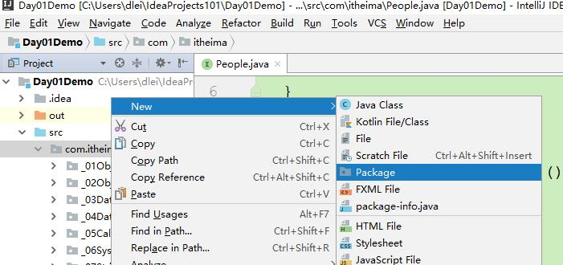
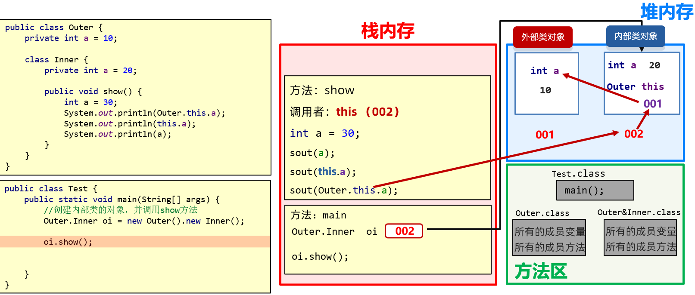

# [MainPage](../readme.md)/Java  


- [MainPage/Java](#mainpagejava)
- [变量](#变量)
- [键盘录入](#键盘录入)
- [运算符及表达式](#运算符及表达式)
  - [算术运算符](#算术运算符)
  - [自增自减运算符](#自增自减运算符)
  - [赋值运算符](#赋值运算符)
  - [隐式转换和强制转换](#隐式转换和强制转换)
  - [关系运算符（比较运算符）](#关系运算符比较运算符)
  - [逻辑运算符](#逻辑运算符)
  - [短路逻辑运算符](#短路逻辑运算符)
  - [三元运算符](#三元运算符)
- [计算机底层运行逻辑-原码，反码及补码](#计算机底层运行逻辑-原码反码及补码)
  - [什么是原码？](#什么是原码)
  - [原码](#原码)
  - [原码的弊端](#原码的弊端)
  - [反码](#反码)
  - [补码](#补码)
  - [对隐式转换及强制转换的解释](#对隐式转换及强制转换的解释)
  - [对于其他运算符的解释](#对于其他运算符的解释)
- [判断和循环](#判断和循环)
  - [判断语句：if语句](#判断语句if语句)
  - [switch语句](#switch语句)
  - [for循环结构](#for循环结构)
  - [while循环](#while循环)
  - [do...while循环](#dowhile循环)
  - [循环代码示例](#循环代码示例)
  - [无限循环](#无限循环)
  - [条件控制语句](#条件控制语句)
  - [break](#break)
  - [continue](#continue)
- [Random](#random)
  - [使用步骤](#使用步骤)
- [数组](#数组)
  - [概念](#概念)
  - [数组的定义](#数组的定义)
  - [数组的静态初始化](#数组的静态初始化)
  - [注意点：](#注意点)
  - [简化格式:](#简化格式)
  - [地址值](#地址值)
  - [数组元素访问](#数组元素访问)
  - [索引](#索引)
  - [数组的遍历](#数组的遍历)
  - [数组的动态初始化](#数组的动态初始化)
  - [数组两种初始化方式的区别](#数组两种初始化方式的区别)
  - [数组常见问题](#数组常见问题)
  - [Java的内存分配](#java的内存分配)
  - [数组的示例](#数组的示例)
- [方法](#方法)
  - [方法的概念](#方法的概念)
  - [方法的定义和调用](#方法的定义和调用)
  - [带参数方法定义和调用](#带参数方法定义和调用)
  - [带返回值方法的定义和调用](#带返回值方法的定义和调用)
  - [方法的注意事项](#方法的注意事项)
  - [方法重载](#方法重载)
  - [方法代码示例](#方法代码示例)
- [面向对象](#面向对象)
  - [类和对象](#类和对象)
    - [类和对象的理解](#类和对象的理解)
    - [类的定义](#类的定义)
    - [对象的使用](#对象的使用)
  - [封装](#封装)
    - [封装思想](#封装思想)
    - [private关键字](#private关键字)
  - [this关键字](#this关键字)
  - [构造方法](#构造方法)
    - [构造方法概述](#构造方法概述)
    - [构造方法的注意事项](#构造方法的注意事项)
  - [标准JavaBean](#标准javabean)
- [对象的内存图](#对象的内存图)
  - [一个对象的内存图](#一个对象的内存图)
  - [this的内存原理](#this的内存原理)
- [API](#api)
  - [API概述](#api概述)
  - [如何使用API帮助文档](#如何使用api帮助文档)
  - [String类](#string类)
    - [String类概述](#string类概述)
    - [String类的特点](#string类的特点)
    - [String类的构造方法](#string类的构造方法)
    - [创建字符串对象两种方式的区别](#创建字符串对象两种方式的区别)
  - [字符串的比较](#字符串的比较)
    - ["=="号的作用](#号的作用)
    - [equals方法的作用](#equals方法的作用)
- [StringBuilder](#stringbuilder)
  - [基本使用](#基本使用)
  - [链式编程](#链式编程)
- [StringJoiner](#stringjoiner)
- [关于字符串的小扩展](#关于字符串的小扩展)
- [字符串相关底层原理](#字符串相关底层原理)
  - [字符串拼接的底层原理](#字符串拼接的底层原理)
  - [StringBuilder提高效率原理图](#stringbuilder提高效率原理图)
- [ArrayList](#arraylist)
  - [集合和数组的优势对比](#集合和数组的优势对比)
  - [ArrayList类概述](#arraylist类概述)
  - [ArrayList类常用方法](#arraylist类常用方法)
    - [构造方法](#构造方法-1)
    - [成员方法](#成员方法)
    - [示例代码](#示例代码)
  - [ArrayList存储字符串并遍历](#arraylist存储字符串并遍历)
    - [案例需求](#案例需求)
    - [代码实现](#代码实现)
- [static关键字](#static关键字)
  - [概述](#概述)
  - [定义格式和使用](#定义格式和使用)
    - [静态变量及其访问](#静态变量及其访问)
    - [实例变量及其访问](#实例变量及其访问)
    - [静态方法及其访问](#静态方法及其访问)
    - [实例方法及其访问](#实例方法及其访问)
  - [小结](#小结)
- [继承](#继承)
  - [概述](#概述-1)
    - [引入](#引入)
    - [继承的含义](#继承的含义)
    - [继承的好处](#继承的好处)
    - [继承的格式](#继承的格式)
  - [子类能从父类继承哪些内容](#子类能从父类继承哪些内容)
  - [继承中成员变量和成员方法的访问特点](#继承中成员变量和成员方法的访问特点)
  - [@Override重写注解](#override重写注解)
- [继承中的构造方法和this，super关键字](#继承中的构造方法和thissuper关键字)
  - [构造方法的访问特点](#构造方法的访问特点)
  - [super](#super)
  - [super(....)用法演示](#super用法演示)
- [多态](#多态)
  - [多态的形式](#多态的形式)
  - [多态的使用场景](#多态的使用场景)
  - [多态的定义和前提](#多态的定义和前提)
  - [多态的运行特点](#多态的运行特点)
  - [多态的弊端](#多态的弊端)
  - [引用类型转换](#引用类型转换)
    - [为什么要转型](#为什么要转型)
    - [向上转型（自动转换）](#向上转型自动转换)
    - [向下转型（强制转换）](#向下转型强制转换)
    - [案例演示](#案例演示)
    - [转型的异常](#转型的异常)
    - [instanceof关键字](#instanceof关键字)
    - [instanceof新特性](#instanceof新特性)
- [抽象类](#抽象类)
  - [概述](#概述-2)
    - [抽象类引入](#抽象类引入)
  - [abstract使用格式](#abstract使用格式)
    - [抽象方法](#抽象方法)
    - [抽象类](#抽象类-1)
    - [抽象类的使用](#抽象类的使用)
  - [抽象类的特征](#抽象类的特征)
  - [抽象类的细节](#抽象类的细节)
  - [抽象类存在的意义](#抽象类存在的意义)
- [包](#包)
  - [包](#包-1)
  - [导包](#导包)
  - [使用不同包下的相同类怎么办？](#使用不同包下的相同类怎么办)
- [权限修饰符](#权限修饰符)
  - [权限修饰符](#权限修饰符-1)
  - [不同权限的访问能力](#不同权限的访问能力)
- [final关键字](#final关键字)
  - [概述](#概述-3)
  - [使用方式](#使用方式)
    - [修饰类](#修饰类)
      - [修饰方法](#修饰方法)
    - [修饰变量-局部变量](#修饰变量-局部变量)
    - [修饰变量-成员变量](#修饰变量-成员变量)
- [接口](#接口)
  - [概述](#概述-4)
  - [定义格式](#定义格式)
  - [接口中成员的特点](#接口中成员的特点)
    - [JDK8以后接口中新增的方法](#jdk8以后接口中新增的方法)
    - [JDK9以后接口中新增的方法](#jdk9以后接口中新增的方法)
    - [案例演示](#案例演示-1)
  - [基本的实现](#基本的实现)
    - [实现接口的概述](#实现接口的概述)
    - [实现接口的格式](#实现接口的格式)
    - [类实现接口的要求和意义](#类实现接口的要求和意义)
    - [类与接口基本实现案例](#类与接口基本实现案例)
    - [类与接口的多实现案例](#类与接口的多实现案例)
  - [接口与接口的多继承](#接口与接口的多继承)
  - [接口的应用](#接口的应用)
  - [扩展：接口的细节](#扩展接口的细节)
- [内部类](#内部类)
  - [概述](#概述-5)
    - [什么是内部类](#什么是内部类)
    - [什么时候使用内部类](#什么时候使用内部类)
  - [内部类的分类](#内部类的分类)
  - [成员内部类](#成员内部类)
  - [成员内部类的细节](#成员内部类的细节)
  - [成员内部类面试题](#成员内部类面试题)
  - [成员内部类内存图](#成员内部类内存图)
  - [静态内部类](#静态内部类)
  - [局部内部类](#局部内部类)
  - [匿名内部类【重点】](#匿名内部类重点)
    - [概述](#概述-6)
    - [格式](#格式)
    - [什么时候用到匿名内部类](#什么时候用到匿名内部类)
    - [匿名内部类前提和格式](#匿名内部类前提和格式)
    - [使用方式](#使用方式-1)
    - [匿名内部类的特点](#匿名内部类的特点)
    - [匿名内部类的使用场景](#匿名内部类的使用场景)
- [Math类](#math类)
  - [概述](#概述-7)
  - [1.2 常见方法](#12-常见方法)
  - [1.3 算法小题(质数)](#13-算法小题质数)
  - [1.4 算法小题(自幂数)](#14-算法小题自幂数)
  - [1.5 课后练习](#15-课后练习)
- [2 System类](#2-system类)
  - [2.1 概述](#21-概述)
  - [2.2 常见方法](#22-常见方法)
- [3 Runtime](#3-runtime)
  - [3.1 概述](#31-概述)
  - [3.2 常见方法](#32-常见方法)
  - [3.3 恶搞好基友](#33-恶搞好基友)
- [4 Object类](#4-object类)
  - [4.1 概述](#41-概述)
  - [4.2 常见方法](#42-常见方法)
- [5 Objects类](#5-objects类)
  - [5.1 概述](#51-概述)
  - [5.2 常见方法](#52-常见方法)
- [6 BigInteger类](#6-biginteger类)
  - [6.1 引入](#61-引入)
  - [6.2  概述](#62--概述)
  - [6.3 常见方法](#63-常见方法)
  - [6.4 底层存储方式：](#64-底层存储方式)
- [7 BigDecimal类](#7-bigdecimal类)
  - [7.1 引入](#71-引入)
  - [7.2 概述](#72-概述)
  - [7.3 常见方法](#73-常见方法)
  - [7.4 底层存储方式：](#74-底层存储方式)


```java
public class VariableDemo{
	public static void main(String[] args){
		
	}
}
```
**calss**:​ 表示定义一个`类`。创建一个类。  

**类**：Java项目最基本的组成单元，一个完整的Java项目有可能会有成千上万个类来组成的。  

class后面跟随的就是这个类的名字，简称：类名。  

类的实现包括两部分：`类的声明`和`类体`。  

**类体**:包括类声明之后的*一对大括号{ }以及它们之间的内容*成为类体，大括号之间的内容称为类体的内容。  

类体分为两部分：`变量的声明`和`方法的定义`。  


```
class 类名{

        变量的声明;

        方法的定义;

    }
```

"VariableDemo"后的大括号表示这个类的范围。  

**public**：表内示程序的访问权限，表示的是任何的场合可以被引用。  

**main**:Java应用程序的入口方法(JVM找到这个程序的入口)，将其声明为public即对外公开，因此JVM便能直接调用它。  
每一个应用程序都必须包含一个main()方法，含有main()方法的类称为主类。  
**static**  
**void**  

# 变量 
  - **变量**分为`成员变量`和`局部变量`  

    - **成员变量**：在类中方法外的变量。（成员变量分为：`实例变量`、`类变量`。用*static*修饰的为类变量（*static变量，也叫静态变量*），否则为实例变量）  

    - **局部变量**：在方法内部或方法声明上(形参)的变量。  

- **变量的有效范围**
  - `成员变量` 在整个类中都有效。（随着对象的存在而存在，随着对象的消失而消失）  
  - `局部变量` 只在声明它的方法内有效。（随着方法的调用而存在，醉着方法的调用完毕而消失）  

- **变量的内存位置**  
  - `成员变量` 堆内存  
  - `局部变量` 栈内存   

- **变量的初始化值**  
  - `成员变量` 有默认初始化值  
  - `局部变量` 没有默认初始化值，必须先定义，赋值才能使用  

- **成员变量的隐藏**  
    如果局部变量的名字和成员变量的名字相同，则成员变量被隐藏（即这个成员变量在这个方法内暂时失效）。
  

# 键盘录入
```java
//1.导包，先找到Scanner这个类在哪(idea在进行步骤2后会自动进行导包)
import java.util.Scanner;
public class class1 {
    public static void main(String[] args) {
        //2.创建对象，申明一下，我准备开始用Scanner这个类了。
        Scanner sc = new Scanner(System.in);
        System.out.println("请输入一个数字");
		//3.接收数据
        int i = sc.nextInt();
        System.out.println(i);
    }
}
```
```java
import java.util.Scanner;
```
导包的动作必须出现在类的定义上  
```java
Scanner sc = new Scanner(System.in);
```
此行代码中只有sc为变量名，可变，其余均不可变  
```java
int i = sc.nextInt();
```
其中只有后半为接收数据，前半意为将接收的数据赋值给变量i。此行代码中只有i为变量名，可变，其余均不可变  

# 运算符及表达式  

## 算术运算符    
对常量或者变量进行操作的符号  

| 运算符 | 说明 |
|-------|------|
| + | 加 |
| - | 减 |
| * | 乘 |
| / | 除 |
| % | 取余数 |  

```java
/*
1.整数相除结果只能得到整除，如果结果想要是小数，必须要有小数参数。
2.小数直接参与运算，得到的结果有可能是不精确的。*/
System.out.println( 10 / 3);//3
System.out.println(10.0 / 3);//3.3333333333333335
```

```java
/*%：取模、取余。
   他做的也是除法运算，只不过获取的是余数而已。*/
System.out.println(10 % 2);//0
System.out.println(10 % 3);//1  
```

## 自增自减运算符   
自增、自减运算符的作用是使变量的值
增1或减1。  
放在操作元前面的自增、自减运算符，会先将变量的值加1（减1），然后再使该变量参与表达式的运算。  
放在操作元后面的自增、自减运算符，会先使变量参与表达式的运算，然后再将该变量加1（减1）。  
```java
int a = 4;
int b = ++a;//此时b=5，a=5，即a先自增为5再赋值给b
```  

```java
int a = 4;
int b = a++;//此时b=4，a=5，即a先赋值给b再自增为5
```  

**注意**  不管是先++，还是后++。单独写在一行的时候，运算结果是一模一样的。
```java
int a = 4;
++a;
System.out.println(a);
a++;
System.out.println(a);
//以上输出结果均为5
```

## 赋值运算符  
  - `=` 把等号右边的结果赋值给左边的变量
  - `+=` `-=` `*=` `/=` `%=` 把左边跟右边进行运算，把最终的结果赋值给左边，对右边没有任何影响。  
  
```java
public class example {
  public static void main(String[]args){
    int a = 10;
    int b = 20:
    a += b;//先将a与b相加得到30，再将30赋值给a，对b无影响
    System.out.println(a);//30
    System.out.println(b);//20
  }
}

```  

**注意** 扩展的赋值运算符中隐层还包含了一个强制转换。以下介绍类型转换

## 隐式转换和强制转换   
  - `隐式转换`也叫自动类型提升。
就是把一个取值范围小的数据或者变量，赋值给另一个取值范围大的变量。此时不需要我们额外写代码单独实现，是程序自动帮我们完成的。  
 
    *规则*  
    - 取值范围小的，和取值范围大的进行运算，小的会先提升为大的，再进行运算。
    - byte、short、char三种类型的数据在运算的时候，都会直接先提升为int，然后再进行运算。
    - byte<short<int< long <float <double  
  - `强制转换`  
    如果要把一个取值范围大的数据或者变量赋值给另一个取值范围小的变量。是不允许直接操作。如果一定要这么干，就需要加入强制转换。  
  
    *书写格式*
    - 目标数据类型 变量名 = （目标数据类型）被强转的数据( 要转成什么类型的，那么就在小括号中写什么类型就可以了。)  

```java
public class example {
    public static void main(String[] args) {
        double a = 12.3;
        int b = (int) a;
        System.out.println(b);//12
    }
}
```  

现在我们回到赋值运算符中隐含的强制转换并给出例子
 
```java
public class OperatorDemo8 {
    public static void main(String[] args) {
        byte a = 10;
        byte b = 20;
        //a += b;
        a = (byte)(a + b);
        System.out.println(a);//30
    }
}
```  
这里的a += b ;实际上相当于 a = (byte)(a + b);  

## 关系运算符（比较运算符）      

|符号|解释|
|----|----|
| ==   | 就是判断左边跟右边是否相等，如果成立就是true，如果不成立就是false |
| !=   | 就是判断左边跟右边是否不相等，如果成立就是true，如果不成立就是false |
| >    | 就是判断左边是否大于右边，如果成立就是true，如果不成立就是false |
| >=   | 就是判断左边是否大于等于右边，如果成立就是true，如果不成立就是false |
| <    | 就是判断左边是否小于右边，如果成立就是true，如果不成立就是false |
| <=   | 就是判断左边是否小于等于右边，如果成立就是true，如果不成立就是false |  

```java
int a = 10;
int b = 20;
System.out.println( a > b );
```  
```java
int a = 10;
int b = 20;
boolean c = a > b;
System.out.println( c );
```  

## 逻辑运算符  

|符号|解释|
|----|----|
|`&`逻辑与（而且）|两边都为真，结果才是真，只要有一个为假，那么结果就是假。|
|逻辑或（或者） |两边都为假，结果才是假，只要有一个为真，那么结果就是真。|                                        
|`^`异或|如果两边相同，结果为false，如果两边不同，结果为true|
|`!`取反|false取反就是true，true取反就是false|  

## 短路逻辑运算符     
`&&` `||`  
运算结果与&（|）一致，只不过具有短路效果。即当左边不能确定整个表达式的结果，右边才会执行。如若左边能确定整个表达式的结果，那么右边就不会执行，从而*提高代码的运行效率*。  

## 三元运算符   
  
  - `格式` 关系表达式？表达式1：表达式2；  
  - `计算规则`   
    计算关系表达式的值。
    如果关系表达式的值为真，那么执行表达式1。
    如果关系表达式的值为假，那么执行表达式2。  

 ```java
 public class OperatorDemo12 {
    public static void main(String[] args) {      
        int a = 10;
        int b = 20;      
       int max =  a > b ? a : b ;//格式：关系表达式 ？ 表达式1 ： 表达式2
        System.out.println(max);
        System.out.println(a > b ? a : b);
    }
}
 ```     

 **注意**  
 此处的表达式1及表达式2不一定为关系表达式里的内容。  

 `举例`  
 ```java
 public class OperatorDemo12 {
   public static void main(String[] args) {      
       int a = 10;
       int b = 20;  
       int c = 30;
       int d = 40;    
      int max =  a > b ? c : d ;
       System.out.println(max);
       System.out.println(a > b ? c : d);
   }

 ```  

 此处a > b 判断为false，输出表达式2，即40（d）  

 # 计算机底层运行逻辑-原码，反码及补码  

 ## 什么是原码？  
 计算机中一个0或一个1被称为一个bit，8个bit被称为一个字节。  

 `0000 0000`这个就是一个字节，其中第一位为`符号位`，后面七位为`数据`。  

 `符号位`功能是记录该数据正负，`数据`则是具体的数值  

 一个字节最大是`0111 1111`即127，最小是`1111 1111`即-127  

 ## 原码  
 十进制数据的二进制表现形式，最左边是符号位，0为正，1为负。  

 利用原码对正数进行计算不会有问题。  

 ## 原码的弊端  
 **例子**  
 `1000 0000`代表-0，-0同为0  

 此时对0+1正常结果为1，但此处原码进行加1得到的是`1000 0001`显示为-1  

 导致出现这种弊端的原因是由于符号位并不参与计算而导致的。就好比数轴加1本因向数轴正方向走一格，但由于-0其符号位为负数，导致加1变为向数轴负方向走一格，从而得到的结果为-1。  

 为解决这种弊端出现了反码。  

 ## 反码  
 反码如若类比上文提到的数轴就相当于将数轴反过来。  

 其计算规则为：正数的反码不变等同于原码，负数在原码的基础上，符号位不变，数值取反，0变1，1变0。  

 |十进制数|原码|反码|
 |-------|----|----|
 |-1|1000 0001|1111 1110|
 |-2|1000 0010|1111 1101|
 |-3|1000 0011|1111 1100|
 |-4|1000 0100|1111 1011|
 |-5|1000 0101|1111 1010|
 |-6|1000 0110|1111 1001|  

 此时如果将-4 ——`1111 1011` 进行减1，就会得到`1111 1010`即-5，进行加1，就会得到`1111 1100` 即-3。  

 这种情况下计算并无问题，但反码仍有其弊端。  

 例如：  

 -0原码为`1000 0000`,其反码为`1111 1111`  

 +0原码为`0000 0000`,其反码为`0000 0000`  

 此时如果将-0`1111 1111`加1将会得到+0`0000 0000`  

 故当反码中负数进行跨0计算时将会产生1的误差。  

 为解决此种弊端出现了补码。  

 ## 补码  

 补码可看作将反码向下错一位。 

 由于0在反码中有两种表现形式即-0与+0，故在补码中多出了一位`1000 0000`计算机中将其规定为-128，其无原码及反码。因此一个字节的范围为-128~127。    
 
 ==注意==：正数的反码，补码均与原码一致。 


   |十进制数|原码|反码|补码|
 |-------|----|----|----|
 |+0|0000 0000|0000 0000|0000 0000|
 |-0|1000 0000|1111 1111|0000 0000|
 |-1|1000 0001|1111 1110|1111 1111|
 |-2|1000 0010|1111 1101|1111 1110|
 |-3|1000 0011|1111 1100|1111 1101|
 |-4|1000 0100|1111 1011|1111 1100|
 |-5|1000 0101|1111 1010|1111 1011|
 |-6|1000 0110|1111 1001|1111 1010|
 |...|...|...|...|
 |-126|1111 1110|1000 0001|1000 0010|
 |-127|1111 1111|1000 0000|1000 0001|
 |-128|无|无|1000 0000|  

 现在我们对之前的一些知识点进行进一步解释。  

 ## 对隐式转换及强制转换的解释  

 byte类型的10 `1个字节` 0000 1010  

 short类型的10 `2个字节` 0000 0000 0000 1010

 int类型的10 `4个字节` 0000 0000 0000 0000 0000 0000 0000 1010

 long类型的10 `8个字节` 0000 0000 0000 0000 0000 0000 0000 0000 0000 0000 0000 0000 0000 0000 0000 1010  

- **隐式转换**
 ```java
 public class example{
  public static void main(String[]args){
    byte a = 10;//0000 1010
    int b = a;//0000 0000 0000 0000 0000 0000 0000 1010
  }
 }
 ```  

 隐式转换就是在原有字节上补0，补到转换后变量的字节。  

- **强制转换**
```java
 public class example{
  public static void main(String[]args){
    int a = 300;//0000 0000 0000 0000 0000 0001 0010 1100
    byte b = (byte)a;//0010 1100
  }
 }
 ```   

强制转换就是强制去掉原有变量前多余的字节使其变为强制转换的变量的应有的字节，而在强制去除字节时可能去掉其中的数据使其转换后的数据与原有数据不同，这就是强制转换有可能出错的原因。  

## 对于其他运算符的解释  

==&(逻辑与)== 0为false,1为true  
```java
public class example{
  public static void main(String[]args){
    int a = 200;//0000 0000 0000 0000 0000 0000 1100 1000
    int b = 10;//0000 0000 0000 0000 0000 0000 0000 1010
    System.out.println(a & b);
  }
 }
```  

对a & b进行计算(同为true即1才为true)
```
  0000 0000 0000 0000 0000 0000 1100 1000
& 0000 0000 0000 0000 0000 0000 0000 1010
-----------------------------------------
  0000 0000 0000 0000 0000 0000 0000 1000 //8
```

```java
System.out.println(a & b);//故输出结果为8
```  

==|(逻辑或)==  0为false,1为true
```java
public class example{
  public static void main(String[]args){
    int a = 200;//0000 0000 0000 0000 0000 0000 1100 1000
    int b = 10;//0000 0000 0000 0000 0000 0000 0000 1010
    System.out.println(a | b);
  }
 }
```  

对a | b进行计算(只要有true即1就为true)
```
  0000 0000 0000 0000 0000 0000 1100 1000
& 0000 0000 0000 0000 0000 0000 0000 1010
-----------------------------------------
  0000 0000 0000 0000 0000 0000 1100 1010 //202
```

```java
System.out.println(a | b);//故输出结果为202
```   

==<<(左移)== 向左移位，低位补0  

```java
public class example{
  public static void main(String[]args){
    int a = 200;//0000 0000 0000 0000 0000 0000 1100 1000
    System.out.println(a << 2);//左移2位
  }
 }
```   

`00|00 0000 0000 0000 0000 0000 1100 1000 00|`得到800  

左移一次结果乘2

==>>(右移)== 向右移动，高位补0低位或1  

如果是正数则最高位补0，如果是负数则最高位补1。  

右移一次除2  

==>>>(无符号右移)== 向右移动，高位补0  

无论正负数最高位均补0    

# 判断和循环  

## 判断语句：if语句  

**if语句格式1**

```java
格式：
if (关系表达式) {
    语句体;	
}
```

执行流程：

①首先计算关系表达式的值

②如果关系表达式的值为true就执行语句体

③如果关系表达式的值为false就不执行语句体

④继续执行后面的语句内容  

**第一种格式的细节**：

1. 如果我们要对一个布尔类型的变量进行判断，不要写==，直接把变量写在小括号中即可。

2. 如果大括号中的语句体只有一条，那么大括号可以省略不写。如果大括号省略了，那么if只能控制距离他最近的那一条语句。  

**注意**  

```java
int a = 10;
```  
以上代码为两句，首先声明一个变量int为a，再将10赋值给a。所以有时我们无法确定该行代码为几句，为避免出错建议不要省略{}  

**if语句格式2**

```java
格式：
if (关系表达式) {
    语句体1;	
} else {
    语句体2;	
}
```

执行流程：

①首先计算关系表达式的值

②如果关系表达式的值为true就执行语句体1

③如果关系表达式的值为false就执行语句体2

④继续执行后面的语句内容  

**if语句格式3**

```java
格式：
if (关系表达式1) {
    语句体1;	
} else if (关系表达式2) {
    语句体2;	
} 
…
else {
    语句体n+1;
}
```

执行流程：

①首先计算关系表达式1的值

②如果值为true就执行语句体1；如果值为false就计算关系表达式2的值

③如果值为true就执行语句体2；如果值为false就计算关系表达式3的值

④…

⑤如果没有任何关系表达式为true，就执行语句体n+1。  

## switch语句  

**格式**

```java
switch (表达式) {
	case 1:
		语句体1;
		break;
	case 2:
		语句体2;
		break;
	...
	default:
		语句体n+1;
		break;
}
```  
**格式说明**  

- `表达式`(将要匹配的值)取值为byte,short,int,char。JDK5后可以是枚举，JDK7以后可以是字符串。  
- case后面的值只能是字面量，不能是变量。
- case给出的值不允许重复。  

**执行流程：**

- 首先计算出表达式的值 
- 其次，和case依次比较，一旦有对应的值，就会执行相应的语句，在执行的过程中，遇到break就会结 束。 
- 最后，如果所有的case都和表达式的值不匹配，就会执行default语句体部分，然后程序结束掉。   

**switch的扩展知识：**

- default的位置和省略情况

  default可以放在任意位置，也可以省略

- case穿透

  不写break会引发case穿透现象

- switch在JDK12的新特性

```java
int number = 10;
switch (number) {
    case 1 -> System.out.println("一");
    case 2 -> System.out.println("二");
    case 3 -> System.out.println("三");
    default -> System.out.println("其他");
}
```  

`switch和if第三种格式各自的使用场景`

当我们需要对一个范围进行判断的时候，用if的第三种格式

当我们把有限个数据列举出来，选择其中一个执行的时候，用switch语句  

## for循环结构

**for循环格式：**

```java
for (初始化语句;条件判断语句;条件控制语句) {
	循环体语句;
}
```  

**swich和if第三种格式的各自使用场景**  
 
 - `if的第三种格式`一般用于对范围的判断  
 - `switch`把有限个数据一一列举出来，让我们任选其一  

**格式解释：**

- 初始化语句：  用于表示循环开启时的起始状态，简单说就是循环开始的时候什么样
- 条件判断语句：用于表示循环反复执行的条件，简单说就是判断循环是否能一直执行下去
- 循环体语句：  用于表示循环反复执行的内容，简单说就是循环反复执行的事情
- 条件控制语句：用于表示循环执行中每次变化的内容，简单说就是控制循环是否能执行下去

**执行流程：**

①执行初始化语句

②执行条件判断语句，看其结果是true还是false

​             如果是false，循环结束

​             如果是true，继续执行

③执行循环体语句

④执行条件控制语句

⑤回到②继续  

**for循环示例-求和**

- 求1-5之间的数据和   
- 示例代码：  

```java
public class ForTest02 {
    public static void main(String[] args) {
		//求和的最终结果必须保存起来，需要定义一个变量，用于保存求和的结果，初始值为0
		int sum = 0;
		//从1开始到5结束的数据，使用循环结构完成
		for(int i=1; i<=5; i++) {
			//将反复进行的事情写入循环结构内部
             // 此处反复进行的事情是将数据 i 加到用于保存最终求和的变量 sum 中
			sum = sum + i;
			/*
				sum += i;	sum = sum + i;
				第一次：sum = sum + i = 0 + 1 = 1;
				第二次：sum = sum + i = 1 + 2 = 3;
				第三次：sum = sum + i = 3 + 3 = 6;
				第四次：sum = sum + i = 6 + 4 = 10;
				第五次：sum = sum + i = 10 + 5 = 15;
			*/
		}
		//当循环执行完毕时，将最终数据打印出来
		System.out.println("1-5之间的数据和是：" + sum);
    }
}
```

- 要点：
  - 今后遇到的需求中，如果带有求和二字，请立即联想到求和变量
  - 求和变量的定义位置，必须在循环外部，如果在循环内部则计算出的数据将是错误的  

## while循环  

**格式：**  

```java
初始化语句;
while(条件判断语句){
	循环体;
	条件控制语句;
}
```  

`示例`打印5次HelloWorld

```java
int i = 1;
while(i <= 5){
    System.out.println("HelloWorld");
    i++;
}
System.out.println(i);
```  

**for和while的对比**  

`相同点`运行规则一致  

```java
int i =0;
while(i < 4){
  i++
}
System.out.println();
```  

while循环中，控制循环的变量，对于while循环来说不归属其语法结构中，在while循环结束后，该变量还可以继续使用  

for循环中，控制循环的变量，因为归属for循环的语法结构中，在for循环结束后，就不能再次被访问到了  

但是for循环可做以下改写：  

```java
int = 0;
for( ; i < 4;i++>){
  System.out.println();
}
```  

for循环小括号中的初始化语句可以为空将其写在for循环外  

此时for循环中控制环境的变量不归属其语法结构中，在for循环结束后，该变量还可以继续使用  

`不同点`  

- for循环中：知道循环的次数或者循环的范围
- while循环：不知道循环的次数和范围，只知道循环的结束条件  

while循环，是当满足什么条件的时候，才做某种操作。 当条件不满足时，执行完循环体内全部语句后再跳出（而不是立即跳出循环）。 for循环，就是遍历某一对象，通俗说就是根据循环次数限制做多少次重复操作。 while循环，是当满足什么条件的时候，才做某种操作。  

## do...while循环  

格式：

```java
初始化语句;
do{
    循环体;
    条件控制语句;
}while(条件判断语句);
```

特点：

​	先执行，再判断。

## 循环代码示例  

**一、**

要求  
- 给出一个整数。  
  若该整数为回文整数，打印true，否则，返回false(回文整数：形如12321)

```java
import java.util.Scanner;

public class class5 {
    public static void main(String[] args) {
        Scanner sc = new Scanner(System.in);
        System.out.println("请输入一个整数");
        int number = sc.nextInt();
        int temp = number;//由于数值number在while循环内已变为0，故定义了一个变量temp以暂存number的数据，并在结尾以此数据对反转的数进行比较
        int sum = 0;//定义一个变量记录反转后的数据
        while(number > 0){//我们对number取余，当对最后一位取完余后必得到0，故我们可以将条件判断句设为number != 0或number > 0,因此循环就会一直重复至对最后一位取完余后再停止
            int ge = number % 10;//对number取余得到number数据的个位数
            number /= 10;//当我们得到一个数的个位数后，如1234得到4后，应再接连得到3，2，1，故在此将数据除10，将数据的最后一位数除去，以得到十位，百位，千位......
            sum = sum * 10 + ge;//进行第一次循环时，得到sum=0 + 个位，第二次得到sum = 个位 * 10 + 十位，如此循环以记录反转的数据

        }
        System.out.println(sum == temp );
    }
}
```  

**二、**  

要求  
- 给出两个正整数，且不超过int的范围，不用乘、除、取余计算第一个数除第二个数的商和余  

```java
import java.util.Scanner;

public class class1 {
    public static void main(String[] args) {
        Scanner sc = new Scanner(System.in);
        System.out.println("请输入第一个整数");
        int num1 = sc.nextInt();
        System.out.println("请输入第二个整数");
        int num2 = sc.nextInt();
        int sum = 0;
        while (num2 <= num1) {
            num1 = num1 - num2;
            sum++;
        }
        System.out.println("商为：" + sum);
        System.out.println("余数为：" + num1);
    }
}
```  

**三、**  

逢7必过小游戏  

```java
public class class6 {
    public static void main(String[] args) {
        for (int i = 1; i <= 100; i++) {
            if(i / 10 % 10 == 7 || i % 10 == 7 || i % 7 == 0){
                System.out.println("过");
                continue;
            }
            System.out.println(i);
        }
    }
}

```  

**四、**  

不调用MATH类进行算数平方根(只保留整数部分）  

```java
import java.util.Scanner;

public class class7 {
    public static void main(String[] args) {
        Scanner sc = new Scanner(System.in);
        System.out.println("请输入一个整数");
        int num = sc.nextInt();
        for (int i = 1; i <= num; i++) {
            if(num == i * i){
                System.out.println(i + "就是" + num + "的算数平方根");
                break;
            } else if (num <= i * i) {
                System.out.println((i-1) + "就是" + num + "的算数平方根的整数部分");
                break;
            }
        }
    }
}

```  

## 无限循环

**概念：**

​	又叫死循环。循环一直停不下来。

**for格式：**

```java
for(;;){
    System.out.println("循环执行一直在打印内容");
}
```

解释：

初始化语句可以空着不写，表示循环之前不定义任何的控制变量。

条件判断语句可以空着不写，如果不写，默认表示true，循环一直进行。

条件控制语句可以空着不写，表示每次循环体执行完毕后，控制变量不做任何变化。

**while格式：**

```java
while(true){
    System.out.println("循环执行一直在打印内容");
}
```

解释：

​	小括号里面就不能省略了，true一定要写出来，否则代码会报错。

**do...while格式：**

```java
do{
    System.out.println("循环执行一直在打印内容");
}while(true);
```

解释：

​	小括号里面就不能省略了，true一定要写出来，否则代码会报错。

**无限循环的注意事项：**

* 最为常用的格式：while
* 无限循环下面不能再写其他代码了，因为永远执行不到。

## 条件控制语句

* break
* continue

## break  

​	不能单独存在的。可以用在switch和循环中，表示结束，跳出的意思。

代码示例：

```java
//1.吃1~5号包子
for (int i = 1; i <= 5; i++) {
    System.out.println("在吃第" + i + "个包子");
    //2.吃完第三个的时候就不吃了
    if(i == 3){
        break;//结束整个循环。
    }
}
```

## continue  

​	不能单独存在的。只能存在于循环当中。

​	表示：跳过本次循环，继续执行下次循环。

代码示例：

```java
//1.吃1~5号包子
for (int i = 1; i <= 5; i++) {
    //2.第3个包子有虫子就跳过，继续吃下面的包子
    if(i == 3){
        //跳过本次循环（本次循环中，下面的代码就不执行了），继续执行下次循环。
        continue;
    }
    System.out.println("在吃第" + i + "个包子");
}
```  

# Random

Random跟Scanner一样，也是Java提前写好的类，我们不需要关心是如何实现的，只要直接使用就可以了。

## 使用步骤  

1. 导包

```java
import java.util.Random;
导包的动作必须出现在类定义的上边。
```

2. 创建对象

```java
Random r = new Random ();
上面这个格式里面，只有r是变量名，可以变，其他的都不允许变。
```

3. 生成随机数

```java
int number = r.nextInt(随机数的范围);
上面这个格式里面，只有number是变量名，可以变，其他的都不允许变。
随机数范围的特点：从0开始，不包含指定值。比如：参数为10，生成的范围[0,10)
```

代码示例：

```java
//1.导包
import java.util.Random;

public class RandomDemo1 {
    public static void main(String[] args) {
        //2.创建对象
        Random r = new Random();
        //3.生成随机数
        int number = r.nextInt(100);//包左不包右，包头不包尾
        //0 ~ 99
        System.out.println(number);

    }
}
```  

# 数组

## 概念  

​	指的是一种容器，可以同来存储同种数据类型的多个值。

​	但是数组容器在存储数据的时候，需要结合隐式转换考虑。

比如：

​	定义了一个int类型的数组。那么boolean。double类型的数据是不能存到这个数组中的，

​	但是byte类型，short类型，int类型的数据是可以存到这个数组里面的。

建议：

​	容器的类，和存储的数据类型保持一致。

举例：

​	整数1 2 3 4 56 就可以使用int类型的数组来存储。

​	小数1.1 1.2 1.3 1.4 就可以使用double类型的数组来存储。

​	字符串"aaa"  "bbb"  "ccc" 就可以使用String类型的数组来存储。

## 数组的定义  

**格式一**

​	数据类型 [] 数组名

比如：int [] array

**格式二**

​	数据类型  数组名 []

比如： int array []  

**详解：**

数据类型：限定了数组以后能存什么类型的数据。

方括号：表示现在定义的是一个数组。

数组名：就是一个名字而已，方便以后使用。  

## 数组的静态初始化

**完整格式：**

​	数据类型[] 数组名 = new 数据类型[]{元素1，元素2，元素3，元素4...};

比如：

​	int[] arr = new int[]{11,22,33};

​	double[] arr = new double[]{1.1,1.2,1.3};

**格式详解：**

​	数据类型：限定了数组以后能存什么类型的数据。

​	方括号：表示现在定义的是一个数组。

​	数组名：其实就是名字而已，方便以后使用，在起名字的时候遵循小驼峰命名法。

​			arr   namesArr

​	new：就是给数组在内存中开辟了一个空间。

​	数据类型：限定了数组以后能存什么类型的数据。

​			  前面和后面的数据类型一定要保持一致。

​			int[] arr = new double[]{11,22,33};//错误写法

​	方括号：表示现在定义的是一个数组。

​	大括号：表示数组里面的元素。元素也就是存入到数组中的数据。

​			多个元素之间，一定要用逗号隔开。

## 注意点：

* 等号前后的数据类型必须保持一致。
* 数组一旦创建之后，长度不能发生变化。

## 简化格式:

​	数据类型[] 数组名 = {元素1，元素2，元素3，元素4...};

比如：

​	int[] array = {1,2,3,4,5};

​	double[] array = {1.1,1.2,1.3};


## 地址值

```java
int[] arr = {1,2,3,4,5};
System.out.println(arr);//[I@6d03e736

double[] arr2 = {1.1,2.2,3.3};
System.out.println(arr2);//[D@568db2f2
```

打印数组的时候，实际出现的是数组的地址值。

数组的地址值：就表示数组在内存中的位置。

以[I@6d03e736为例：

[ ：表示现在打印的是一个数组。

I：表示现在打印的数组是int类型的。

@：仅仅是一个间隔符号而已。

6d03e736：就是数组在内存中真正的地址值。（十六进制的）

但是，我们习惯性会把[I@6d03e736这个整体称之为数组的地址值。  

地址值对于我们来京，作用不大，简单了解。  

## 数组元素访问  

**格式：**

​	数组名[索引];

**作用：**

* 获取数组中对应索引上的值

* 修改数组中对应索引上的值

  一旦修改之后，原来的值就会被覆盖了。

**代码示例：**

```java
public class ArrDemo2 {
    /*

        数组中元素访问的格式：
                数组名[索引];

         作用：
            1.获取指定索引上对应的元素
            2.修改指定索引上对应的元素


    */
    public static void main(String[] args) {
       int[] arr = {1,2,3,4,5};
       //需求1：获取arr数组中，3索引上的值
        int number = arr[3];
        System.out.println(number);
        System.out.println(arr[3]);

       //需求2：将arr数组中，3索引上的值修改为10
            arr[3] = 10;
        System.out.println("修改之后为:" + arr[3]);

    }
}
```

## 索引

​	也叫角标、下标

​	就是数组容器中每一个小格子对应的编号。

**索引的特点：**

* 索引一定是从0开始的。
* 连续不间断。
* 逐个+1增长。

## 数组的遍历

遍历：就是把数组里面所有的内容一个一个全部取出来。

数组的长度：数组名.length;

通用代码：

```java
for(int i = 0; i < arr.length; i++){
    //在循环的过程中，i依次表示数组中的每一个索引
    sout(arr[i]);//就可以把数组里面的每一个元素都获取出来，并打印在控制台上了。
}
```

## 数组的动态初始化

**格式：**

​	数据类型[] 数组名 = new 数据类型[数组的长度];

**举例：**

```java
//1.定义一个数组，存3个人的年龄，年龄未知
int[] agesArr = new int[3];


//2.定义一个数组，存班级10名学生的考试成绩，考试成绩暂时未知，考完才知道。
int[] scoresArr = new int[10];
```

**数组的默认初始化值：**

整数类型：0

小数类型：0.0

布尔类型：false

字符类型：'\u0000'

引用类型：null

## 数组两种初始化方式的区别

静态初始化：int[] arr = {1,2,3,4,5};

动态初始化：int[] arr = new int[3];

静态初始化：手动指定数组的元素，系统会根据元素的个数，计算出数组的长度。

动态初始化：手动指定数组长度，由系统给出默认初始化值。  

**使用场景：**

只明确元素个数，但是不明确具体的数据，推荐使用动态初始化。

已经明确了要操作的所有数据，推荐使用静态初始化。

**举例：**

* 使用数组来存储键盘录入的5个整数。

  int[] arr = new int[5];

* 将全班的学生成绩存入数组中，已知学生成绩为：66,77,88,99,100

  int[] arr = new int[5];

  arr[0] = 66;

  arr[1] = 77;

  ... 虽然可以实现，但是太麻烦了。

  建议使用静态初始化：int[] arr = {66,77,88,99,100};

## 数组常见问题

当访问了数组中不存在的索引，就会引发索引越界异常。

避免：

​	针对于任意一个数组，索引的范围：
   	最小索引：0
   	最大索引：数组的长度 - 1
           		    数组名.length - 1

```java
public class ArrDemo6 {
    public static void main(String[] args) {
       int[] arr = {1,2,3,4,5,5,5,5,5};
        //用索引来访问数组中的元素
        System.out.println(arr[1]);
        System.out.println(arr[10]);//ArrayIndexOutOfBoundsException

    }
}
```  

## Java的内存分配  

- `栈` 方法运行时使用的内存，比如main方法运行，进入方法栈中
- `堆` 存储对象或数组（数组也是对象），new来创建的，都存储在堆内存
- `方法区` 存储可以运行的class文件
- `本地方法栈` JVM在使用操作系统功能的时候使用，和我们的开发无关
- `寄存器` 给CPU使用，与我们的开发无关  

**栈内存**  

程序的主入口（main方法）开始执行时会进栈，代码执行完毕会出栈  

**堆内存**  

new出来的东西会在这块内存中开辟空间并产生地址（地址值），其存储在栈内存里的就是地址值     
`两个数组指向同一个空间的内存图`当其中一个数组对空间的中的值发生了改变，那么其他数组再次访问的时候都是修改后的结果了  
eg:  

```java
int[] arr1 ={1,2,3,4,5};
int[] arr2 = arr;
```  

若此时有  

```java
arr2[0] =11;
```  

则有  

```java
arr1[0] = 11;
arr2[0] = 11;
```  

**基本数据类型**  

- 整数类型(byte,short,int,long)
- 浮点数类型(float,double)
- 布尔类型(boolean)
- 字符类型(char)  

**引用数据类型**  

除基本数据类型外的其他所有类型  

`基本数据类型` 数据存储在自己的空间中  
特点：赋值给其他变量，也是赋的真实值  
方法传递基本数据类型的内存原理：传递基本数据类型时，传递的是真实的数据，形参的改变，不影响实参的值  

`引用数据类型` 数据时存储在其他空间中，自己空间中存储的是地址值  
特点：赋值给其他变量，赋的地址值  
方法传递引用数据类型的内存原理：传递引用数据类型时，传递的是地址值，形参的改变，影响实际参数的值  

## 数组的示例  

**一、**

需求：求数组中的最大值

代码示例：

```java  
//max的初始化值一定要是数组中的值。
//循环的开始条件如果为0，那么第一次循环的时候是自己跟自己比了一下，对结果没有任何影响，但是效率偏低
//为了提高效率，减少一次循环的次数，循环开始条件可以写1.


//1.定义数组用来存储5个值
int[] arr = {33,5,22,44,55};
//2.定义一个变量max用来存储最大值
//临时认为0索引的数据是最大的
int max = arr[0];
//3.循环获取数组中的每一个元素
//拿着每一个元素跟max进行比较
for (int i = 1; i < arr.length; i++) {
    //i 索引  arr[i] 元素
    if(arr[i] > max){
        max = arr[i];
    }
}
//4.当循环结束之后，max记录的就是数组中的最大值
System.out.println(max);//55
```

**二、**

需求：生成10个1~100之间的随机数存入数组。

1）求出所有数据的和

2）求所有数据的平均数

3）统计有多少个数据比平均值小

代码示例：

```java
//分析：
//1.定义数组
int[] arr = new int[10];
//2.把随机数存入到数组当中
Random r = new Random();

for (int i = 0; i < arr.length; i++) {
    //每循环一次，就会生成一个新的随机数
    int number = r.nextInt(100) + 1;
    //把生成的随机数添加的数组当中
    //数组名[索引] = 数据;
    arr[i] = number;
}


// 1）求出所有数据的和
//定义求和变量
int sum = 0;
for (int i = 0; i < arr.length; i++) {
    //循环得到每一个元素
    //并把元素累加到sum当中
    sum = sum + arr[i];
}
System.out.println("数组中所有数据的和为：" + sum);


//2）求所有数据的平均数
int avg = sum / arr.length;
System.out.println("数组中平均数为：" + avg);


//3）统计有多少个数据比平均值小
int count = 0;
for (int i = 0; i < arr.length; i++) {
    if(arr[i] < avg){
        count++;
    }
}

//当循环结束之后，就表示我已经找到了所有的比平均数小的数据
System.out.println("在数组中，一共有" + count + "个数据，比平均数小");


//遍历数组，验证答案
for (int i = 0; i < arr.length; i++) {
    System.out.print(arr[i] + " ");
}
```

**三、**

需求：定义一个数组，存入1~5。要求打乱数组中所有数据的顺序。

代码示例：

```java
//1.定义数组存储1~5
int[] arr = {1, 2, 3, 4, 5};
//2.循环遍历数组，从0索引开始打乱数据的顺序
Random r = new Random();
for (int i = 0; i < arr.length; i++) {
    //生成一个随机索引
    int randomIndex = r.nextInt(arr.length);
    //拿着随机索引指向的元素 跟 i 指向的元素进行交换
    int temp = arr[i];
    arr[i] = arr[randomIndex];
    arr[randomIndex] = temp;
}
//当循环结束之后，那么数组中所有的数据已经打乱顺序了
for (int i = 0; i < arr.length; i++) {
    System.out.print(arr[i] + " ");
}
```  

#  方法

## 方法的概念

​	方法（method）是程序中最小的执行单元

* 注意：
  * 方法必须先创建才可以使用，该过程成为方法定义
  * 方法创建后并不是直接可以运行的，需要手动使用后，才执行，该过程成为方法调用

## 方法的定义和调用

**无参数方法定义和调用**

* 定义格式：

  ```java
  public static void 方法名 (   ) {
  	// 方法体;
  }
  ```


* 调用格式：

  ```java
  方法名();
  ```


* 注意：

  ​	方法必须先定义，后调用，否则程序将报错


##  带参数方法定义和调用

**带参数方法定义和调用**
* 定义格式：

  参数：由数据类型和变量名组成 -  数据类型 变量名

  参数范例：int a

  ```java
  public static void 方法名 (参数1) {
  	方法体;
  }
  
  public static void 方法名 (参数1, 参数2, 参数3...) {
  	方法体;
  }
  ```

* 范例：

  ```java
  public static void isEvenNumber(int number){
      ...
  }
  public static void getMax(int num1, int num2){
      ...
  }
  ```

  * 注意：

  		方法定义时，参数中的数据类型与变量名都不能缺少，缺少任意一个程序将报错
			
  		方法定义时，多个参数之间使用逗号( ，)分隔

* 调用格式：

  ```java
  方法名(参数)；
  
  方法名(参数1,参数2);
  ```

* 范例：

  ```java
  isEvenNumber(10);
  
  getMax(10,20);
  ```

  * 方法调用时，参数的数量与类型必须与方法定义中的设置相匹配，否则程序将报错 

**形参和实参**

1. 形参：方法定义中的参数

​          等同于变量定义格式，例如：int number

2. 实参：方法调用中的参数

​          等同于使用变量或常量，例如： 10  number  

## 带返回值方法的定义和调用

**带返回值方法定义和调用**

* 定义格式

  ```java
  public static 数据类型 方法名 ( 参数 ) { 
  	return 数据 ;
  }
  ```

* 范例

  ```java
  public static boolean isEvenNumber( int number ) {           
  	return true ;
  }
  public static int getMax( int a, int b ) {
  	return  100 ;
  }
  ```

  * 注意：
    * 方法定义时return后面的返回值与方法定义上的数据类型要匹配，否则程序将报错

* 调用格式

  ```java
  方法名 ( 参数 ) ;
  数据类型 变量名 = 方法名 ( 参数 ) ;
  ```

* 范例

  ```java
  isEvenNumber ( 5 ) ;
  boolean  flag =  isEvenNumber ( 5 ); 
  ```

  * 注意：
    * 方法的返回值通常会使用变量接收，否则该返回值将无意义


##  方法的注意事项

**方法的注意事项**

* 方法不能嵌套定义

  * 示例代码：

    ```java
    public class MethodDemo {
        public static void main(String[] args) {
    
        }
    
        public static void methodOne() {
    		public static void methodTwo() {
           		// 这里会引发编译错误!!!
        	}
        }
    }
    ```

* void表示无返回值，可以省略return，也可以单独的书写return，后面不加数据

  * 示例代码：

    ```java
    public class MethodDemo {
        public static void main(String[] args) {
    
        }
        public static void methodTwo() {
            //return 100; 编译错误，因为没有具体返回值类型
            return;	
            //System.out.println(100); return语句后面不能跟数据或代码
        }
    }
    ```  

## 方法重载

**方法重载**

* 方法重载概念

  方法重载指同一个类中定义的多个方法之间的关系，满足下列条件的多个方法相互构成重载

  * 多个方法在同一个类中
  * 多个方法具有相同的方法名
  * 多个方法的参数不相同，类型不同或者数量不同

* 注意：

  * 重载仅对应方法的定义，与方法的调用无关，调用方式参照标准格式
  * 重载仅针对同一个类中方法的名称与参数进行识别，与返回值无关，换句话说不能通过返回值来判定两个方法是否相互构成重载

* 正确范例：

  ```java
  public class MethodDemo {
  	public static void fn(int a) {
      	//方法体
      }
      public static int fn(double a) {
      	//方法体
      }
  }
  
  public class MethodDemo {
  	public static float fn(int a) {
      	//方法体
      }
      public static int fn(int a , int b) {
      	//方法体
      }
  }
  ```


**方法重载示例**

* 需求：使用方法重载的思想，设计比较两个整数是否相同的方法，兼容全整数类型（byte,short,int,long） 

* 思路：

  * ①定义比较两个数字的是否相同的方法compare()方法，参数选择两个int型参数
  * ②定义对应的重载方法，变更对应的参数类型，参数变更为两个long型参数
  * ③定义所有的重载方法，两个byte类型与两个short类型参数 
  * ④完成方法的调用，测试运行结果 

* 代码：

  ```java
  public class MethodTest {
      public static void main(String[] args) {
          //调用方法
          System.out.println(compare(10, 20));
          System.out.println(compare((byte) 10, (byte) 20));
          System.out.println(compare((short) 10, (short) 20));
          System.out.println(compare(10L, 20L));
      }
  
      //int
      public static boolean compare(int a, int b) {
          System.out.println("int");
          return a == b;
      }
  
      //byte
      public static boolean compare(byte a, byte b) {
          System.out.println("byte");
          return a == b;
      }
  
      //short
      public static boolean compare(short a, short b) {
          System.out.println("short");
          return a == b;
      }
  
      //long
      public static boolean compare(long a, long b) {
          System.out.println("long");
          return a == b;
      }
  
  }
  ```  


## 方法代码示例  

**一、**  

给定一个数组及一个数字，判断这个数字是否在数组内。  
若在数组内返回true，若不在数组内返回false。  

```java
import java.util.Scanner;

public class class9 {
    public static void main(String[] args) {
        int [] arr = {11,22,33,44,55,66};
        boolean a = exits(arr);
        System.out.println(a);
    }
    public static boolean exits(int [] arr){
        Scanner sc = new Scanner(System.in);
        System.out.println("请输入需要验证的数字：");
        int num = sc.nextInt();
        for (int i = 0; i < arr.length; i++) {
            if(arr[i] == num){
                return true;
            }
        }
        return false;
    }
}
```  

**二、**  

给定一个数组，复制数组中其中一段数据给一个新的数组，用键盘输入复制的数据的范围，最后将数组以[ 1,2,3,4]的格式打印出来。  

```java
import java.util.Scanner;

public class class10 {
    public static void main(String[] args) {
        int [] arr = {11,22,33,44,55,66,77,88,99,00};
        int [] Arrary = copyOfRange(arr);
        print(Arrary);
    }
    public static int [] copyOfRange(int[] arr){//复制数据给一个新数组的方法
        Scanner sc = new Scanner(System.in);
        System.out.println("请输入索引起始值：");
        int from = sc.nextInt();
        System.out.println("请输入索引结束值：");
        int to = sc.nextInt();
        int [] arr2 = new int [to - from];
        int i2 = 0;
        for (int i = from; i < to; i++) {
            arr2[i2] = arr[i];
            i2++;
        }
        return arr2;
    }
    public static void print(int[]ARR){//打印新数组的方法
        for (int i = 0; i < ARR.length; i++) {
            if(i == 0){
                System.out.print("[" + ARR[0] + ",");
            } else if (i < ARR.length - 1) {
                System.out.print(ARR[i] + ",");
            }else {
                System.out.print(ARR[ARR.length - 1] + "]");
            }
        }
    }

}

```  

**三、**  

购买机票
输入购买的机票的月份，舱位，原价，按需求打折  
5，6，7，8，9，10旺季,头等舱(记录为0)打9折,经济舱（1）7折
1，2，3，4，11，12淡季,头等舱(记录为0)打85折,经济舱（1）65折  

```java
import java.util.Scanner;

public class class12 {
    public static void main(String[] args) {
        Scanner sc = new Scanner(System.in);
        System.out.println("请输入您购买的机票的原价：");
        double price = sc.nextInt();
        System.out.println("请输入您购买的机票的月份：");
        int month = sc.nextInt();
        System.out.println("请输入您购买的机票的舱位：");
        int cabin = sc.nextInt();
        if (month > 12 || month < 1) {
            System.out.println("您输入的月份有误！");
        } else if (cabin == 0) {
            double finPrice = Month0(month, price);
            System.out.println(finPrice);
        } else if (cabin == 1) {
            double finPrice = Month1(month, price);
            System.out.println(finPrice);
        } else {
            System.out.println("您输的舱位有误！");
        }
    }

    public static double Month0(int month, double price) {

        switch (month) {
            case 5, 6, 7, 8, 9, 10 -> price = price * 0.9;
            case 1, 2, 3, 4, 11, 12 -> price = price * 0.7;
        }
        return price;
    }

    public static double Month1(int month, double price) {
        switch (month) {
            case 5, 6, 7, 8, 9, 10 -> price = price * 0.85;
            case 1, 2, 3, 4, 11, 12 -> price = price * 0.65;
        }
        return price;
    }
}
```  

```java
import java.util.Scanner;

public class class13 {
    public static void main(String[] args) {
        Scanner sc = new Scanner(System.in);
        System.out.println("请输入您购买的机票的原价：");
        double price = sc.nextDouble();
        System.out.println("请输入您购买的的票的月份：");
        int month = sc.nextInt();
        System.out.println("请输入您购买的舱位");
        int cabin = sc.nextInt();
        if (month < 1 || month > 12) {
            System.out.println("您输入的月份有误！");
        } else if (month >= 5 && month <= 10) {
            if (cabin == 0) {
                price = price * 0.9;
            } else if (cabin == 1) {
                price = price * 0.85;
            } else {
                System.out.println("您输入的舱位有误！");
            }
        } else {
            if (cabin == 0) {
                price = price * 0.7;
            } else if (cabin == 1) {
                price = price * 0.65;
            } else {
                System.out.println("您输入的舱位有误！");
            }
        }
        System.out.println(price);
    }
}

```

**四、**  

前四位为字母最后一位为数字的五位随机验证码  

```java
import java.util.Random;//前四位为字母最后一位为数字的五位随机验证码

public class class14 {
    public static void main(String[] args) {
        ma();
    }

    public static void ma() {
        Random r = new Random();
        String st = "";
        for (int i = 1; i <= 5; i++) {
            if (i < 5) {
                int a = r.nextInt(58) + 65;
                st = st + (char) a;
            } else {
                int b = r.nextInt(10);
                st = st + b;
            }
        }
        System.out.println(st);
    }
}
```  

**五、**  

去除最高分及最低分算平均分  

```java
import java.util.Scanner;//去除最高分及最低分算平均分

public class class15 {
    public static void main(String[] args) {
        Scanner sc = new Scanner(System.in);
        int[] arr = new int[6];
        for (int i = 0; i < arr.length; ) {
            System.out.println("请输入评委的打分：");
            int score = sc.nextInt();
            if (score >= 0 && score <= 100) {
                arr[i] = score;
                i++;
            } else {
                System.out.println("成绩超出了范围，请重新输入！");
            }
        }
        int arrMax = arr[0];
        for (int i = 1; i < arr.length; i++) {
            if (arr[i] > arr[i - 1]) {
                arrMax = arr[i];
            }
        }
        int arrMin = arr[0];
        for (int i = 1; i < arr.length; i++) {
            if (arr[i] < arr[i - 1]) {
                arrMin = arr[i];
            }
        }
        int sum = 0;
        for (int i = 0; i < arr.length; i++) {
            sum = sum + arr[i];
        }
        sum = sum - arrMax - arrMin;
        int avg = sum / arr.length - 2;
        System.out.println("最终成绩为：" + avg);
    }
}
```  

**六、**  

数字加密,将每一位数字加5对十取余后反转  

```java
import java.util.Scanner;//数字加密,将每一位数字加5对十取余后反转

public class class16 {

    public static void main(String[] args) {
        int password = passWord();
        int[] arr = num(password);
        int[] brr = jiaMi(arr);
        for (int i = 0; i < brr.length; i++) {
            System.out.print(brr[i]);
        }
    }

    public static int[] num(int password) {
        int temp = password;
        int count = 0;
        for (int i = 0; temp != 0; i++) {
            temp = temp / 10;
            count++;
        }
        int[] arr = new int[count];
        for (int i = 0; i < arr.length; i++) {
            int ge = password % 10;
            password = password / 10;
            arr[i] = ge;
        }
        return arr;
    }

    public static int[] jiaMi(int[] arr) {
        for (int i = 0; i < arr.length; i++) {
            arr[i] = (arr[i] + 5) % 10;
        }
        int[] brr = new int[arr.length];
        for (int i = 0; i < brr.length; i++) {
            brr[i] = arr[i];
        }
        return brr;
    }

    public static int passWord() {
        Scanner sc = new Scanner(System.in);
        System.out.println("请输入密码：");
        int password = sc.nextInt();
        return password;
    }
}
```  

**七、**  

双色球  


```java
import java.util.Random;//双色球
import java.util.Scanner;

public class class11 {
    public static void main(String[] args) {
        int[] arrRed = new int[33];
        int[] arrBlue = new int[16];
        int[] gotArrRed = new int[6];
        int[] gotArrBlue = new int[1];
        int[] awardRed = new int[6];
        int[] awardBlue = new int[1];
        fullArr(arrRed);
        fullArr(arrBlue);
        intNumRed(gotArrRed);
        intNumBlue(gotArrBlue);
        getNumRed(awardRed, arrRed);
        getNumBlue(awardBlue, arrBlue);
        /*getArr(awardRed);//
        System.out.println();
        getArr(awardBlue);//*/
        int countRed = compareRed(gotArrRed, awardRed);
        int countBlue = compareBlue(gotArrBlue, awardBlue);
        award(countRed,countBlue);
    }

    public static void fullArr(int[] arr) {
        int num = 1;
        for (int i = 0; i < arr.length; i++) {
            arr[i] = num;
            num++;
        }
    }

    public static void getNumRed(int[] arr, int[] arrRed) {
        fullArr(arrRed);
        Random r = new Random();
        for (int i = 0; i < arr.length; i++) {
            int num = r.nextInt(arrRed.length);
            int temp = arrRed[num];
            arr[i] = temp;
        }
    }

    public static void getNumBlue(int[] arr, int[] arrBlue) {
        fullArr(arrBlue);
        Random r = new Random();
        for (int i = 0; i < arr.length; i++) {
            int num = r.nextInt(arrBlue.length);
            int temp = arrBlue[num];
            arr[i] = temp;
        }
    }

    public static void intNumRed(int[] arrRed) {
        Scanner sc = new Scanner(System.in);
        System.out.println("请输入红色球的号码");
        for (int i = 0; i < arrRed.length; ) {
            int num = sc.nextInt();
            if (num >= 0 && num <= 33) {
                arrRed[i] = num;
                i++;
            } else {
                System.out.println("您输入的号码有误");
            }
        }
    }

    public static void intNumBlue(int[] arrBlue) {
        Scanner sc = new Scanner(System.in);
        System.out.println("请输入蓝色球的号码");
        for (int i = 0; i < arrBlue.length; ) {
            int num = sc.nextInt();
            if (num >= 0 && num <= 16) {
                arrBlue[i] = num;
                i++;
            } else {
                System.out.println("您输入的号码有误");
            }
        }
    }

    public static int compareRed(int[] arrRed, int[] awardRed) {
        int count = 0;
        for (int i = 0; i < arrRed.length; i++) {
            for (int j = 0; j < awardRed.length; j++) {
                if (arrRed[i] == awardRed[j]) {
                    count++;
                }
            }
        }
        return count;
    }

    public static int compareBlue(int[] arrBlue, int[] awardBlue) {
        int count = 0;
        for (int i = 0; i < arrBlue.length; i++) {
            for (int j = 0; j < awardBlue.length; j++) {
                if (arrBlue[i] == awardBlue[j]) {
                    count++;
                }
            }
        }
        return count;
    }

    public static void award(int countRed, int countBlue) {
        if ((countRed == 0 && countBlue == 1) || (countRed == 1 && countBlue == 1)) {
            System.out.println("恭喜您中了六等奖");
        } else if ((countRed == 2 && countBlue == 1) || (countRed == 3 && countBlue == 1)) {
            System.out.println("恭喜您中了五等奖");
        } else if ((countRed == 4 && countBlue == 0) || (countRed == 4 && countBlue == 1) || (countRed == 5 && countBlue == 0)) {
            System.out.println("恭喜您中了四等奖");
        } else if (countRed == 5 && countBlue == 1) {
            System.out.println("恭喜您中了三等奖");
        } else if (countRed == 6 && countBlue == 0) {
            System.out.println("恭喜您中了二等奖");
        } else if (countRed == 6 && countBlue == 1) {
            System.out.println("恭喜您中了一等奖");
        } else {
            System.out.println("很遗憾，您未中奖！");
        }
    }

    public static void getArr(int[] arr) {
        for (int i = 0; i < arr.length; i++) {
            System.out.print(arr[i] + " ");
        }
    }
}
```

# 面向对象  

## 类和对象

### 类和对象的理解

客观存在的事物皆为对象 ，所以我们也常常说万物皆对象。

* 类
  * 类的理解
    * 类是对现实生活中一类具有共同属性和行为的事物的抽象
    * 类是对象的数据类型，类是具有相同属性和行为的一组对象的集合
    * 简单理解：类就是对现实事物的一种描述
  * 类的组成
    * 属性：指事物的特征，例如：手机事物（品牌，价格，尺寸）
    * 行为：指事物能执行的操作，例如：手机事物（打电话，发短信）
* 类和对象的关系
  * 类：类是对现实生活中一类具有共同属性和行为的事物的抽象
  * 对象：是能够看得到摸的着的真实存在的实体
  * 简单理解：**类是对事物的一种描述，对象则为具体存在的事物**

### 类的定义

类的组成是由属性和行为两部分组成

* 属性：在类中通过`成员变量`来体现（类中方法外的变量）
* 行为：在类中通过`成员方法`来体现（和前面的方法相比去掉static关键字即可）

类的定义步骤：

①定义类

②编写类的成员变量

③编写类的成员方法

```java
public class 类名 {
	// 成员变量
	变量1的数据类型 变量1；
	变量2的数据类型 变量2;
	…
	// 成员方法
	方法1;
	方法2;	
}
```

示例代码：

```java
/*
    手机类：
        类名：
        手机(Phone)

        成员变量：
        品牌(brand)
        价格(price)

        成员方法：
        打电话(call)
        发短信(sendMessage)
 */
public class Phone {
    //成员变量
    String brand;
    int price;

    //成员方法
    public void call() {
        System.out.println("打电话");
    }

    public void sendMessage() {
        System.out.println("发短信");
    }
}

```

### 对象的使用

* 创建对象的格式：
  * 类名 对象名 = new 类名();
* 调用成员的格式：
  * 对象名.成员变量
  * 对象名.成员方法();
* 示例代码

```java
/*
    创建对象
        格式：类名 对象名 = new 类名();
        范例：Phone p = new Phone();

    使用对象
        1：使用成员变量
            格式：对象名.变量名
            范例：p.brand
        2：使用成员方法
            格式：对象名.方法名()
            范例：p.call()
 */
public class PhoneDemo {
    public static void main(String[] args) {
        //创建对象
        Phone p = new Phone();

        //使用成员变量
        System.out.println(p.brand);
        System.out.println(p.price);

        p.brand = "小米";
        p.price = 2999;

        System.out.println(p.brand);
        System.out.println(p.price);

        //使用成员方法
        p.call();
        p.sendMessage();
    }
}
```  

## 封装  

### 封装思想  

- **封装概述** 是面向对象的三大特征之一(封装，继承，多态)  
- **封装代码实现**  将类的某些信息隐藏在类内部，不允许外部程序直接访问，而是通过该类提供的方法来实现对隐藏信息的操作和访问  
==成员变量private==，提供对应的`getXxx()`/`setXxx()`方法  

###  private关键字  

private是一个修饰符，可以用来修饰成员（成员变量，成员方法）  

* 被private修饰的成员，只能在本类进行访问，针对private修饰的成员变量，如果需要被其他类使用，提供相应的操作
  * 提供“get变量名()”方法，用于*获取*成员变量的值，方法用public修饰
  * 提供“set变量名(参数)”方法，用于*设置*成员变量的值，方法用public修饰

* 示例代码：  

定义标准的学生类，要求name和age使用private修饰，并提供set和get方法以及便于显示数据的show方法，测试类中创建对象并使用，最终控制台输出

  ```java
  /*
      学生类
   */
  class Student {
      //成员变量
      private String name;
      private int age;
  
      //get/set方法
      public void setName(String n) {
          name = n;
      }
  
      public String getName() {
          return name;
      }
  
      public void setAge(int a) {
          age = a;
      }
  
      public int getAge() {
          return age;
      }
  
      public void show() {
          System.out.println(name + "," + age);
      }
  }
  /*
      学生测试类
   */
  public class StudentDemo {
      public static void main(String[] args) {
          //创建对象
          Student s = new Student();
  
          //使用set方法给成员变量赋值
          s.setName("林青霞");
          s.setAge(30);
  
          s.show();
  
          //使用get方法获取成员变量的值
          System.out.println(s.getName() + "---" + s.getAge());
          System.out.println(s.getName() + "," + s.getAge());
  
      }
  }
  ```  

## this关键字  

* this修饰的变量用于指代成员变量，其主要作用是（区分局部变量和成员变量的重名问题）
  * 方法的形参如果与成员变量同名，不带this修饰的变量指的是形参，而不是成员变量
  * 方法的形参没有与成员变量同名，不带this修饰的变量指的是成员变量

```java
public class Student {
    private String name;
    private int age;

    public void setName(String name) {
        this.name = name;
    }

    public String getName() {
        return name;
    }

    public void setAge(int age) {
        this.age = age;
    }

    public int getAge() {
        return age;
    }

    public void show() {
        System.out.println(name + "," + age);
    }
}
```  

## 构造方法  

### 构造方法概述  

构造方法是一种特殊的方法

- 作用：创建对象   Student stu = **new Student();**

- 格式：

  public class 类名{

  ​        修饰符 类名( 参数 ) {

  ​        }

  }  

- 功能：在创建对象时对成员变量进行赋值    
- 特点   
   - 方法名与类名相同，大小写也要一致  
   - 没有返回值类型，连void都没有  
   - 没有具体的返回值(不能由return带回结果数据)  
  
==空参构造方法== 如果没写任何构造方法，那么JVM会加一个空参构造，此时就只能先调用成员变量再对其赋值  

==带全部参数的构造方法==  可以直接在创建对象时在括号里对成员变量进行赋值。

- 执行时机  
  - 创建对象时由JVM调用，不能手动调用构造方法  
  - 每创建一次对象，就会调用一次构造方法   

* 示例代码：

```java
class Student {
    private String name;
    private int age;

    //构造方法
    public Student() {
        System.out.println("无参构造方法");
    }

    public void show() {
        System.out.println(name + "," + age);
    }
}
/*
    测试类
 */
public class StudentDemo {
    public static void main(String[] args) {
        //创建对象
        Student s = new Student();
        s.show();
    }
}
```

###  构造方法的注意事项

* 构造方法的创建

如果没有定义构造方法，系统将给出一个默认的无参数构造方法
如果定义了构造方法，系统将不再提供默认的构造方法

* 构造方法的重载

如果自定义了带参构造方法，还要使用无参数构造方法，就必须再写一个无参数构造方法

* 推荐的使用方式

无论是否使用，都手工书写无参数构造方法

* 重要功能！

可以使用带参构造，为成员变量进行初始化

* 示例代码

```java
/*
    学生类
 */
class Student {
    private String name;
    private int age;

    public Student() {}

    public Student(String name) {
        this.name = name;
    }

    public Student(int age) {
        this.age = age;
    }

    public Student(String name,int age) {
        this.name = name;
        this.age = age;
    }

    public void show() {
        System.out.println(name + "," + age);
    }
}
/*
    测试类
 */
public class StudentDemo {
    public static void main(String[] args) {
        //创建对象
        Student s1 = new Student();
        s1.show();

        //public Student(String name)
        Student s2 = new Student("林青霞");
        s2.show();

        //public Student(int age)
        Student s3 = new Student(30);
        s3.show();

        //public Student(String name,int age)
        Student s4 = new Student("林青霞",30);
        s4.show();
    }
}
```  

## 标准JavaBean  

- 类名需要见名知意  
- 成员变量使用==private==修饰  
- 提供至少两个构造方法  
  - 无参构造方法
  - 带全部参数的构造方法  
- 成员方法  
  - 提供每一个成员变量的setXXX()/getXXX()
  - 如果还有其他行为，也需要写上   

# 对象的内存图  

## 一个对象的内存图  

`方法区` 存储可以运行的class文件  
字节码文件加载时进入的内存  

在创建一个对象  

```java
Student s = new Student();
```  

1、加载class文件（Student这个类的字节码文件加载到方法区）    
2、声明局部变量（即等号左边的s)  
3、在堆内存中开辟一个空间（即等号右边的new）  
4、默认初始化  
5、显示初始化（即在定义成员变量时对其赋值）
6、构造方法初始化  
7、将堆内存中的地址值赋值给左边的局部变量  

```java
public class student{
    String name;
    int age;
    public void study(){
        sout("好好学习")；
    }
}
```

```java
public class studentTest{
    psvm{
        Student s = new Student;
        sout(s);//输出s的地址值
        sout(s.name + "," + s.age)；//s即s在堆内存的空间，在堆内存中s的空间里找到name，默认初始化，输出null，0  
        s.name = "张三"；
        s.age = 23;
        sout(s.name + "," + s.age)；//输出张三，23  
        s.study();//s即s在堆内存的空间，在堆内存中s空间内会有成员方法的地址，然后在方法区里面的Student.class中找到study();
    }
}
```  

当所有方法从栈内存出去时就没有变量指向空间（堆内存里的空间），那么此时堆内存里的空间也会消失  

## this的内存原理  

`this的作用` 区分局部变量和成员变量  
`this的本质` 所在方法调用者的地址  

```java
public class Student{
    private int age;
    public void method(){
        int age = 10;
        sout(age);
        sout(this.age);
    }
}
```  

```java
public class studentTest{
    psvm{
        Student s = new Student();
        s.method();
    }
}
```  

```
堆内存  
方法：method
调用者：s(001)<-地址值
this(001)
int age = 10;
sout(age);//就近原则，输出10
sout(this.age);//输出method（001）空间内的age，由于该空间内的age为默认初始化，故输出0
```  

# API  

## API概述  

- 什么是API

  ​	API (Application Programming Interface) ：应用程序编程接口

- java中的API

  ​	指的就是 JDK 中提供的各种功能的 Java类，这些类将底层的实现封装了起来，我们不需要关心这些类是如何实现的，只需要学习这些类如何使用即可，我们可以通过帮助文档来学习这些API如何使用。  

## 如何使用API帮助文档  

  - 打开帮助文档


- 找到索引选项卡中的输入框


- 在输入框中输入Random


- 看类在哪个包下


- 看类的描述


- 看构造方法


- 看成员方法

  

## String类

### String类概述

​	String 类代表字符串，Java 程序中的所有字符串文字（例如“abc”）都被实现为此类的实例。也就是说，Java 程序中所有的双引号字符串，都是 String 类的对象。String 类在 java.lang 包下，所以使用的时候不需要导包！

### String类的特点

- 字符串不可变，它们的值在创建后不能被更改
- 虽然 String 的值是不可变的，但是它们可以被共享
- 字符串效果上相当于字符数组( char[] )，但是底层原理是字节数组( byte[] )

### String类的构造方法

- 常用的构造方法

  | 方法名                      | 说明                                      |
  | --------------------------- | ----------------------------------------- |
  | public   String()           | 创建一个空白字符串对象，不含有任何内容    |
  | public   String(char[] chs) | 根据字符数组的内容，来创建字符串对象      |
  | public   String(byte[] bys) | 根据字节数组的内容，来创建字符串对象      |
  | String s =   “abc”;         | 直接赋值的方式创建字符串对象，内容就是abc |

- 示例代码

  ```java
  public class StringDemo01 {
      public static void main(String[] args) {
          //public String()：创建一个空白字符串对象，不含有任何内容
          String s1 = new String();
          System.out.println("s1:" + s1);
  
          //public String(char[] chs)：根据字符数组的内容，来创建字符串对象
          char[] chs = {'a', 'b', 'c'};
          String s2 = new String(chs);
          System.out.println("s2:" + s2);
  
          //public String(byte[] bys)：根据字节数组的内容，来创建字符串对象
          byte[] bys = {97, 98, 99};
          String s3 = new String(bys);
          System.out.println("s3:" + s3);
  
          //String s = “abc”;	直接赋值的方式创建字符串对象，内容就是abc
          String s4 = "abc";
          System.out.println("s4:" + s4);
      }
  }
  ```

### 创建字符串对象两种方式的区别  

- 通过构造方法创建  

  ​	通过 new 创建的字符串对象，每一次 new 都会申请一个内存空间，虽然内容相同，但是地址值不同  

- 直接赋值方式创建  

  ​	以“”方式给出的字符串，只要字符序列相同(顺序和大小写)，无论在程序代码中出现几次，JVM 都只会建立一个 String 对象，并在字符串池中维护  

## 字符串的比较  

###  "=="号的作用  

- 比较基本数据类型：比较的是具体的值
- 比较引用数据类型：比较的是对象地址值

### equals方法的作用  

- 方法介绍  

  ```java
  public boolean equals(String s)     比较两个字符串内容是否相同、区分大小写
  ```  

- 示例代码  

  ```java
  public class StringDemo02 {
      public static void main(String[] args) {
          //构造方法的方式得到对象
          char[] chs = {'a', 'b', 'c'};
          String s1 = new String(chs);
          String s2 = new String(chs);
  
          //直接赋值的方式得到对象
          String s3 = "abc";
          String s4 = "abc";
  
          //比较字符串对象地址是否相同
          System.out.println(s1 == s2);
          System.out.println(s1 == s3);
          System.out.println(s3 == s4);
          System.out.println("--------");
  
          //比较字符串内容是否相同
          System.out.println(s1.equals(s2));
          System.out.println(s1.equals(s3));
          System.out.println(s3.equals(s4));
      }
  }
  
    false
    false
    true
    --------
    true
    true
    true
  ```  

# StringBuilder  

StringBuilder 可以看成是一个容器，创建之后里面的内容是可变的。  

当我们在拼接字符串和反转字符串的时候会使用到  

## 基本使用  

```java
public class StringBuilderDemo3 {
    public static void main(String[] args) {
        //1.创建对象
        StringBuilder sb = new StringBuilder("abc");

        //2.添加元素
        /*sb.append(1);
        sb.append(2.3);
        sb.append(true);*/

        //反转
        sb.reverse();

        //获取长度
        int len = sb.length();
        System.out.println(len);


        //打印
        //普及：
        //因为StringBuilder是Java已经写好的类
        //java在底层对他做了一些特殊处理。
        //打印对象不是地址值而是属性值。
        System.out.println(sb);
    }
}
```  

## 链式编程  

```java  
public class StringBuilderDemo4 {
    public static void main(String[] args) {
        //1.创建对象
        StringBuilder sb = new StringBuilder();

        //2.添加字符串
        sb.append("aaa").append("bbb").append("ccc").append("ddd");

        System.out.println(sb);//aaabbbcccddd

        //3.再把StringBuilder变回字符串
        String str = sb.toString();
        System.out.println(str);//aaabbbcccddd

    }
}
```  

# StringJoiner  

* StringJoiner跟StringBuilder一样，也可以看成是一个容器，创建之后里面的内容是可变的。
* 作用：提高字符串的操作效率，而且代码编写特别简洁，但是目前市场上很少有人用。 
* JDK8出现的  

基本使用：  

```java  
//1.创建一个对象，并指定中间的间隔符号
StringJoiner sj = new StringJoiner("---");
//2.添加元素
sj.add("aaa").add("bbb").add("ccc");
//3.打印结果
System.out.println(sj);//aaa---bbb---ccc
```  

```java  
//1.创建对象
StringJoiner sj = new StringJoiner(", ","[","]");
//2.添加元素
sj.add("aaa").add("bbb").add("ccc");
int len = sj.length();
System.out.println(len);//15
//3.打印
System.out.println(sj);//[aaa, bbb, ccc]
String str = sj.toString();
System.out.println(str);//[aaa, bbb, ccc]
```

# 关于字符串的小扩展    

1. 字符串存储的内存原理

   String s = “abc”；直接赋值

   特点：

   ​	此时字符串abc是存在字符串常量池中的。

   ​	先检查字符串常量池中有没有字符串abc，如果有，不会创建新的，而是直接复用。如果没有abc，才会创建一个新的。

   所以，直接赋值的方式，代码简单，而且节约内存。

2. new出来的字符串

   看到new关键字，一定是在堆里面开辟了一个小空间。

   String s1 = new String（“abc”）；

   String s2 = “abc”；

   s1记录的是new出来的，在堆里面的地址值。

   s2是直接赋值的，所以记录的是字符串常量池中的地址值。

3. ==号比较的到底是什么？

   如果比较的是基本数据类型：比的是具体的数值是否相等。

   如果比较的是引用数据类型：比的是地址值是否相等。

   结论：==只能用于比较基本数据类型。不能比较引用数据类型。  

# 字符串相关底层原理  

## 字符串拼接的底层原理  

- **例（不带变量）**  

```java
public class Test {
    public static void main(String[] args){
        String s = 'a' + 'b' + 'c';
        sout(s);
    }
}
```  

```
结果：abc
```

```
拼接的时候没有变量，都是字符串  
触发字符串的优化机制。  
在编译的时候就已经是最终结果  
```  

**Java文件**
```java
public class Test {
    public static void main(String[] args){
        String s = 'a' + 'b' + 'c';
        sout(s);
    }
}
```  

**class文件**  
```java
public class Test {
    public static void main(String[] args){
        String s = 'abc';
        sout(s);
    }
}
```  

**例（带变量）**  

  

==JDK8前==  在拼接带变量的String时会创建一个StringBuilder对象，然后再调用其append方法完成拼接  

虽然StringBuilder可以节省内存空间，但每拼接一个变量时，就会生成一个StringBuilder和toString（将StringBuilder转回为String）  

  

==JDK8后== 在拼接带变量的String时会先预估字符串拼接后的总大小，生成一个数组将它们放进数组以拼接  

如上图中s1、s2、s3三个变量的长度预估均为1，故生成一个长度为3的数组  

相比于JDK8前的方法已加快了速度，但进行预估同样需要大量时间  

**故**  

如果很多字符串变量拼接，不要直接用+。这样会在底层创建多个对象，浪费时间、性能  

## StringBuilder提高效率原理图  

  

StringBuilder是一个内容可变的容器  

StringBuilder的默认长度是16  

若长度超过16StringBuilder会进行扩容  

扩容：老容量 * 2 + 2 = 34  

若添加的内容的长度超过默认扩容的34，那么生成的StringBuilder的容量就是要添加内容的大小  

# ArrayList  

## 集合和数组的优势对比  

1. 长度可变   
2. 添加数据的时候不需要考虑索引，默认将数据添加到末尾  

## ArrayList类概述  

- 什么是集合  

  ​	提供一种存储空间可变的存储模型，存储的数据容量可以发生改变  

- ArrayList集合的特点  

  ​	长度可以变化，只能存储引用数据类型。  

- 泛型的使用  

  ​	用于约束集合中存储元素的数据类型  

## ArrayList类常用方法  

### 构造方法  

| 方法名             | 说明                 |
| ------------------ | -------------------- |
| public ArrayList() | 创建一个空的集合对象 |  

### 成员方法  

| 方法名                                | 说明                                   |
| ------------------------------------- | -------------------------------------- |
| public boolean add(要添加的元素)      | 将指定的元素追加到此集合的末尾         |
| public boolean remove(要删除的元素)   | 删除指定元素,返回值表示是否删除成功    |
| public E  remove(int   index)         | 删除指定索引处的元素，返回被删除的元素 |
| public E   set(int index,E   element) | 修改指定索引处的元素，返回被修改的元素 |
| public E   get(int   index)           | 返回指定索引处的元素                   |
| public int   size()                   | 返回集合中的元素的个数                 |  

###  示例代码  

```java
public class ArrayListDemo02 {
    public static void main(String[] args) {
        //创建集合
        ArrayList<String> array = new ArrayList<String>();

        //添加元素
        array.add("hello");
        array.add("world");
        array.add("java");

        //public boolean remove(Object o)：删除指定的元素，返回删除是否成功
        //        System.out.println(array.remove("world"));
        //        System.out.println(array.remove("javaee"));

        //public E remove(int index)：删除指定索引处的元素，返回被删除的元素
        //        System.out.println(array.remove(1));

        //IndexOutOfBoundsException
        //        System.out.println(array.remove(3));

        //public E set(int index,E element)：修改指定索引处的元素，返回被修改的元素
        //        System.out.println(array.set(1,"javaee"));

        //IndexOutOfBoundsException
        //        System.out.println(array.set(3,"javaee"));

        //public E get(int index)：返回指定索引处的元素
        //        System.out.println(array.get(0));
        //        System.out.println(array.get(1));
        //        System.out.println(array.get(2));
        //System.out.println(array.get(3)); 

        //public int size()：返回集合中的元素的个数
        System.out.println(array.size());

        //输出集合
        System.out.println("array:" + array);
    }
}
```   

## ArrayList存储字符串并遍历  

### 案例需求  

​	创建一个存储字符串的集合，存储3个字符串元素，使用程序实现在控制台遍历该集合  

### 代码实现  

```java
public class ArrayListDemo3 {
    public static void main(String[] args) {
        //1.创建集合对象
        ArrayList<String> list = new ArrayList<>();

        //2.添加元素
        list.add("aaa");
        list.add("bbb");
        list.add("ccc");
        list.add("ddd");

        //3.遍历
        //快捷键: list.fori 正向遍历
        //list.forr 倒着遍历
        System.out.print("[");
        for (int i = 0; i < list.size(); i++) {
            //i 依次表示集合里面的每一个索引

            if(i == list.size() - 1){
                //最大索引
                System.out.print(list.get(i));
            }else{
                //非最大索引
                System.out.print(list.get(i) + ", ");
            }
        }
        System.out.print("]");
    }
}

```  

# static关键字   

## 概述  

以前我们定义过如下类：  

```java
public class Student {
    // 成员变量
    public String name;
    public char sex; // '男'  '女'
    public int age;

    // 无参数构造方法
    public Student() {

    }
    
    // 有参数构造方法
    public Student(String  a) {

    }
}
```  

我们已经知道面向对象中，存在类和对象的概念，我们在类中定义了一些成员变量，例如name,age,sex ,结果发现这些成员变量，每个对象都存在（因为每个对象都可以访问）。   

而像name ,age , sex确实是每个学生对象都应该有的属性，应该属于每个对象。  

所以Java中成员（**变量和方法**）等是存在所属性的，Java是通过static关键字来区分的。**static关键字在Java开发非常的重要，对于理解面向对象非常关键。**  

关于 `static` 关键字的使用，它可以用来修饰的成员变量和成员方法，被static修饰的成员是**属于类**的是放在静态区中，没有static修饰的成员变量和方法则是**属于对象**的。我们上面案例中的成员变量都是没有static修饰的，所以属于每个对象。  

## 定义格式和使用   

static是静态的意思。 static可以修饰成员变量或者修饰方法。  

### 静态变量及其访问  

有static修饰成员变量，说明这个成员变量是属于类的，这个成员变量称为**类变量**或者**静态成员变量**。 直接用  类名访问即可。因为类只有一个，所以静态成员变量在内存区域中也只存在一份。所有的对象都可以共享这个变量。  

**如何使用呢**  

例如现在我们需要定义传智全部的学生类，那么这些学生类的对象的学校属性应该都是“传智”，这个时候我们可以把这个属性定义成static修饰的静态成员变量。  

**定义格式**  

```java
修饰符 static 数据类型 变量名 = 初始值；    
```  

**举例**  

```java
public class Student {
    public static String schoolName = "ITMO"； // 属于类，只有一份。
    // .....
}
```  

**静态成员变量的访问:**  

**格式：类名.静态变量**  

```java
public static void  main(String[] args){
    System.out.println(Student.schoolName); // ITMO
    Student.schoolName = "Student";
    System.out.println(Student.schoolName); // Student
}
```  

### 实例变量及其访问  

无static修饰的成员变量属于每个对象的，  这个成员变量叫**实例变量**，之前我们写成员变量就是实例成员变量。  

**需要注意的是**：实例成员变量属于每个对象，必须创建类的对象才可以访问。     

**格式：对象.实例成员变量**  

### 静态方法及其访问  

有static修饰成员方法，说明这个成员方法是属于类的，这个成员方法称为**类方法** 或者 **静态方法**。 直接用  类名访问即可。因为类只有一个，所以静态方法在内存区域中也只存在一份。所有的对象都可以共享这个方法。  

与静态成员变量一样，静态方法也是直接通过**类名.方法名称**即可访问。  

**举例**  

```java
public class Student{
    public static String schoolName = "ITMO"； // 属于类，只有一份。
    // .....
    public static void study(){
    	System.out.println("我们都在ITMO学习");   
    }
}
```  

**静态成员变量的访问:**  

**格式：类名.静态方法**  

```java
public static void  main(String[] args){
    Student.study();
}
```  

### 实例方法及其访问  

无static修饰的成员方法属于每个对象的，这个成员方法也叫做**实例方法**。  

**需要注意的是**：实例方法是属于每个对象，必须创建类的对象才可以访问。   

**格式：对象.实例方法**  

**示例**：  

```java
public class Student {
    // 实例变量
    private String name ;
    // 2.方法：行为
    // 无 static修饰，实例方法。属于每个对象，必须创建对象调用
    public void run(){
        System.out.println("学生可以跑步");
    }
	// 无 static修饰，实例方法
    public  void sleep(){
        System.out.println("学生睡觉");
    }
    public static void study(){
        
    }
}
```  

```java
public static void main(String[] args){
    // 创建对象 
    Student stu = new Student ;
    stu.name = "徐干";
    // Student.sleep();// 报错，必须用对象访问。
    stu.sleep();
    stu.run();
}
```  

## 小结  

1.当 `static` 修饰成员变量或者成员方法时，该变量称为**静态变量**，该方法称为**静态方法**。该类的每个对象都**共享**同一个类的静态变量和静态方法。任何对象都可以更改该静态变量的值或者访问静态方法。但是不推荐这种方式去访问。因为静态变量或者静态方法直接通过类名访问即可，完全没有必要用对象去访问。  

2.无static修饰的成员变量或者成员方法，称为**实例变量，实例方法**，实例变量和实例方法必须创建类的对象，然后通过对象来访问。  

3.static修饰的成员属于类，会存储在静态区，是随着类的加载而加载的，且只加载一次，所以只有一份，节省内存。存储于一块固定的内存区域（静态区），所以，可以直接被类名调用。它优先于对象存在，所以，可以被所有对象共享。  

4.无static修饰的成员，是属于对象，对象有多少个，他们就会出现多少份。所以必须由对象调用。  

# 继承   

## 概述  

### 引入  
假如我们要定义如下类:    
学生类,老师类和工人类，分析如下。  

1. 学生类  
   属性:姓名,年龄  
   行为:吃饭,睡觉  

2. 老师类  
   属性:姓名,年龄，薪水  
   行为:吃饭,睡觉，教书  

3. 班主任  
   属性:姓名,年龄，薪水  
   行为:吃饭,睡觉，管理  

如果我们定义了这三个类去开发一个系统，那么这三个类中就存在大量重复的信息（属性:姓名，年龄。行为：吃饭，睡觉）。这样就导致了相同代码大量重复，代码显得很臃肿和冗余，那么如何解决呢？  

假如多个类中存在相同属性和行为时，我们可以将这些内容抽取到单独一个类中，那么多个类无需再定义这些属性和行为，只要**继承**那一个类即可。如图所示：  
  

其中，多个类可以称为**子类**，单独被继承的那一个类称为**父类**、**超类（superclass）**或者**基类**。  

### 继承的含义  

继承描述的是事物之间的所属关系，这种关系是：`is-a` 的关系。例如，兔子属于食草动物，食草动物属于动物。可见，父类更通用，子类更具体。我们通过继承，可以使多种事物之间形成一种关系体系。  

**继承**：就是子类继承父类的**属性**和**行为**，使得子类对象可以直接具有与父类相同的属性、相同的行为。子类可以直接访问父类中的**非私有**的属性和行为。  

### 继承的好处  
1. 提高**代码的复用性**（减少代码冗余，相同代码重复利用）。  
2. 使类与类之间产生了关系。  

### 继承的格式  
通过 `extends` 关键字，可以声明一个子类继承另外一个父类，定义格式如下：  
```java
class 父类 {
	...
}

class 子类 extends 父类 {
	...
}
```  

**需要注意：Java是单继承的，一个类只能继承一个直接父类，跟现实世界很像，但是Java中的子类是更加强大的。**  

## 子类能从父类继承哪些内容  

  

- 构造方法  

子类不能继承构造方法  

由于构造方法的方法名需与类名保持一致，故若子类能继承父类的构造方法那么子类的构造方法的方法名将于子类的类名不一致，故子类不能继承构造方法  

- 成员变量  

子类可以继承父类的**非私有变量**及**私有变量**，但子类不能直接访问父类的私有变量，可以通过getter/setter方法访问父类的private成员变量  

- 成员方法  

Java在最顶级的父类开始会创建一个虚方法表，它会将该父类中的常用的方法抽取出来，它们有：  

  - 非private  
  - 非static  
  - 非final  

  

  

## 继承中成员变量和成员方法的访问特点  

- 成员变量  

  - 继承中成员变量的访问特点：==就进原则==  
  先在局部位置找，本来成员位置找，父类成员位置找，逐级往上  
  - 若出现重名的成员变量  
     - sout(name);
     - sout(this.name);
     - sout(super.name);
  
- 成员方法  

  - 如果子类父类中出现**不重名**的成员方法，这时的调用是**没有影响的**。对象调用方法时，会先在子类中查找有没有对应的方法，若子类中存在就会执行子类中的方法，若子类中不存在就会执行父类中相应的方法 。代码如下：  
 ```java
 class Fu {
	public void show() {
		System.out.println("Fu类中的show方法执行");
	}
 }
 class Zi extends Fu {
	public void show2() {
		System.out.println("Zi类中的show2方法执行");
	}
 }
 public  class Demo05 {
	public static void main(String[] args) {
		Zi z = new Zi();
     	//子类中没有show方法，但是可以找到父类方法去执行
		z.show(); 
		z.show2();
	}
 }
 ```  

  - 成员方法重名  

如果子类父类中出现重名的成员方法，则创建子类对象调用该方法的时候，子类对象会优先调用自己的方法。 

**方法重写**  

当父类的方法不能满足子类现在的需求时，需要进行方法的重写  

- 概念  

子类中出现与父类一模一样的方法时（返回值类型，方法名和参数列表都相同），会出现覆盖效果，也称为重写或者复写。**声明不变，重新实现**   

## @Override重写注解  

* @Override:注解，重写注解校验！  

* 这个注解标记的方法，就说明这个方法必须是重写父类的方法，否则编译阶段报错。  

* 建议重写都加上这个注解，一方面可以提高代码的可读性，一方面可以防止重写出错！  

  

# 继承中的构造方法和this，super关键字  

## 构造方法的访问特点  

- 父类中的构造方法不会被子类继承，但是可以通过super调用  
- 子类构造方法的第一行有一个默认的super()  
- 子类中所有的构造方法默认先访问父类中的无参构造，再执行自己  
- 如果想要调用父类的的有参构造，必须手动书写super()，将数据写在小括号里    
  
**为什么**  

- 子类在初始化的时候，有可能会使用到父类中的数据，如果父类没有完成初始化，子类将无法使用父类的数据  
- 子类初始化之前，一定要调用父类构造方法先完成父类的数据空间初始化  

## super  

super：代表父类储存空间  

## super(....)用法演示  

代码如下：  

```java
class Person {
    private String name ="凤姐";
    private int age = 20;

    public Person() {
        System.out.println("父类无参");
    }
    
    public Person(String name , int age){
        this.name = name ;
        this.age = age ;
    }

    // getter/setter省略
}

class Student extends Person {
    private double score = 100;

    public Student() {
        //super(); // 调用父类无参构造方法,默认就存在，可以不写，必须再第一行
        System.out.println("子类无参");
    }
    
     public Student(String name ， int age，double score) {
        super(name ,age);// 调用父类有参构造方法Person(String name , int age)初始化name和age
        this.score = score;    
        System.out.println("子类有参");
     }
      // getter/setter省略
}

public class Demo07 {
    public static void main(String[] args) {
        // 调用子类有参数构造方法
        Student s2 = new Student("张三"，20，99);
        System.out.println(s2.getScore()); // 99
        System.out.println(s2.getName()); // 输出 张三
        System.out.println(s2.getAge()); // 输出 20
    }
}
```  

**注意：**  

**子类的每个构造方法中均有默认的super()，调用父类的空参构造。手动调用父类构造会覆盖默认的super()。**  

# 多态

## 多态的形式

**多态是继封装、继承之后，面向对象的第三大特性。**

**多态是出现在继承或者实现关系中的**。

**多态体现的格式**：

```java
父类类型 变量名 = new 子类/实现类构造器;
变量名.方法名();
```

**多态的前提**：有继承关系，子类对象是可以赋值给父类类型的变量。例如Animal是一个动物类型，而Cat是一个猫类型。Cat继承了Animal，Cat对象也是Animal类型，自然可以赋值给父类类型的变量。

## 多态的使用场景

如果没有多态，在下图中register方法只能传递学生对象，其他的Teacher和administrator对象是无法传递给register方法方法的，在这种情况下，只能定义三个不同的register方法分别接收学生，老师和管理员。


有了多态之后，方法的形参就可以定义为共同的父类Person。

**要注意的是：**

* 当一个方法的形参是一个类，我们可以传递这个类所有的子类对象。
* 当一个方法的形参是一个接口，我们可以传递这个接口所有的实现类对象（后面会学）。
* 而且多态还可以根据传递的不同对象来调用不同类中的方法。


代码示例：

```java
父类：
public class Person {
    private String name;
    private int age;

    空参构造
    带全部参数的构造
    get和set方法

    public void show(){
        System.out.println(name + ", " + age);
    }
}

子类1：
public class Administrator extends Person {
    @Override
    public void show() {
        System.out.println("管理员的信息为：" + getName() + ", " + getAge());
    }
}

子类2：
public class Student extends Person{

    @Override
    public void show() {
        System.out.println("学生的信息为：" + getName() + ", " + getAge());
    }
}

子类3：
public class Teacher extends Person{

    @Override
    public void show() {
        System.out.println("老师的信息为：" + getName() + ", " + getAge());
    }
}

测试类：
public class Test {
    public static void main(String[] args) {
        //创建三个对象，并调用register方法

        Student s = new Student();
        s.setName("张三");
        s.setAge(18);


        Teacher t = new Teacher();
        t.setName("王建国");
        t.setAge(30);

        Administrator admin = new Administrator();
        admin.setName("管理员");
        admin.setAge(35);


        register(s);
        register(t);
        register(admin);


    }


    //这个方法既能接收老师，又能接收学生，还能接收管理员
    //只能把参数写成这三个类型的父类
    public static void register(Person p){
        p.show();
    }
}
```

## 多态的定义和前提

**多态**： 是指同一行为，具有多个不同表现形式。

从上面案例可以看出，Cat和Dog都是动物，都是吃这一行为，但是出现的效果（表现形式）是不一样的。

 **前提【重点】**

1. 有继承或者实现关系

2. 方法的重写【意义体现：不重写，无意义】

3. 父类引用指向子类对象【格式体现】

   > 父类类型：指子类对象继承的父类类型，或者实现的父接口类型。

## 多态的运行特点

调用成员变量时：编译看左边，运行看左边

调用成员方法时：编译看左边，运行看右边

代码示例：

```java
Fu f = new Zi()；
//编译看左边的父类中有没有name这个属性，没有就报错
//在实际运行的时候，把父类name属性的值打印出来
System.out.println(f.name);
//编译看左边的父类中有没有show这个方法，没有就报错
//在实际运行的时候，运行的是子类中的show方法
f.show();
```

## 多态的弊端

我们已经知道多态编译阶段是看左边父类类型的，如果子类有些独有的功能，此时**多态的写法就无法访问子类独有功能了**。

```java 
class Animal{
    public  void eat()｛
        System.out.println("动物吃东西！")
    ｝
}
class Cat extends Animal {  
    public void eat() {  
        System.out.println("吃鱼");  
    }  
   
    public void catchMouse() {  
        System.out.println("抓老鼠");  
    }  
}  

class Dog extends Animal {  
    public void eat() {  
        System.out.println("吃骨头");  
    }  
}

class Test{
    public static void main(String[] args){
        Animal a = new Cat();
        a.eat();
        a.catchMouse();//编译报错，编译看左边，Animal没有这个方法
    }
}
```

## 引用类型转换

### 为什么要转型

**多态的写法就无法访问子类独有功能了。**

当使用多态方式调用方法时，首先检查父类中是否有该方法，如果没有，则编译错误。也就是说，**不能调用**子类拥有，而父类没有的方法。编译都错误，更别说运行了。这也是多态给我们带来的一点"小麻烦"。所以，想要调用子类特有的方法，必须做向下转型。

回顾基本数据类型转换

- 自动转换: 范围小的赋值给范围大的.自动完成:double d = 5; 
- 强制转换: 范围大的赋值给范围小的,强制转换:int i = (int)3.14 

​     多态的转型分为向上转型（自动转换）与向下转型（强制转换）两种。

### 向上转型（自动转换）

- **向上转型**：多态本身是子类类型向父类类型向上转换（自动转换）的过程，这个过程是默认的。
  当父类引用指向一个子类对象时，便是向上转型。
  使用格式：

```java
父类类型  变量名 = new 子类类型();
如：Animal a = new Cat();
```

**原因是：父类类型相对与子类来说是大范围的类型，Animal是动物类，是父类类型。Cat是猫类，是子类类型。Animal类型的范围当然很大，包含一切动物。**所以子类范围小可以直接自动转型给父类类型的变量。

### 向下转型（强制转换）

- **向下转型**：父类类型向子类类型向下转换的过程，这个过程是强制的。
  一个已经向上转型的子类对象，将父类引用转为子类引用，可以使用强制类型转换的格式，便是向下转型。

使用格式：

```java
子类类型 变量名 = (子类类型) 父类变量名;
如:Aniaml a = new Cat();
   Cat c =(Cat) a;  
```

### 案例演示

当使用多态方式调用方法时，首先检查父类中是否有该方法，如果没有，则编译错误。也就是说，**不能调用**子类拥有，而父类没有的方法。编译都错误，更别说运行了。

转型演示，代码如下：

定义类：

```java
abstract class Animal {  
    abstract void eat();  
}  

class Cat extends Animal {  
    public void eat() {  
        System.out.println("吃鱼");  
    }  
    public void catchMouse() {  
        System.out.println("抓老鼠");  
    }  
}  

class Dog extends Animal {  
    public void eat() {  
        System.out.println("吃骨头");  
    }  
    public void watchHouse() {  
        System.out.println("看家");  
    }  
}
```

定义测试类：

```java
public class Test {
    public static void main(String[] args) {
        // 向上转型  
        Animal a = new Cat();  
        a.eat(); 				// 调用的是 Cat 的 eat

        // 向下转型  
        Cat c = (Cat)a;       
        c.catchMouse(); 		// 调用的是 Cat 的 catchMouse
    }  
}
```

### 转型的异常

转型的过程中，一不小心就会遇到这样的问题，请看如下代码：

```java
public class Test {
    public static void main(String[] args) {
        // 向上转型  
        Animal a = new Cat();  
        a.eat();               // 调用的是 Cat 的 eat

        // 向下转型  
        Dog d = (Dog)a;       
        d.watchHouse();        // 调用的是 Dog 的 watchHouse 【运行报错】
    }  
}
```

这段代码可以通过编译，但是运行时，却报出了 `ClassCastException` ，类型转换异常！这是因为，明明创建了Cat类型对象，运行时，当然不能转换成Dog对象的。

### instanceof关键字

为了避免ClassCastException的发生，Java提供了 `instanceof` 关键字，给引用变量做类型的校验，格式如下：

```java
变量名 instanceof 数据类型 
如果变量属于该数据类型或者其子类类型，返回true。
如果变量不属于该数据类型或者其子类类型，返回false。
```

所以，转换前，我们最好先做一个判断，代码如下：

```java
public class Test {
    public static void main(String[] args) {
        // 向上转型  
        Animal a = new Cat();  
        a.eat();               // 调用的是 Cat 的 eat

        // 向下转型  
        if (a instanceof Cat){
            Cat c = (Cat)a;       
            c.catchMouse();        // 调用的是 Cat 的 catchMouse
        } else if (a instanceof Dog){
            Dog d = (Dog)a;       
            d.watchHouse();       // 调用的是 Dog 的 watchHouse
        }
    }  
}
```

### instanceof新特性

JDK14的时候提出了新特性，把判断和强转合并成了一行

```java
//新特性
//先判断a是否为Dog类型，如果是，则强转成Dog类型，转换之后变量名为d
//如果不是，则不强转，结果直接是false
if(a instanceof Dog d){
    d.lookHome();
}else if(a instanceof Cat c){
    c.catchMouse();
}else{
    System.out.println("没有这个类型，无法转换");
}
```  

# 抽象类

## 概述

### 抽象类引入

​	父类中的方法，被它的子类们重写，子类各自的实现都不尽相同。那么父类的方法声明和方法主体，只有声明还有意义，而方法主体则没有存在的意义了(因为子类对象会调用自己重写的方法)。换句话说，父类可能知道子类应该有哪个功能，但是功能具体怎么实现父类是不清楚的（由子类自己决定），父类只需要提供一个没有方法体的定义即可，具体实现交给子类自己去实现。**我们把没有方法体的方法称为抽象方法。Java语法规定，包含抽象方法的类就是抽象类**。

- **抽象方法** ： 没有方法体的方法。
- **抽象类**：包含抽象方法的类。

## abstract使用格式

**abstract是抽象的意思，用于修饰方法方法和类，修饰的方法是抽象方法，修饰的类是抽象类。**

### 抽象方法

使用`abstract` 关键字修饰方法，该方法就成了抽象方法，抽象方法只包含一个方法名，而没有方法体。

定义格式：

```java
修饰符 abstract 返回值类型 方法名 (参数列表)；
```

代码举例：

```java
public abstract void run()；
```

### 抽象类

如果一个类包含抽象方法，那么该类必须是抽象类。**注意：抽象类不一定有抽象方法，但是有抽象方法的类必须定义成抽象类。**

定义格式：

```java
abstract class 类名字 { 
  
}
```

代码举例：

```java
public abstract class Animal {
    public abstract void run()；
}
```

### 抽象类的使用

**要求**：继承抽象类的子类**必须重写父类所有的抽象方法**。否则，该子类也必须声明为抽象类。

代码举例：

```java
// 父类,抽象类
abstract class Employee {
	private String id;
	private String name;
	private double salary;
	
	public Employee() {
	}
	
	public Employee(String id, String name, double salary) {
		this.id = id;
		this.name = name;
		this.salary = salary;
	}
	
	// 抽象方法
	// 抽象方法必须要放在抽象类中
	abstract public void work();
}

// 定义一个子类继承抽象类
class Manager extends Employee {
	public Manager() {
	}
	public Manager(String id, String name, double salary) {
		super(id, name, salary);
	}
	// 2.重写父类的抽象方法
	@Override
	public void work() {
		System.out.println("管理其他人");
	}
}

// 定义一个子类继承抽象类
class Cook extends Employee {
	public Cook() {
	}
	public Cook(String id, String name, double salary) {
		super(id, name, salary);
	}
	@Override
	public void work() {
		System.out.println("厨师炒菜多加点盐...");
	}
}

// 测试类
public class Demo10 {
	public static void main(String[] args) {
		// 创建抽象类,抽象类不能创建对象
		// 假设抽象类让我们创建对象,里面的抽象方法没有方法体,无法执行.所以不让我们创建对象
//		Employee e = new Employee();
//		e.work();
		
		// 3.创建子类
		Manager m = new Manager();
		m.work();
		
		Cook c = new Cook("ap002", "库克", 1);
		c.work();
	}
}
```

此时的方法重写，是子类对父类抽象方法的完成实现，我们将这种方法重写的操作，也叫做**实现方法**。

## 抽象类的特征

抽象类的特征总结起来可以说是 **有得有失**

**有得：抽象类得到了拥有抽象方法的能力。**

**有失：抽象类失去了创建对象的能力。**

其他成员（构造方法，实例方法，静态方法等）抽象类都是具备的。

## 抽象类的细节

不需要背，只要当idea报错之后，知道如何修改即可。

关于抽象类的使用，以下为语法上要注意的细节，虽然条目较多，但若理解了抽象的本质，无需死记硬背。

1. 抽象类**不能创建对象**，如果创建，编译无法通过而报错。只能创建其非抽象子类的对象。

   > 理解：假设创建了抽象类的对象，调用抽象的方法，而抽象方法没有具体的方法体，没有意义。

2. 抽象类中，可以有构造方法，是供子类创建对象时，初始化父类成员使用的。

   > 理解：子类的构造方法中，有默认的super()，需要访问父类构造方法。

3. 抽象类中，不一定包含抽象方法，但是有抽象方法的类必定是抽象类。

   > 理解：未包含抽象方法的抽象类，目的就是不想让调用者创建该类对象，通常用于某些特殊的类结构设计。

4. 抽象类的子类，必须重写抽象父类中**所有的**抽象方法，否则子类也必须定义成抽象类，编译无法通过而报错。 

   > 理解：假设不重写所有抽象方法，则类中可能包含抽象方法。那么创建对象后，调用抽象的方法，没有意义。

5. 抽象类存在的意义是为了被子类继承。

   > 理解：抽象类中已经实现的是模板中确定的成员，抽象类不确定如何实现的定义成抽象方法，交给具体的子类去实现。

## 抽象类存在的意义

​	抽象类存在的意义是为了被子类继承，否则抽象类将毫无意义。抽象类可以强制让子类，一定要按照规定的格式进行重写。  

# 包

## 包

​	包在操作系统中其实就是一个文件夹。**包是用来分门别类的管理技术，不同的技术类放在不同的包下**，方便管理和维护。

在IDEA项目中，建包的操作如下：

  

**包名的命名规范**：

```java
路径名.路径名.xxx.xxx
// 例如：com.itheima.oa
```

- 包名一般是公司域名的倒写。例如：黑马是www.itheima.com,包名就可以定义成com.itheima.技术名称。
- 包名必须用”.“连接。
- 包名的每个路径名必须是一个合法的标识符，而且不能是Java的关键字。

## 导包

什么时候需要导包？

​	情况一：在使用Java中提供的非核心包中的类时

​	情况二：使用自己写的其他包中的类时

什么时候不需要导包？

​	情况一：在使用Java核心包（java.lang）中的类时

​	情况二：在使用自己写的同一个包中的类时

## 使用不同包下的相同类怎么办？

假设demo1和demo2中都有一个Student该如何使用？

代码示例：

```java
//使用全类名的形式即可。
//全类名：包名 + 类名
//拷贝全类名的快捷键：选中类名crtl + shift + alt + c 或者用鼠标点copy，再点击copy Reference
com.itheima.homework.demo1.Student s1 = new com.itheima.homework.demo1.Student();
com.itheima.homework.demo2.Student s2 = new com.itheima.homework.demo2.Student();
```

# 权限修饰符

## 权限修饰符

​	在Java中提供了四种访问权限，使用不同的访问权限修饰符修饰时，被修饰的内容会有不同的访问权限，我们之前已经学习过了public 和 private，接下来我们研究一下protected和默认修饰符的作用。

- public：公共的，所有地方都可以访问。

- protected：本类 ，本包，其他包中的子类都可以访问。

- 默认（没有修饰符）：本类 ，本包可以访问。

  注意：默认是空着不写，不是default

- private：私有的，当前类可以访问。
  `public > protected > 默认 > private`

## 不同权限的访问能力

|                  | public | protected | 默认 | private |
| ---------------- | ------ | --------- | ---- | ------- |
| 同一类中         | √      | √         | √    | √       |
| 同一包中的类     | √      | √         | √    |         |
| 不同包的子类     | √      | √         |      |         |
| 不同包中的无关类 | √      |           |      |         |

可见，public具有最大权限。private则是最小权限。

编写代码时，如果没有特殊的考虑，建议这样使用权限：

- 成员变量使用`private` ，隐藏细节。
- 构造方法使用` public` ，方便创建对象。
- 成员方法使用`public` ，方便调用方法。

> 小贴士：不加权限修饰符，就是默认权限

# final关键字

## 概述

​	学习了继承后，我们知道，子类可以在父类的基础上改写父类内容，比如，方法重写。

如果有一个方法我不想别人去改写里面内容，该怎么办呢？

Java提供了`final` 关键字，表示修饰的内容不可变。

- **final**：  不可改变，最终的含义。可以用于修饰类、方法和变量。
  - 类：被修饰的类，不能被继承。
  - 方法：被修饰的方法，不能被重写。
  - 变量：被修饰的变量，有且仅能被赋值一次。

## 使用方式

### 修饰类

final修饰的类，不能被继承。

格式如下：

```java
final class 类名 {
}
```

代码:

```java
final class Fu {
}
// class Zi extends Fu {} // 报错,不能继承final的类
```

查询API发现像 `public final class String` 、`public final class Math` 、`public final class Scanner` 等，很多我们学习过的类，都是被final修饰的，目的就是供我们使用，而不让我们所以改变其内容。

#### 修饰方法

final修饰的方法，不能被重写。
格式如下：

```java
修饰符 final 返回值类型 方法名(参数列表){
    //方法体
}
```

代码: 

```java
class Fu2 {
	final public void show1() {
		System.out.println("Fu2 show1");
	}
	public void show2() {
		System.out.println("Fu2 show2");
	}
}

class Zi2 extends Fu2 {
//	@Override
//	public void show1() {
//		System.out.println("Zi2 show1");
//	}
	@Override
	public void show2() {
		System.out.println("Zi2 show2");
	}
}
```

### 修饰变量-局部变量

1. **局部变量——基本类型**
   基本类型的局部变量，被final修饰后，只能赋值一次，不能再更改。代码如下：

```java
public class FinalDemo1 {
    public static void main(String[] args) {
        // 声明变量，使用final修饰
        final int a;
        // 第一次赋值 
        a = 10;
        // 第二次赋值
        a = 20; // 报错,不可重新赋值

        // 声明变量，直接赋值，使用final修饰
        final int b = 10;
        // 第二次赋值
        b = 20; // 报错,不可重新赋值
    }
}
```

思考，下面两种写法，哪种可以通过编译？

写法1：

```java
final int c = 0;
for (int i = 0; i < 10; i++) {
    c = i;
    System.out.println(c);
}
```

写法2：

```java
for (int i = 0; i < 10; i++) {
    final int c = i;
    System.out.println(c);
}
```

根据 `final` 的定义，写法1报错！写法2，为什么通过编译呢？因为每次循环，都是一次新的变量c。这也是大家需要注意的地方。

### 修饰变量-成员变量

成员变量涉及到初始化的问题，初始化方式有显示初始化和构造方法初始化，只能选择其中一个：

- 显示初始化(在定义成员变量的时候立马赋值)（常用）；

```java
public class Student {
    final int num = 10;
}
```

- 构造方法初始化(在构造方法中赋值一次)（不常用，了解即可）。

  **注意：每个构造方法中都要赋值一次！**

```java
public class Student {
    final int num = 10;
    final int num2;

    public Student() {
        this.num2 = 20;
//     this.num2 = 20;
    }
    
     public Student(String name) {
        this.num2 = 20;
//     this.num2 = 20;
    }
}
```

> 被final修饰的常量名称，一般都有书写规范，所有字母都**大写**。

# 接口

## 概述

**接口是更加彻底的抽象，JDK7之前，包括JDK7，接口中全部是抽象方法。接口同样是不能创建对象的**

## 定义格式

```java
//接口的定义格式：
interface 接口名称{
    // 抽象方法
}

// 接口的声明：interface
// 接口名称：首字母大写，满足“驼峰模式”
```  

## 接口中成员的特点  

- 成员变量  
  - 只能是常量  
  - 默认修饰符：**public static final**  
    也就是说在接口中定义的成员变量实际上是一个常量。这里是使用public static final修饰后，变量值就不可被修改，并且是静态化的变量可以直接用接口名访问，所以也叫常量。常量必须要给初始值。常量命名规范建议字母全部大写，多个单词用下划线连接。   
 - 构造方法  
   - 无
 - 成员方法    
   - 只能是抽象方法  
   - 默认修饰符：**public abstract**     
 - JDK7以前：接口中只能定义抽象方法  
 - JDK8的新特性：接口中可以定义有方法体的方法（默认，静态） 
 - JDK9的新特性：接口中可以定义私有方法  

### JDK8以后接口中新增的方法  
一、
- 允许在接口中定义默认方法，需要用到**default**修饰  
  - 作用：解决接口升级的问题（若在已写好的接口中添加方法，那么接口的实现类要对新添加的接口进行重写，很麻烦）
-  接口中默认方法的定义格式  
  - 格式：**public default** 返回值类型 方法名 （参数列表）{}
  - 范例：public default void show(){}  
- 接口中默认方法的注意事项  
  - 默认方法不是抽象方法，所以不强制被重写。但如果被重写，重写的时候去掉default关键字  
  - public可以省略，default不能省略  
  - 如果实现了多个接口，多个接口中存在相同名字的默认方法，子类就必须对该方法进行重写  

二、
- 允许在接口中定义静态方法，需要用static修饰  
- 接口中静态方法的定义格式  
  - 格式：**public static**返回值类型 方法名（参数列表）{}
  - 范例：public static void show(){}  
- 接口中静态方法的注意事项  
  - 静态方法只能通过接口名调用，不能通过实现类名或者对象名调用，因为接口无法创造对象  
  - public可以省略，static不能省略     

### JDK9以后接口中新增的方法

- 允许在接口中定义私有方法  
- 意义：此方法只为接口提供服务，不需要外类访问  
- 接口中私有方法的定义格式  
  - 格式1：private 返回值类型 方法名（参数列表）{}
  - 范例1：private void show(){}
  - **为默认方法服务**
  - 格式2：private static 返回值类型 方法名（参数列表）{}
  - private static void method(){}
  - **为静态方法服务** 

### 案例演示

```java
public interface InterF {
    // 抽象方法！
    //    public abstract void run();
    void run();

    //    public abstract String getName();
    String getName();

    //    public abstract int add(int a , int b);
    int add(int a , int b);


    // 它的最终写法是：
    // public static final int AGE = 12 ;
    int AGE  = 12; //常量
    String SCHOOL_NAME = "itmo";

}
```  

## 基本的实现

### 实现接口的概述

类与接口的关系为实现关系，即**类实现接口**，该类可以称为接口的实现类，也可以称为接口的子类。实现的动作类似继承，格式相仿，只是关键字不同，实现使用 ` implements`关键字。

### 实现接口的格式

```java
/**接口的实现：
    在Java中接口是被实现的，实现接口的类称为实现类。
    实现类的格式:*/
class 类名 implements 接口1,接口2,接口3...{

}
```  

### 类实现接口的要求和意义

1. 必须重写实现的全部接口中所有抽象方法。
2. 如果一个类实现了接口，但是没有重写完全部接口的全部抽象方法，这个类也必须定义成抽象类。
3. **意义：接口体现的是一种规范，接口对实现类是一种强制性的约束，要么全部完成接口申明的功能，要么自己也定义成抽象类。这正是一种强制性的规范。**

###  类与接口基本实现案例

假如我们定义一个运动员的**接口**（规范），代码如下：

```java
/**
   接口：接口体现的是规范。
 * */
public interface SportMan {
    void run(); // 抽象方法，跑步。
    void law(); // 抽象方法，遵守法律。
    String compittion(String project);  // 抽象方法，比赛。
}
```

接下来定义一个乒乓球运动员类，实现接口，实现接口的**实现类**代码如下：

```java
package com.itheima._03接口的实现;
/**
 * 接口的实现：
 *    在Java中接口是被实现的，实现接口的类称为实现类。
 *    实现类的格式:
 *      class 类名 implements 接口1,接口2,接口3...{
 *
 *
 *      }
 * */
public class PingPongMan  implements SportMan {
    @Override
    public void run() {
        System.out.println("乒乓球运动员稍微跑一下！！");
    }

    @Override
    public void law() {
        System.out.println("乒乓球运动员守法！");
    }

    @Override
    public String compittion(String project) {
        return "参加"+project+"得金牌！";
    }
}
```

**测试代码**：

```java
public class TestMain {
    public static void main(String[] args) {
        // 创建实现类对象。
        PingPongMan zjk = new PingPongMan();
        zjk.run();
        zjk.law();
        System.out.println(zjk.compittion("全球乒乓球比赛"));

    }
}
```

### 类与接口的多实现案例

**类与接口之间的关系是多实现的，一个类可以同时实现多个接口。**

首先我们先定义两个接口，代码如下：

```java
/** 法律规范：接口*/
public interface Law {
    void rule();
}

/** 这一个运动员的规范：接口*/
public interface SportMan {
    void run();
}

```

然后定义一个实现类：

```java
/**
 * Java中接口是可以被多实现的：
 *    一个类可以实现多个接口: Law, SportMan
 *
 * */
public class JumpMan implements Law ,SportMan {
    @Override
    public void rule() {
        System.out.println("尊长守法");
    }

    @Override
    public void run() {
        System.out.println("训练跑步！");
    }
}
```

从上面可以看出类与接口之间是可以多实现的，我们可以理解成实现多个规范，这是合理的。

## 接口与接口的多继承

Java中，接口与接口之间是可以多继承的：也就是一个接口可以同时继承多个接口。大家一定要注意：

**类与接口是实现关系**

**接口与接口是继承关系**

接口继承接口就是把其他接口的抽象方法与本接口进行了合并。

案例演示：

```java 
public interface Abc {
    void go();
    void test();
}

/** 法律规范：接口*/
public interface Law {
    void rule();
    void test();
}

 *
 *  总结：
 *     接口与类之间是多实现的。
 *     接口与接口之间是多继承的。
 * */
public interface SportMan extends Law , Abc {
    void run();
}
```  

## 接口的应用  

  

当一个方法的参数是接口时，可以传递接口所有的实现类的对象，这种方式称之为接口的多态   

同样遵守编译看左边，运行看右边的规则  

## 扩展：接口的细节

不需要背，只要当idea报错之后，知道如何修改即可。

关于接口的使用，以下为语法上要注意的细节，虽然条目较多，但若理解了抽象的本质，无需死记硬背。

1. 当两个接口中存在相同抽象方法的时候，该怎么办？

> 只要重写一次即可。此时重写的方法，既表示重写1接口的，也表示重写2接口的。

2. 实现类能不能继承A类的时候，同时实现其他接口呢？

> 继承的父类，就好比是亲爸爸一样
> 实现的接口，就好比是干爹一样
> 可以继承一个类的同时，再实现多个接口，只不过，要把接口里面所有的抽象方法，全部实现。

3. 实现类能不能继承一个抽象类的时候，同时实现其他接口呢？

> 实现类可以继承一个抽象类的同时，再实现其他多个接口，只不过要把里面所有的抽象方法全部重写。

4. 实现类Zi，实现了一个接口，还继承了一个Fu类。假设在接口中有一个方法，父类中也有一个相同的方法。子类如何操作呢？

> 处理办法一：如果父类中的方法体，能满足当前业务的需求，在子类中可以不用重写。
> 处理办法二：如果父类中的方法体，不能满足当前业务的需求，需要在子类中重写。

5. 如果一个接口中，有10个抽象方法，但是我在实现类中，只需要用其中一个，该怎么办?

> 可以在接口跟实现类中间，新建一个中间类（适配器类）
> 让这个适配器类去实现接口，对接口里面的所有的方法做空重写。
> 让子类继承这个适配器类，想要用到哪个方法，就重写哪个方法。
> 因为中间类没有什么实际的意义，所以一般会把中间类定义为抽象的，不让外界创建对象

# 内部类

## 概述

### 什么是内部类

将一个类A定义在另一个类B里面，里面的那个类A就称为**内部类**，B则称为**外部类**。可以把内部类理解成寄生，外部类理解成宿主。

### 什么时候使用内部类

一个事物内部还有一个独立的事物，内部的事物脱离外部的事物无法独立使用

1. 人里面有一颗心脏。
2. 汽车内部有一个发动机。
3. 为了实现更好的封装性。

## 内部类的分类

按定义的位置来分

1. **成员内部内**，类定义在了成员位置 (类中方法外称为成员位置，无static修饰的内部类)
2. **静态内部类**，类定义在了成员位置 (类中方法外称为成员位置，有static修饰的内部类)
3. **局部内部类**，类定义在方法内
4. **匿名内部类**，没有名字的内部类，可以在方法中，也可以在类中方法外。

## 成员内部类

**成员内部类特点**：

- 无static修饰的内部类，属于外部类对象的。
- 宿主：外部类对象。

**内部类的使用格式**：

```java
 外部类.内部类。 // 访问内部类的类型都是用 外部类.内部类
```

**获取成员内部类对象的两种方式**：

方式一：外部直接创建成员内部类的对象

```java
外部类.内部类 变量 = new 外部类（）.new 内部类（）;
```

方式二：在外部类中定义一个方法提供内部类的对象

**案例演示**

```java
方式一：
public class Test {
    public static void main(String[] args) {
        //  宿主：外部类对象。
       // Outer out = new Outer();
        // 创建内部类对象。
        Outer.Inner oi = new Outer().new Inner();
        oi.method();
    }
}

public class Outer {
    // 成员内部类，属于外部类对象的。
    // 拓展：成员内部类不能定义静态成员。
    public class Inner{
        // 这里面的东西与类是完全一样的。
        public void method(){
            System.out.println("内部类中的方法被调用了");
        }
    }
}


方式二：
public class Test {
    public static void main(String[] args) {
        Outer o = new Outer();
        System.out.println(o.getInstance());


    }
}

public class Outer {
    String name;
    private class Inner{
        static int a = 10;
    }
    public Inner getInstance(){
        return new Inner();
    }
}
```

## 成员内部类的细节

编写成员内部类的注意点：

1. 成员内部类可以被一些修饰符所修饰，比如： private，默认，protected，public，static等
2. 在成员内部类里面，JDK16之前不能定义静态变量，JDK16开始才可以定义静态变量。
3. 创建内部类对象时，对象中有一个隐含的Outer.this记录外部类对象的地址值。（请参见后文成员内部内存图）

详解：

​	内部类被private修饰，外界无法直接获取内部类的对象，只能通过上节中的方式二获取内部类的对象

​	被其他权限修饰符修饰的内部类一般用上节中的方式一直接获取内部类的对象

​	内部类被static修饰是成员内部类中的特殊情况，叫做静态内部类下面单独学习。

​	内部类如果想要访问外部类的成员变量，外部类的变量必须用final修饰，JDK8以前必须手动写final，JDK8之后不需要手动写，JDK默认加上。

## 成员内部类面试题

请在?地方向上相应代码,以达到输出的内容

注意：内部类访问外部类对象的格式是：**外部类名.this**

```java
public class Test {
    public static void main(String[] args) {
        Outer.inner oi = new Outer().new inner();
        oi.method();
    }
}

class Outer {	// 外部类
    private int a = 30;

    // 在成员位置定义一个类
    class inner {
        private int a = 20;

        public void method() {
            int a = 10;
            System.out.println(???);	// 10   答案：a
            System.out.println(???);	// 20	答案：this.a
            System.out.println(???);	// 30	答案：Outer.this.a
        }
    }
}
```

## 成员内部类内存图



## 静态内部类

**静态内部类特点**：

* 静态内部类是一种特殊的成员内部类。

- 有static修饰，属于外部类本身的。
- 总结：静态内部类与其他类的用法完全一样。只是访问的时候需要加上外部类.内部类。
- **拓展1**:静态内部类可以直接访问外部类的静态成员。
- **拓展2**:静态内部类不可以直接访问外部类的非静态成员，如果要访问需要创建外部类的对象。
- **拓展3**:静态内部类中没有银行的Outer.this。

**内部类的使用格式**：

```
外部类.内部类。
```

**静态内部类对象的创建格式**：

```java
外部类.内部类  变量 = new  外部类.内部类构造器;
```

**调用方法的格式：**

* 调用非静态方法的格式：先创建对象，用对象调用
* 调用静态方法的格式：外部类名.内部类名.方法名();

**案例演示**：

```java
// 外部类：Outer01
class Outer01{
    private static  String sc_name = "黑马程序";
    // 内部类: Inner01
    public static class Inner01{
        // 这里面的东西与类是完全一样的。
        private String name;
        public Inner01(String name) {
            this.name = name;
        }
        public void showName(){
            System.out.println(this.name);
            // 拓展:静态内部类可以直接访问外部类的静态成员。
            System.out.println(sc_name);
        }
    }
}

public class InnerClassDemo01 {
    public static void main(String[] args) {
        // 创建静态内部类对象。
        // 外部类.内部类  变量 = new  外部类.内部类构造器;
        Outer01.Inner01 in  = new Outer01.Inner01("张三");
        in.showName();
    }
}
```

## 局部内部类

- **局部内部类** ：定义在**方法中**的类。

定义格式:

```java
class 外部类名 {
	数据类型 变量名;
	
	修饰符 返回值类型 方法名(参数列表) {
		// …
		class 内部类 {
			// 成员变量
			// 成员方法
		}
	}
}
```

## 匿名内部类【重点】

### 概述

**匿名内部类** ：是内部类的简化写法。他是一个隐含了名字的内部类。开发中，最常用到的内部类就是匿名内部类了。

### 格式

```java
new 类名或者接口名() {
     重写方法;
};
```

包含了：

* 继承或者实现关系

* 方法重写
* 创建对象

所以从语法上来讲，这个整体其实是匿名内部类对象

### 什么时候用到匿名内部类 

**实际上，如果我们希望定义一个只要使用一次的类，就可考虑使用匿名内部类。匿名内部类的本质作用**

**是为了简化代码**。 

之前我们使用接口时，似乎得做如下几步操作：

1. 定义子类
2. 重写接口中的方法
3. 创建子类对象
4. 调用重写后的方法

```java
interface Swim {
    public abstract void swimming();
}

// 1. 定义接口的实现类
class Student implements Swim {
    // 2. 重写抽象方法
    @Override
    public void swimming() {
        System.out.println("狗刨式...");
    }
}

public class Test {
    public static void main(String[] args) {
        // 3. 创建实现类对象
        Student s = new Student();
        // 4. 调用方法
        s.swimming();
    }
}
```

我们的目的，最终只是为了调用方法，那么能不能简化一下，把以上四步合成一步呢？匿名内部类就是做这样的快捷方式。

### 匿名内部类前提和格式

匿名内部类必须**继承一个父类**或者**实现一个父接口**。

**匿名内部类格式**

```java
new 父类名或者接口名(){
    // 方法重写
    @Override 
    public void method() {
        // 执行语句
    }
};
```

### 使用方式

以接口为例，匿名内部类的使用，代码如下：

```java
interface Swim {
    public abstract void swimming();
}

public class Demo07 {
    public static void main(String[] args) {
        // 使用匿名内部类
		new Swim() {
			@Override
			public void swimming() {
				System.out.println("自由泳...");
			}
		}.swimming();

        // 接口 变量 = new 实现类(); // 多态,走子类的重写方法
        Swim s2 = new Swim() {
            @Override
            public void swimming() {
                System.out.println("蛙泳...");
            }
        };

        s2.swimming();
        s2.swimming();
    }
}
```

### 匿名内部类的特点

1. 定义一个没有名字的内部类
2. 这个类实现了父类，或者父类接口
3. 匿名内部类会创建这个没有名字的类的对象

### 匿名内部类的使用场景

通常在方法的形式参数是接口或者抽象类时，也可以将匿名内部类作为参数传递。代码如下：

```java
interface Swim {
    public abstract void swimming();
}

public class Demo07 {
    public static void main(String[] args) {
        // 普通方式传入对象
        // 创建实现类对象
        Student s = new Student();
        
        goSwimming(s);
        // 匿名内部类使用场景:作为方法参数传递
        Swim s3 = new Swim() {
            @Override
            public void swimming() {
                System.out.println("蝶泳...");
            }
        };
        // 传入匿名内部类
        goSwimming(s3);

        // 完美方案: 一步到位
        goSwimming(new Swim() {
            public void swimming() {
                System.out.println("大学生, 蛙泳...");
            }
        });

        goSwimming(new Swim() {
            public void swimming() {
                System.out.println("小学生, 自由泳...");
            }
        });
    }

    // 定义一个方法,模拟请一些人去游泳
    public static void goSwimming(Swim s) {
        s.swimming();
    }
}
```

#  Math类

##  概述

> tips：了解内容

查看API文档，我们可以看到API文档中关于Math类的定义如下：

  

Math类所在包为java.lang包，因此在使用的时候不需要进行导包。并且Math类被final修饰了，因此该类是不能被继承的。

Math类包含执行基本数字运算的方法，我们可以使用Math类完成基本的数学运算。


要想使用Math类我们就需要先创建该类的对象，那么创建对象就需要借助于构造方法。因此我们就需要首先查看一下API文档，看看API文档中针对Math类有没有提供对应的构造方法。通过API文档来查看

一下Math类的成员，如下所示：

 

在API文档中没有体现可用的构造方法，因此我们就不能直接通过new关键字去创建Math类的对象。同时我们发现Math类中的方法都是静态的，因此在使用的时候我们可以直接通过类名去调用。在Math类中

定义了很多数学运算的方法，但是我们并不可能将所有的方法学习一遍，我们主要学习的就是一些常见的方法。

## 1.2 常见方法

> tips：重点讲解内容

<font color="red" size="3">**常见方法介绍**</font>

我们要学习的Math的常见方法如下所示：

```java
public static int abs(int a)					// 返回参数的绝对值
public static double ceil(double a)				// 返回大于或等于参数的最小整数
public static double floor(double a)			// 返回小于或等于参数的最大整数
public static int round(float a)				// 按照四舍五入返回最接近参数的int类型的值
public static int max(int a,int b)				// 获取两个int值中的较大值
public static int min(int a,int b)				// 获取两个int值中的较小值
public static double pow (double a,double b)	// 计算a的b次幂的值
public static double random()					// 返回一个[0.0,1.0)的随机值
```

<font color="red" size="3">**案例演示**</font>

接下来我们就来演示一些这些方法的执行效果，如下所示：

```java
public class MathDemo01 {

    public static void main(String[] args) {

        // public static int abs(int a)         返回参数的绝对值
        System.out.println("-2的绝对值为：" + Math.abs(-2));
        System.out.println("2的绝对值为：" + Math.abs(2));

        // public static double ceil(double a)  返回大于或等于参数的最小整数
        System.out.println("大于或等于23.45的最小整数位：" + Math.ceil(23.45));
        System.out.println("大于或等于-23.45的最小整数位：" + Math.ceil(-23.45));

        // public static double floor(double a) 返回小于或等于参数的最大整数
        System.out.println("小于或等于23.45的最大整数位：" + Math.floor(23.45));
        System.out.println("小于或等于-23.45的最大整数位：" + Math.floor(-23.45));

        // public static int round(float a)     按照四舍五入返回最接近参数的int
        System.out.println("23.45四舍五入的结果为：" + Math.round(23.45));
        System.out.println("23.55四舍五入的结果为：" + Math.round(23.55));

        // public static int max(int a,int b)   返回两个int值中的较大值
        System.out.println("23和45的最大值为: " + Math.max(23, 45));

        // public static int min(int a,int b)   返回两个int值中的较小值
        System.out.println("12和34的最小值为: " + Math.min(12 , 34));

        // public static double pow (double a,double b)返回a的b次幂的值
        System.out.println("2的3次幂计算结果为: " + Math.pow(2,3));

        // public static double random()返回值为double的正值，[0.0,1.0)
        System.out.println("获取到的0-1之间的随机数为: " + Math.random());
    }

}
```

运行程序进行测试，控制台输出结果如下：

```java
-2的绝对值为：2
2的绝对值为：2
大于或等于23.45的最小整数位：24.0
大于或等于-23.45的最小整数位：-23.0
小于或等于23.45的最大整数位：23.0
小于或等于-23.45的最大整数位：-24.0
23.45四舍五入的结果为：23
23.55四舍五入的结果为：24
23和45的最大值为: 45
12和34的最小值为: 12
2的3次幂计算结果为: 8.0
获取到的0-1之间的随机数为: 0.7322484131745958
```

## 1.3 算法小题(质数)

需求：

​	判断一个数是否为一个质数

代码实现：

```java
public class MathDemo2 {
    public static void main(String[] args) {
        //判断一个数是否为一个质数
        System.out.println(isPrime(997));
        //997 2~996 995次
    }

    public static boolean isPrime(int number) {
        int count = 0;
        for (int i = 2; i <= Math.sqrt(number); i++) {
            count++;
            if (number % i == 0) {
                return false;
            }
        }
        System.out.println(count);
        return true;
    }
}
```

## 1.4 算法小题(自幂数)

自幂数，一个n位自然数等于自身各个数位上数字的n次幂之和

​	举例1：三位数  1^3 + 5^3 + 3^3 = 153  

​	举例2：四位数  1^4 + 6^4 + 3^4 + 4^3 = 1634

如果自幂数是：

* 一位自幂数，也叫做：独身数
* 三位自幂数：水仙花数  四位自幂数：四叶玫瑰数
* 五位自幂数：五角星数  六位自幂数：六合数
* 七位自幂数：北斗七星数  八位自幂数：八仙数
* 九位自幂数：九九重阳数  十位自幂数：十全十美数

要求1：统计一共有多少个水仙花数。

要求2：（课后作业）证明没有两位的自幂数。

要求3：（课后作业）分别统计有多少个四叶玫瑰数和五角星数。（答案：都是3个）

```java
//水仙花数:100 ~ 999
int count = 0;
//得到每一个三位数
for (int i = 100; i <= 999; i++) {
    //个位 十位 百位
    int ge = i % 10;
    int shi = i / 10 % 10;
    int bai = i / 100 % 10;
    //判断:
    //每一位的三次方之和 跟本身 进行比较。
    double sum = Math.pow(ge, 3) + Math.pow(shi, 3) + Math.pow(bai, 3);
    if (sum == i) {
        count++;
        //System.out.println(i);

        System.out.println(count);
    }
}
```

## 1.5 课后练习

要求2：（课后作业）证明没有两位的自幂数。

要求3：（课后作业）分别统计有多少个四叶玫瑰数和五角星数。（答案：都是3个）


# 2 System类

## 2.1 概述

> tips：了解内容

查看API文档，我们可以看到API文档中关于System类的定义如下：

  


System类所在包为java.lang包，因此在使用的时候不需要进行导包。并且System类被final修饰了，因此该类是不能被继承的。

System包含了系统操作的一些常用的方法。比如获取当前时间所对应的毫秒值，再比如终止当前JVM等等。


要想使用System类我们就需要先创建该类的对象，那么创建对象就需要借助于构造方法。因此我们就需要首先查看一下API文档，看看API文档中针对System类有没有提供对应的构造方法。通过API文档来

查看一下System类的成员，如下所示：

 

在API文档中没有体现可用的构造方法，因此我们就不能直接通过new关键字去创建System类的对象。同时我们发现System类中的方法都是静态的，因此在使用的时候我们可以直接通过类名去调用（Nested 

Class Summary内部类或者内部接口的描述）。

## 2.2 常见方法

> tips：重点讲解内容

<font color="red" size="3">**常见方法介绍**</font>

我们要学习的System类中的常见方法如下所示：

```java
public static long currentTimeMillis()			// 获取当前时间所对应的毫秒值（当前时间为0时区所对应的时间即就是英国格林尼治天文台旧址所在位置）
public static void exit(int status)				// 终止当前正在运行的Java虚拟机，0表示正常退出，非零表示异常退出
public static native void arraycopy(Object src,  int  srcPos, Object dest, int destPos, int length); // 进行数值元素copy
```

<font color="red" size="3">**案例演示**</font>

接下来我们就来通过一些案例演示一下这些方法的特点。

<font color="blue" size="2">**案例1**</font>：演示currentTimeMillis方法

```java
public class SystemDemo01 {

    public static void main(String[] args) {

        // 获取当前时间所对应的毫秒值
        long millis = System.currentTimeMillis();

        // 输出结果
        System.out.println("当前时间所对应的毫秒值为：" + millis);

    }

}
```

运行程序进行测试，控制台的输出结果如下：

```java
当前时间所对应的毫秒值为：1576050298343
```

获取到当前时间的毫秒值的意义：我们常常来需要统计某一段代码的执行时间。此时我们就可以在执行这段代码之前获取一次时间，在执行完毕以后再次获取一次系统时间，然后计算两个时间的差值，

这个差值就是这段代码执行完毕以后所需要的时间。如下代码所示：

```java
public class SystemDemo2 {
    public static void main(String[] args) {
        //判断1~100000之间有多少个质数

        long start = System.currentTimeMillis();

        for (int i = 1; i <= 100000; i++) {
            boolean flag = isPrime2(i);
            if (flag) {
                System.out.println(i);
            }
        }
        long end = System.currentTimeMillis();
        //获取程序运行的总时间
        System.out.println(end - start); //方式一：1514 毫秒  方式二：71毫秒
    }

    //以前判断是否为质数的方式
    public static boolean isPrime1(int number) {
        for (int i = 2; i < number; i++) {
            if (number % i == 0) {
                return false;
            }
        }
        return true;
    }

    //改进之后判断是否为质数的方式（效率高）
    public static boolean isPrime2(int number) {
        for (int i = 2; i <= Math.sqrt(number); i++) {
            if (number % i == 0) {
                return false;
            }
        }
        return true;
    }
}
```

<font color="blue" size="2">**案例2**</font>：演示exit方法

```java
public class SystemDemo01 {

    public static void main(String[] args) {
        
        // 输出
        System.out.println("程序开始执行了.....");
        
        // 终止JVM
        System.exit(0);
        
        // 输出
        System.out.println("程序终止了..........");
        
    }
    
}
```

运行程序进行测试，控制台输出结果如下：

```java
程序开始执行了.....
```

此时可以看到在控制台只输出了"程序开始了..."，由于JVM终止了，因此输出"程序终止了..."这段代码没有被执行。

<font color="blue" size="2">**案例3**</font>：演示arraycopy方法

方法参数说明：

```java
// src: 	 源数组
// srcPos：  源数值的开始位置
// dest：    目标数组
// destPos： 目标数组开始位置
// length:   要复制的元素个数
public static native void arraycopy(Object src,  int  srcPos, Object dest, int destPos, int length); 
```

代码如下所示：

```java
public class SystemDemo01 {

    public static void main(String[] args) {

        // 定义源数组
        int[] srcArray = {23 , 45 , 67 , 89 , 14 , 56 } ;

        // 定义目标数组
        int[] desArray = new int[10] ;

        // 进行数组元素的copy: 把srcArray数组中从0索引开始的3个元素，从desArray数组中的1索引开始复制过去
        System.arraycopy(srcArray , 0 , desArray , 1 , 3);

        // 遍历目标数组
        for(int x = 0 ; x < desArray.length ; x++) {
            if(x != desArray.length - 1) {
                System.out.print(desArray[x] + ", ");
            }else {
                System.out.println(desArray[x]);
            }

        }

    }

}
```

运行程序进行测试，控制台输出结果如下所示：

```java
0, 23, 45, 67, 0, 0, 0, 0, 0, 0
```

通过控制台输出结果我们可以看到，数组元素的确进行复制了。

使用这个方法我们也可以完成数组元素的删除操作，如下所示：

```java
public class SystemDemo02 {
    public static void main(String[] args) {
        // 定义一个数组
        int[] srcArray = {23 , 45 , 67 , 89 , 14 , 56 } ;
        // 删除数组中第3个元素(67)：要删除67这个元素，我们只需要将67后面的其他元素依次向前进行移动即可
        System.arraycopy(srcArray , 3 , srcArray , 2 , 3);
        // 遍历srcArray数组
        for(int x = 0 ; x < srcArray.length ; x++) {
            if(x != desArray.length - 1) {
                System.out.print(srcArray[x] + ", ");
            }else {
                System.out.println(srcArray[x]);
            }
        }
    }
}
```

运行程序进行测试，控制台的输出结果如下所示：

```java
23, 45, 89, 14, 56, 56 
```

通过控制台输出结果我们可以看到此时多出了一个56元素，此时我们只需要将最后一个位置设置为0即可。如下所示：

```java
public class SystemDemo02 {
    public static void main(String[] args) {
        // 定义一个数组
        int[] srcArray = {23 , 45 , 67 , 89 , 14 , 56 } ;
        // 删除数组中第3个元素(67)：要删除67这个元素，我们只需要将67后面的其他元素依次向前进行移动即可
        System.arraycopy(srcArray , 3 , srcArray , 2 , 3);
        // 将最后一个位置的元素设置为0
        srcArray[srcArray.length - 1] = 0 ;
        // 遍历srcArray数组
        for(int x = 0 ; x < srcArray.length ; x++) {
            if(x != srcArray.length - 1 ) {
                System.out.print(srcArray[x] + ", ");
            }else {
                System.out.println(srcArray[x]);
            }
        }
    }
}
```

运行程序进行测试，控制台输出结果如下所示：

```java
23, 45, 89, 14, 56, 0
```

此时我们可以看到元素"67"已经被删除掉了。67后面的其他元素依次向前进行移动了一位。

**arraycopy方法底层细节：**

1.如果数据源数组和目的地数组都是基本数据类型，那么两者的类型必须保持一致，否则会报错

2.在拷贝的时候需要考虑数组的长度，如果超出范围也会报错

3.如果数据源数组和目的地数组都是引用数据类型，那么子类类型可以赋值给父类类型

代码示例：

```java
public class SystemDemo3 {
    public static void main(String[] args) {
        //public static void arraycopy(数据源数组，起始索引，目的地数组，起始索引，拷贝个数) 数组拷贝
        //细节:
        //1.如果数据源数组和目的地数组都是基本数据类型，那么两者的类型必须保持一致，否则会报错
        //2.在拷贝的时候需要考虑数组的长度，如果超出范围也会报错
        //3.如果数据源数组和目的地数组都是引用数据类型，那么子类类型可以赋值给父类类型

        Student s1 = new Student("zhangsan", 23);
        Student s2 = new Student("lisi", 24);
        Student s3 = new Student("wangwu", 25);

        Student[] arr1 = {s1, s2, s3};
        Person[] arr2 = new Person[3];
        //把arr1中对象的地址值赋值给arr2中
        System.arraycopy(arr1, 0, arr2, 0, 3);

        //遍历数组arr2
        for (int i = 0; i < arr2.length; i++) {
            Student stu = (Student) arr2[i];
            System.out.println(stu.getName() + "," + stu.getAge());
        }
    }
}

class Person {
    private String name;
    private int age;

    public Person() {
    }

    public Person(String name, int age) {
        this.name = name;
        this.age = age;
    }

    /**
     * 获取
     *
     * @return name
     */
    public String getName() {
        return name;
    }

    /**
     * 设置
     *
     * @param name
     */
    public void setName(String name) {
        this.name = name;
    }

    /**
     * 获取
     *
     * @return age
     */
    public int getAge() {
        return age;
    }

    /**
     * 设置
     *
     * @param age
     */
    public void setAge(int age) {
        this.age = age;
    }

    public String toString() {
        return "Person{name = " + name + ", age = " + age + "}";
    }
}


class Student extends Person {

    public Student() {
    }

    public Student(String name, int age) {
        super(name, age);
    }
}
```

# 3 Runtime

## 3.1 概述

​	Runtime表示Java中运行时对象，可以获取到程序运行时设计到的一些信息

## 3.2 常见方法

<font color="red" size="3">**常见方法介绍**</font>

我们要学习的Object类中的常见方法如下所示：

```java
public static Runtime getRuntime()		//当前系统的运行环境对象
public void exit(int status)			//停止虚拟机
public int availableProcessors()		//获得CPU的线程数
public long maxMemory()				    //JVM能从系统中获取总内存大小（单位byte）
public long totalMemory()				//JVM已经从系统中获取总内存大小（单位byte）
public long freeMemory()				//JVM剩余内存大小（单位byte）
public Process exec(String command) 	//运行cmd命令
```

代码示例：

```java
public class RunTimeDemo1 {
    public static void main(String[] args) throws IOException {
        /*
            public static Runtime getRuntime() 当前系统的运行环境对象
            public void exit(int status) 停止虚拟机
            public int availableProcessors() 获得CPU的线程数
            public long maxMemory() JVM能从系统中获取总内存大小(单位byte)
            public long totalMemory() JVM已经从系统中获取总内存大小(单位byte)
            public long freeMemory() JVM剩余内存大小(单位byte)
            public Process exec(string command) 运行cmd命令
        */

        //1.获取Runtime的对象
        //Runtime r1 =Runtime.getRuntime();

        //2.exit 停止虚拟机
        //Runtime.getRuntime().exit(0);
        //System.out.println("看看我执行了吗?");


        //3.获得CPU的线程数
        System.out.println(Runtime.getRuntime().availableProcessors());//8
        //4.总内存大小,单位byte字节
        System.out.println(Runtime.getRuntime().maxMemory() / 1024 / 1024);//4064
        //5.已经获取的总内存大小,单位byte字节
        System.out.println(Runtime.getRuntime().totalMemory() / 1024 / 1024);//254
        //6.剩余内存大小
        System.out.println(Runtime.getRuntime().freeMemory() / 1024 / 1024);//251

        //7.运行cmd命令
        //shutdown :关机
        //加上参数才能执行
        //-s :默认在1分钟之后关机
        //-s -t 指定时间 : 指定关机时间
        //-a :取消关机操作
        //-r: 关机并重启
        Runtime.getRuntime().exec("shutdown -s -t 3600");


    }
}

```

## 3.3 恶搞好基友

需求：

​	界面上方按钮默认隐藏

​	界面中间有一个提示文本和三个按钮

​	当你的好基友点击中间三个按钮的时候就在N秒之后关机，不同的按钮N的值不一样

​	任意一个按钮被点击之后，上方了按钮出现。当点击上方按钮之后取消关机任务

 

```java
public class Test {
    public static void main(String[] args) {
        new MyJframe();
    }
}
```

```java
public class MyJframe extends JFrame implements ActionListener {

    JButton yesBut = new JButton("帅爆了");
    JButton midBut = new JButton("一般般吧");
    JButton noBut = new JButton("不帅，有点磕碜");
    JButton dadBut = new JButton("饶了我吧！");


    //决定了上方的按钮是否展示
    boolean flag = false;


    public MyJframe() {
        initJFrame();


        initView();


        //显示
        this.setVisible(true);
    }

    private void initView() {

        this.getContentPane().removeAll();

        if (flag) {
            //展示按钮
            dadBut.setBounds(50, 20, 100, 30);
            dadBut.addActionListener(this);
            this.getContentPane().add(dadBut);
        }


        JLabel text = new JLabel("你觉得自己帅吗？");
        text.setFont(new Font("微软雅黑", 0, 30));
        text.setBounds(120, 150, 300, 50);


        yesBut.setBounds(200, 250, 100, 30);
        midBut.setBounds(200, 325, 100, 30);
        noBut.setBounds(160, 400, 180, 30);

        yesBut.addActionListener(this);
        midBut.addActionListener(this);
        noBut.addActionListener(this);

        this.getContentPane().add(text);
        this.getContentPane().add(yesBut);
        this.getContentPane().add(midBut);
        this.getContentPane().add(noBut);

        this.getContentPane().repaint();
    }

    private void initJFrame() {
        //设置宽高
        this.setSize(500, 600);
        //设置标题
        this.setTitle("恶搞好基友");
        //设置关闭模式
        this.setDefaultCloseOperation(3);
        //置顶
        this.setAlwaysOnTop(true);
        //居中
        this.setLocationRelativeTo(null);
        //取消内部默认布局
        this.setLayout(null);
    }

    @Override
    public void actionPerformed(ActionEvent e) {
        Object obj = e.getSource();
        if (obj == yesBut) {
            //给好基友一个弹框
            showJDialog("xxx，你太自信了，给你一点小惩罚");
            try {
                Runtime.getRuntime().exec("shutdown -s -t 3600");
            } catch (IOException ioException) {
                ioException.printStackTrace();
            }
            flag = true;
            initView();

        } else if (obj == midBut) {
            System.out.println("你的好基友点击了一般般吧");

            //给好基友一个弹框
            showJDialog("xxx，你还是太自信了，也要给你一点小惩罚");

            try {
                Runtime.getRuntime().exec("shutdown -s -t 7200");
            } catch (IOException ioException) {
                ioException.printStackTrace();
            }

            flag = true;
            initView();


        } else if (obj == noBut) {
            System.out.println("你的好基友点击了不帅");

            //给好基友一个弹框
            showJDialog("xxx，你还是有一点自知之明的，也要给你一点小惩罚");

            try {
                Runtime.getRuntime().exec("shutdown -s -t 1800");
            } catch (IOException ioException) {
                ioException.printStackTrace();
            }

            flag = true;
            initView();
        } else if (obj == dadBut) {
            //给好基友一个弹框
            showJDialog("xxx，这次就饶了你~");

            try {
                Runtime.getRuntime().exec("shutdown -a");
            } catch (IOException ioException) {
                ioException.printStackTrace();
            }

        }
    }

    public void showJDialog(String content) {
        //创建一个弹框对象
        JDialog jDialog = new JDialog();
        //给弹框设置大小
        jDialog.setSize(200, 150);
        //让弹框置顶
        jDialog.setAlwaysOnTop(true);
        //让弹框居中
        jDialog.setLocationRelativeTo(null);
        //弹框不关闭永远无法操作下面的界面
        jDialog.setModal(true);

        //创建Jlabel对象管理文字并添加到弹框当中
        JLabel warning = new JLabel(content);
        warning.setBounds(0, 0, 200, 150);
        jDialog.getContentPane().add(warning);

        //让弹框展示出来
        jDialog.setVisible(true);
    }
}

```

# 4 Object类

## 4.1 概述

> tips：重点讲解内容

查看API文档，我们可以看到API文档中关于Object类的定义如下：

 


Object类所在包是java.lang包。Object 是类层次结构的根，每个类都可以将 Object 作为超类。所有类都直接或者间接的继承自该类；换句话说，该类所具备的方法，其他所有类都继承了。


查看API文档我们可以看到，在Object类中提供了一个无参构造方法，如下所示：

 

但是一般情况下我们很少去主动的创建Object类的对象，调用其对应的方法。更多的是创建Object类的某个子类对象，然后通过子类对象调用Object类中的方法。

## 4.2 常见方法

> tips：重点讲解内容

<font color="red" size="3">**常见方法介绍**</font>

我们要学习的Object类中的常见方法如下所示：

```java
public String toString()				//返回该对象的字符串表示形式(可以看做是对象的内存地址值)
public boolean equals(Object obj)		//比较两个对象地址值是否相等；true表示相同，false表示不相同
protected Object clone()    			//对象克隆
```

<font color="red" size="3">**案例演示**</font>

接下来我们就来通过一些案例演示一下这些方法的特点。

<font color="blue" size="2">**案例1**</font>：演示toString方法

实现步骤：

1. 创建一个学生类，提供两个成员变量（name ， age）；并且提供对应的无参构造方法和有参构造方法以及get/set方法
2. 创建一个测试类（ObjectDemo01），在测试类的main方法中去创建学生对象，然后调用该对象的toString方法获取该对象的字符串表现形式，并将结果进行输出

如下所示：

Student类

```java
public class Student {

    private String name ;       // 姓名
    private String age ;        // 年龄

    // 无参构造方法和有参构造方法以及get和set方法略
    ...
        
}
```

ObjectDemo01测试类

```java
public class ObjectDemo01 {

    public static void main(String[] args) {

        // 创建学生对象
        Student s1 = new Student("itheima" , "14") ;

        // 调用toString方法获取s1对象的字符串表现形式
        String result1 = s1.toString();

        // 输出结果
        System.out.println("s1对象的字符串表现形式为：" + result1);

    }

}
```

运行程序进行测试，控制台输出结果如下所示：

```java
s1对象的字符串表现形式为：com.itheima.api.system.demo04.Student@3f3afe78
```

为什么控制台输出的结果为：com.itheima.api.system.demo04.Student@3f3afe78； 此时我们可以查看一下Object类中toString方法的源码，如下所示：

```java
public String toString() {		// Object类中toString方法的源码定义
	return getClass().getName() + "@" + Integer.toHexString(hashCode());
}
```

其中getClass().getName()对应的结果就是：com.itheima.api.system.demo04.Student；Integer.toHexString(hashCode())对应的结果就是3f3afe78。

我们常常将"com.itheima.api.system.demo04.Student@3f3afe78"这一部分称之为对象的内存地址值。但是一般情况下获取对象的内存地址值没有太大的意义。获取对象的成员变量的字符串拼接形式才

算有意义，怎么实现呢？此时我们就需要在Student类中重写Object的toString方法。我们可以通过idea开发工具进行实现，具体步骤如下所示：

1. 在空白处使用快捷键：alt + insert。此时会弹出如下的对话框

 

2. 选择toString，此时会弹出如下的对话框

 

同时选择name和age属性，点击OK。此时就会完成toString方法的重写，代码如下所示：

```java
@Override
public String toString() {
    return "Student{" +
        "name='" + name + '\'' +
        ", age='" + age + '\'' +
        '}';
}
```

这段代码就是把Student类中的成员变量进行了字符串的拼接。重写完毕以后，再次运行程序，控制台输出结果如下所示：

```java
s1对象的字符串表现形式为：Student{name='itheima', age='14'}
```

此时我们就可以清楚的查看Student的成员变量值，因此重写toString方法的意义就是以良好的格式，更方便的展示对象中的属性值


我们再来查看一下如下代码的输出：

```java
// 创建学生对象
Student s1 = new Student("itheima" , "14") ;

// 直接输出对象s1
System.out.println(s1);
```

运行程序进行测试，控制台输出结果如下所示：

```java
Student{name='itheima', age='14'}
```

我们可以看到和刚才的输出结果是一致的。那么此时也就证明直接输出一个对象，那么会默认调用对象的toString方法，因此如上代码的等同于如下代码：

```java
// 创建学生对象
Student s1 = new Student("itheima" , "14") ;

// 调用s1的toString方法，把结果进行输出
System.out.println(s1.toString());
```

因此后期为了方便进行测试，我们常常是通过输出语句直接输出一个对象的名称。


小结：

1. 在通过输出语句输出一个对象时，默认调用的就是toString()方法
2. 输出地址值一般没有意义，我们可以通过重写toString方法去输出对应的成员变量信息（快捷键：atl + insert ， 空白处 右键 -> Generate -> 选择toString）
3. toString方法的作用：以良好的格式，更方便的展示对象中的属性值
4. 一般情况下Jdk所提供的类都会重写Object类中的toString方法

<font color="blue" size="2">**案例2**</font>：演示equals方法

实现步骤：

1. 在测试类（ObjectDemo02）的main方法中，创建两个学生对象，然后比较两个对象是否相同

代码如下所示：

```java
public class ObjectDemo02 {

    public static void main(String[] args) {

        // 创建两个学生对象
        Student s1 = new Student("itheima" , "14") ;
        Student s2 = new Student("itheima" , "14") ;

        // 比较两个对象是否相等
        System.out.println(s1 == s2);

    }

}
```

运行程序进行测试，控制台的输出结果如下所示：

```java
false
```

因为"=="号比较的是对象的地址值，而我们通过new关键字创建了两个对象，它们的地址值是不相同的。因此比较结果就是false。


我们尝试调用Object类中的equals方法进行比较，代码如下所示：

```java
// 调用equals方法比较两个对象是否相等
boolean result = s1.equals(s2);

// 输出结果
System.out.println(result);
```

运行程序进行测试，控制台的输出结果为：

```java
false
```

为什么结果还是false呢？我们可以查看一下Object类中equals方法的源码，如下所示：

```java
public boolean equals(Object obj) {		// Object类中的equals方法的源码
    return (this == obj);
}
```

通过源码我们可以发现默认情况下equals方法比较的也是对象的地址值。比较内存地址值一般情况下是没有意义的，我们希望比较的是对象的属性，如果两个对象的属性相同，我们认为就是同一个对象；

那么要比较对象的属性，我们就需要在Student类中重写Object类中的equals方法。equals方法的重写，我们也可以使用idea开发工具完成，具体的操作如下所示：

1. 在空白处使用快捷键：alt + insert。此时会弹出如下的对话框

  

2. 选择equals() and hashCode()方法，此时会弹出如下的对话框

 

点击next，会弹出如下对话框：

 

选择neme和age属性点击next，此时就会弹出如下对话框：

 

取消name和age属性（因为此时选择的是在生成hashCode方法时所涉及到的属性，关于hashCode方法后期再做重点介绍），点击Finish完成生成操作。生成的equals方法和hashCode方法如下：

```java
@Override
public boolean equals(Object o) {
    if (this == o) return true;
    if (o == null || getClass() != o.getClass()) return false;
    Student student = (Student) o;
    return Objects.equals(name, student.name) && Objects.equals(age, student.age);	// 比较的是对象的name属性值和age属性值
}

@Override
public int hashCode() {
    return 0;
}
```

hashCode方法我们暂时使用不到，可以将hashCode方法删除。重写完毕以后运行程序进行测试，控制台输出结果如下所示：

```java
true
```

此时equals方法比较的是对象的成员变量值，而s1和s2两个对象的成员变量值都是相同的。因此比较完毕以后的结果就是true。

小结：

1. 默认情况下equals方法比较的是对象的地址值
2. 比较对象的地址值是没有意义的，因此一般情况下我们都会重写Object类中的equals方法

<font color="blue" size="2">**案例2**</font>：对象克隆

​	把A对象的属性值完全拷贝给B对象，也叫对象拷贝,对象复制

**对象克隆的分类：**

>深克隆和浅克隆

**浅克隆：**

​	不管对象内部的属性是基本数据类型还是引用数据类型，都完全拷贝过来 

​	基本数据类型拷贝过来的是具体的数据，引用数据类型拷贝过来的是地址值。

​	Object类默认的是浅克隆


**深克隆：**

​	基本数据类型拷贝过来，字符串复用，引用数据类型会重新创建新的


代码实现：

```java
package com.itheima.a04objectdemo;

public class ObjectDemo4 {
    public static void main(String[] args) throws CloneNotSupportedException {
        // protected object clone(int a) 对象克隆 

        //1.先创建一个对象
        int[] data = {1, 2, 3, 4, 5, 6, 7, 8, 9, 10, 11, 12, 13, 14, 15, 0};
        User u1 = new User(1, "zhangsan", "1234qwer", "girl11", data);

        //2.克隆对象
        //细节:
        //方法在底层会帮我们创建一个对象,并把原对象中的数据拷贝过去。
        //书写细节:
        //1.重写Object中的clone方法
        //2.让javabean类实现Cloneable接口
        //3.创建原对象并调用clone就可以了
        //User u2 =(User)u1.clone();

        //验证一件事情：Object中的克隆是浅克隆
        //想要进行深克隆，就需要重写clone方法并修改里面的方法体
        //int[] arr = u1.getData();
        //arr[0] = 100;

        //System.out.println(u1);
        //System.out.println(u2);


        //以后一般会用第三方工具进行克隆
        //1.第三方写的代码导入到项目中
        //2.编写代码
        //Gson gson =new Gson();
        //把对象变成一个字符串
        //String s=gson.toJson(u1);
        //再把字符串变回对象就可以了
        //User user =gson.fromJson(s, User.class);

        //int[] arr=u1.getData();
        //arr[0] = 100;

        //打印对象
        //System.out.println(user);

    }
}

package com.itheima.a04objectdemo;

import java.util.StringJoiner;


//Cloneable
//如果一个接口里面没有抽象方法
//表示当前的接口是一个标记性接口
//现在Cloneable表示一旦实现了，那么当前类的对象就可以被克降
//如果没有实现，当前类的对象就不能克隆
public class User implements Cloneable {
    private int id;
    private String username;
    private String password;
    private String path;
    private int[] data;


    public User() {
    }

    public User(int id, String username, String password, String path, int[] data) {
        this.id = id;
        this.username = username;
        this.password = password;
        this.path = path;
        this.data = data;
    }

    /**
     * 获取
     *
     * @return id
     */
    public int getId() {
        return id;
    }

    /**
     * 设置
     *
     * @param id
     */
    public void setId(int id) {
        this.id = id;
    }

    /**
     * 获取
     *
     * @return username
     */
    public String getUsername() {
        return username;
    }

    /**
     * 设置
     *
     * @param username
     */
    public void setUsername(String username) {
        this.username = username;
    }

    /**
     * 获取
     *
     * @return password
     */
    public String getPassword() {
        return password;
    }

    /**
     * 设置
     *
     * @param password
     */
    public void setPassword(String password) {
        this.password = password;
    }

    /**
     * 获取
     *
     * @return path
     */
    public String getPath() {
        return path;
    }

    /**
     * 设置
     *
     * @param path
     */
    public void setPath(String path) {
        this.path = path;
    }

    /**
     * 获取
     *
     * @return data
     */
    public int[] getData() {
        return data;
    }

    /**
     * 设置
     *
     * @param data
     */
    public void setData(int[] data) {
        this.data = data;
    }

    public String toString() {
        return "角色编号为：" + id + "，用户名为：" + username + "密码为：" + password + ", 游戏图片为:" + path + ", 进度:" + arrToString();
    }


    public String arrToString() {
        StringJoiner sj = new StringJoiner(", ", "[", "]");

        for (int i = 0; i < data.length; i++) {
            sj.add(data[i] + "");
        }
        return sj.toString();
    }

    @Override
    protected Object clone() throws CloneNotSupportedException {
        //调用父类中的clone方法
        //相当于让Java帮我们克隆一个对象，并把克隆之后的对象返回出去。

        //先把被克隆对象中的数组获取出来
        int[] data = this.data;
        //创建新的数组
        int[] newData =new int[data.length];
        //拷贝数组中的数据
        for (int i = 0; i < data.length; i++) {
            newData[i] = data[i];
        }
        //调用父类中的方法克隆对象
            User u=(User)super.clone();
        //因为父类中的克隆方法是浅克隆，替换克隆出来对象中的数组地址值
        u.data =newData;
        return u;
    }
}

```


# 5 Objects类

## 5.1 概述

> tips：了解内容

查看API文档，我们可以看到API文档中关于Objects类的定义如下：

 

Objects类所在包是在java.util包下，因此在使用的时候需要进行导包。并且Objects类是被final修饰的，因此该类不能被继承。

Objects类提供了一些对象常见操作的方法。比如判断对象是否相等，判断对象是否为null等等。


接下来我们来查看一下API文档，看一下Objects类中的成员，如下所示：

 

我们可以发现Objects类中无无参构造方法，因此我们不能使用new关键字去创建Objects的对象。同时我们可以发现Objects类中所提供的方法都是静态的。因此我们可以通过类名直接去调用这些方法。

## 5.2 常见方法

> tips：重点讲解内容

<font color="red" size="3">**常见方法介绍**</font>

我们要重点学习的Objects类中的常见方法如下所示：

```java
public static String toString(Object o) 					// 获取对象的字符串表现形式
public static boolean equals(Object a, Object b)			// 比较两个对象是否相等
public static boolean isNull(Object obj)					// 判断对象是否为null
public static boolean nonNull(Object obj)					// 判断对象是否不为null
```


我们要了解的Objects类中的常见方法如下所示：

```java
public static <T> T requireNonNull(T obj)					// 检查对象是否不为null,如果为null直接抛出异常；如果不是null返回该对象；
public static <T> T requireNonNullElse(T obj, T defaultObj) // 检查对象是否不为null，如果不为null，返回该对象；如果为null返回defaultObj值
public static <T> T requireNonNullElseGet(T obj, Supplier<? extends T> supplier)	// 检查对象是否不为null，如果不为null，返回该对象；如果															 // 为null,返回由Supplier所提供的值
```

上述方法中的T可以理解为是Object类型。

<font color="red" size="3">**案例演示**</font>

接下来我们就来通过一些案例演示一下Objects类中的这些方法特点。

<font color="blue" size="2">**案例1**</font>：演示重点学习方法

实现步骤：

1. 创建一个学生类，提供两个成员变量（name ， age）；并且提供对应的无参构造方法和有参构造方法以及get/set方法，并且重写toString方法和equals方法
2. 创建一个测试类（ObjectsDemo01）, 在该类中编写测试代码

如下所示：

Student类

```java
public class Student {

    private String name ;       // 姓名
    private String age ;        // 年龄

    // 其他代码略
    ...
        
}
```

ObjectsDemo01测试类

```java
public class ObjectsDemo01 {

    public static void main(String[] args) {

        // 调用方法
        method_04() ;

    }

    // 测试nonNull方法
    public static void method_04() {

        // 创建一个学生对象
        Student s1 = new Student("itheima" , "14") ;

        // 调用Objects类中的nonNull方法
        boolean result = Objects.nonNull(s1);

        // 输出结果
        System.out.println(result);

    }

    // 测试isNull方法
    public static void method_03() {

        // 创建一个学生对象
        Student s1 = new Student("itheima" , "14") ;

        // 调用Objects类中的isNull方法
        boolean result = Objects.isNull(s1);

        // 输出结果
        System.out.println(result);

    }

    // 测试equals方法
    public static void method_02() {

        // 创建两个学生对象
        Student s1 = new Student("itheima" , "14") ;
        Student s2 = new Student("itheima" , "14") ;

        // 调用Objects类中的equals方法，比较两个对象是否相等
        boolean result = Objects.equals(s1, s2);     // 如果Student没有重写Object类中的equals方法，此处比较的还是对象的地址值

        // 输出结果
        System.out.println(result);

    }

    // 测试toString方法
    public static void method_01() {

        // 创建一个学生对象
        Student s1 = new Student("itheima" , "14") ;

        // 调用Objects中的toString方法,获取s1对象的字符串表现形式
        String result = Objects.toString(s1);       // 如果Student没有重写Object类中的toString方法，此处还是返回的对象的地址值

        // 输出结果
        System.out.println(result);

    }

}
```

<font color="blue" size="2">**案例2**</font>：演示需要了解的方法

```java
public class ObjectsDemo02 {

    public static void main(String[] args) {

        // 调用方法
        method_03();

    }

    // 演示requireNonNullElseGet
    public static void method_03() {

        // 创建一个学生对象
        Student s1 = new Student("itheima" , "14") ;

        // 调用Objects对象的requireNonNullElseGet方法,该方法的第二个参数是Supplier类型的，查看源码我们发现Supplier是一个函数式接口,
        // 那么我们就可以为其传递一个Lambda表达式，而在Supplier接口中所定义的方法是无参有返回值的方法，因此具体调用所传入的Lambda表达式如下所示
        Student student = Objects.requireNonNullElseGet(s1, () -> {
            return new Student("itcast", "14");
        });

        // 输出
        System.out.println(student);

    }

    // 演示requireNonNullElse
    public static void method_02() {

        // 创建一个学生对象
        Student s1 = new Student("itheima" , "14") ;

        // 调用Objects对象的requireNonNullElse方法
        Student student = Objects.requireNonNullElse(s1, new Student("itcast", "14"));

        // 输出
        System.out.println(student);

    }

    // 演示requireNonNull
    public static void method_01() {

        // 创建一个学生对象
        Student s1 = new Student("itheima" , "14") ;

        // 调用Objects对象的requireNonNull方法
        Student student = Objects.requireNonNull(s1);

        // 输出
        System.out.println(student);

    }

}
```

注：了解性的方法可以可以作为扩展视频进行下发。

# 6 BigInteger类

## 6.1 引入

​	平时在存储整数的时候，Java中默认是int类型，int类型有取值范围：-2147483648 ~ 2147483647。如果数字过大，我们可以使用long类型，但是如果long类型也表示不下怎么办呢？

​	就需要用到BigInteger，可以理解为：大的整数。

​	有多大呢？理论上最大到42亿的21亿次方

​	基本上在内存撑爆之前，都无法达到这个上限。

## 6.2  概述

查看API文档，我们可以看到API文档中关于BigInteger类的定义如下：

 

BigInteger所在包是在java.math包下，因此在使用的时候就需要进行导包。我们可以使用BigInteger类进行大整数的计算

## 6.3 常见方法

<font color="red" size="3">**构造方法**</font>

```java
public BigInteger(int num, Random rnd) 		//获取随机大整数，范围：[0 ~ 2的num次方-1]
public BigInteger(String val) 				//获取指定的大整数
public BigInteger(String val, int radix) 	//获取指定进制的大整数
    
下面这个不是构造，而是一个静态方法获取BigInteger对象
public static BigInteger valueOf(long val) 	//静态方法获取BigInteger的对象，内部有优化
```

**构造方法小结：**

* 如果BigInteger表示的数字没有超出long的范围，可以用静态方法获取。
* 如果BigInteger表示的超出long的范围，可以用构造方法获取。
* 对象一旦创建，BigInteger内部记录的值不能发生改变。
* 只要进行计算都会产生一个新的BigInteger对象


<font color="red" size="3">**常见成员方法**</font>

BigDecimal类中使用最多的还是提供的进行四则运算的方法，如下：

```java
public BigInteger add(BigInteger val)					//加法
public BigInteger subtract(BigInteger val)				//减法
public BigInteger multiply(BigInteger val)				//乘法
public BigInteger divide(BigInteger val)				//除法
public BigInteger[] divideAndRemainder(BigInteger val)	 //除法，获取商和余数
public  boolean equals(Object x) 					    //比较是否相同
public  BigInteger pow(int exponent) 					//次幂、次方
public  BigInteger max/min(BigInteger val) 				//返回较大值/较小值
public  int intValue(BigInteger val) 					//转为int类型整数，超出范围数据有误
```

代码实现：

```java
package com.itheima.a06bigintegerdemo;

import java.math.BigInteger;

public class BigIntegerDemo1 {
    public static void main(String[] args) {
        /*
            public BigInteger(int num, Random rnd) 获取随机大整数，范围:[0~ 2的num次方-11
            public BigInteger(String val) 获取指定的大整数
            public BigInteger(String val, int radix) 获取指定进制的大整数

            public static BigInteger valueOf(long val) 静态方法获取BigInteger的对象，内部有优化

            细节:
            对象一旦创建里面的数据不能发生改变。
        */


        //1.获取一个随机的大整数
        /* Random r=new Random();
            for (int i = e; i < 100; i++) {
            BigInteger bd1 = new BigInteger(4,r);
            System.out.println(bd1);//[@ ~ 15]}
            }
        */

        //2.获取一个指定的大整数，可以超出long的取值范围
        //细节:字符串中必须是整数，否则会报错
        /* BigInteger bd2 = new BigInteger("1.1");
            System.out.println(bd2);
        */

        /*
            BigInteger bd3 = new BigInteger("abc");
            System.out.println(bd3);
         */

        //3.获取指定进制的大整数
        //细节:
        //1.字符串中的数字必须是整数
        //2.字符串中的数字必须要跟进制吻合。
        //比如二进制中，那么只能写日和1，写其他的就报错。
        BigInteger bd4 = new BigInteger("123", 2);
        System.out.println(bd4);

        //4.静态方法获取BigInteger的对象，内部有优化
        //细节:
        //1.能表示范围比较小，只能在long的取值范围之内，如果超出long的范围就不行了。
        //2.在内部对常用的数字: -16 ~ 16 进行了优化。
        //  提前把-16~16 先创建好BigInteger的对象，如果多次获取不会重新创建新的。
        BigInteger bd5 = BigInteger.valueOf(16);
        BigInteger bd6 = BigInteger.valueOf(16);
        System.out.println(bd5 == bd6);//true


        BigInteger bd7 = BigInteger.valueOf(17);
        BigInteger bd8 = BigInteger.valueOf(17);
        System.out.println(bd7 == bd8);//false


        //5.对象一旦创建内部的数据不能发生改变
        BigInteger bd9 =BigInteger.valueOf(1);
        BigInteger bd10 =BigInteger.valueOf(2);
        //此时，不会修改参与计算的BigInteger对象中的借，而是产生了一个新的BigInteger对象记录
        BigInteger result=bd9.add(bd10);
        System.out.println(result);//3

    }
}

```

```java
package com.itheima.a06bigintegerdemo;

import java.math.BigInteger;

public class BigIntegerDemo2 {
    public static void main(String[] args) {
        /*
            public BigInteger add(BigInteger val) 加法
            public BigInteger subtract(BigInteger val) 减法
            public BigInteger multiply(BigInteger val) 乘法
            public BigInteger divide(BigInteger val) 除法，获取商
            public BigInteger[] divideAndRemainder(BigInteger val) 除法，获取商和余数
            public boolean equals(Object x) 比较是否相同
            public BigInteger pow(int exponent) 次幂
            public BigInteger max/min(BigInteger val) 返回较大值/较小值
            public int intValue(BigInteger val) 转为int类型整数，超出范围数据有误
        */

        //1.创建两个BigInteger对象
        BigInteger bd1 = BigInteger.valueOf(10);
        BigInteger bd2 = BigInteger.valueOf(5);

        //2.加法
        BigInteger bd3 = bd1.add(bd2);
        System.out.println(bd3);

        //3.除法，获取商和余数
        BigInteger[] arr = bd1.divideAndRemainder(bd2);
        System.out.println(arr[0]);
        System.out.println(arr[1]);

        //4.比较是否相同
        boolean result = bd1.equals(bd2);
        System.out.println(result);

        //5.次幂
        BigInteger bd4 = bd1.pow(2);
        System.out.println(bd4);

        //6.max
        BigInteger bd5 = bd1.max(bd2);


        //7.转为int类型整数，超出范围数据有误
        /* BigInteger bd6 = BigInteger.valueOf(2147483647L);
         int i = bd6.intValue();
         System.out.println(i);
         */

        BigInteger bd6 = BigInteger.valueOf(200);
        double v = bd6.doubleValue();
        System.out.println(v);//200.0
    }
}

```


## 6.4 底层存储方式：

对于计算机而言，其实是没有数据类型的概念的，都是0101010101，数据类型是编程语言自己规定的，所以在实际存储的时候，先把具体的数字变成二进制，每32个bit为一组，存储在数组中。 

数组中最多能存储元素个数：21亿多

数组中每一位能表示的数字：42亿多

理论上，BigInteger能表示的最大数字为：42亿的21亿次方。

但是还没到这个数字，电脑的内存就会撑爆，所以一般认为BigInteger是无限的。 

存储方式如图所示：


# 7 BigDecimal类

## 7.1 引入

首先我们来分析一下如下程序的执行结果：

```java
public class BigDecimalDemo01 {

    public static void main(String[] args) {
        System.out.println(0.09 + 0.01);
    }

}
```

这段代码比较简单，就是计算0.09和0.01之和，并且将其结果在控制台进行输出。那么按照我们的想法在控制台输出的结果应该为0.1。那么实际的运行结果是什么呢？我们来运行一下程序，控制台的输出

结果如下所示：

```java
0.09999999999999999
```

这样的结果其实就是一个丢失精度的结果。为什么会产生精度丢失呢？

在使用float或者double类型的数据在进行数学运算的时候，很有可能会产生精度丢失问题。我们都知道计算机底层在进行运算的时候，使用的都是二进制数据； 当我们在程序中写了一个十进制数据 ，在

进行运算的时候，计算机会将这个十进制数据转换成二进制数据，然后再进行运算，计算完毕以后计算机会把运算的结果再转换成十进制数据给我们展示； 如果我们使用的是整数类型的数据进行计算，那

么在把十进制数据转换成二进制数据的时候不会存在精度问题； 如果我们的数据是一个浮点类型的数据，有的时候计算机并不会将这个数据完全转换成一个二进制数据，而是将这个将其转换成一个无限的

趋近于这个十进数的二进制数据； 这样使用一个不太准确的数据进行运算的时候， 最终就会造成精度丢失；为了提高精度，Java就给我们提供了BigDecimal供我们进行数据运算。

## 7.2 概述

查看API文档，我们可以看到API文档中关于BigDecimal类的定义如下：

 

BigDecimal所在包是在java.math包下，因此在使用的时候就需要进行导包。我们可以使用BigDecimal类进行更加精准的数据计算。

## 7.3 常见方法

<font color="red" size="3">**构造方法**</font>

要用BigDecimal类，那么就需要首先学习一下如何去创建BigDecimal的对象。通过查看API文档，我们可以发现Jdk中针对BigDecimal类提供了很多的构造方法，但是最常用的构造方法是：

 

了解完常见的构造方法以后，我们接下来就重点介绍一下常见的成员方法。

<font color="red" size="3">**常见成员方法**</font>

BigDecimal类中使用最多的还是提供的进行四则运算的方法，如下：

```java
public BigDecimal add(BigDecimal value)				// 加法运算
public BigDecimal subtract(BigDecimal value)		// 减法运算
public BigDecimal multiply(BigDecimal value)		// 乘法运算
public BigDecimal divide(BigDecimal value)			// 触发运算
```

接下来我们就来通过一些案例演示一下这些成员方法的使用。

<font color="blue" size="2">**案例1**</font>：演示基本的四则运算

代码如下所示：

```java
public class BigDecimalDemo01 {

    public static void main(String[] args) {

        // 创建两个BigDecimal对象
        BigDecimal b1 = new BigDecimal("0.3") ;
        BigDecimal b2 = new BigDecimal("4") ;

        // 调用方法进行b1和b2的四则运算，并将其运算结果在控制台进行输出
        System.out.println(b1.add(b2));         // 进行加法运算
        System.out.println(b1.subtract(b2));    // 进行减法运算
        System.out.println(b1.multiply(b2));    // 进行乘法运算
        System.out.println(b1.divide(b2));      // 进行除法运算

    }

}
```

运行程序进行测试，控制台输出结果如下：

```java
4.3
-3.7
1.2
0.075
```

此时我们可以看到使用BigDecimal类来完成浮点数的计算不会存在损失精度的问题。

<font color="blue" size="2">**案例2**</font>：演示除法的特殊情况

如果使用BigDecimal类型的数据进行除法运算的时候，得到的结果是一个无限循环小数，那么就会报错：ArithmeticException。 如下代码所示：

```java
public class BigDecimalDemo02 {

    public static void main(String[] args) {

        // 创建两个BigDecimal对象
        BigDecimal b1 = new BigDecimal("1") ;
        BigDecimal b2 = new BigDecimal("3") ;

        // 调用方法进行b1和b2的除法运算，并且将计算结果在控制台进行输出
        System.out.println(b1.divide(b2));

    }

}
```

运行程序进行测试，控制台输出结果如下所示：

```java
Exception in thread "main" java.lang.ArithmeticException: Non-terminating decimal expansion; no exact representable decimal result.
	at java.base/java.math.BigDecimal.divide(BigDecimal.java:1716)
	at com.itheima.api.bigdecimal.demo02.BigDecimalDemo02.main(BigDecimalDemo02.java:14)
```

针对这个问题怎么解决，此时我们就需要使用到BigDecimal类中另外一个divide方法，如下所示：

```java
BigDecimal divide(BigDecimal divisor, int scale, int roundingMode)
```

上述divide方法参数说明：

```
divisor:			除数对应的BigDecimal对象；
scale:				精确的位数；
roundingMode:		取舍模式；
取舍模式被封装到了RoundingMode这个枚举类中（关于枚举我们后期再做重点讲解），在这个枚举类中定义了很多种取舍方式。最常见的取舍方式有如下几个：
UP(直接进1) ， FLOOR(直接删除) ， HALF_UP(4舍五入),我们可以通过如下格式直接访问这些取舍模式：枚举类名.变量名
```

接下来我们就来演示一下这些取舍模式，代码如下所示：

```java
public class BigDecimalDemo02 {

    public static void main(String[] args) {

        // 调用方法
        method_03() ;

    }

    // 演示取舍模式HALF_UP
    public static void method_03() {

        // 创建两个BigDecimal对象
        BigDecimal b1 = new BigDecimal("0.3") ;
        BigDecimal b2 = new BigDecimal("4") ;

        // 调用方法进行b1和b2的除法运算，并且将计算结果在控制台进行输出
        System.out.println(b1.divide(b2 , 2 , RoundingMode.HALF_UP));

    }

    // 演示取舍模式FLOOR
    public static void method_02() {

        // 创建两个BigDecimal对象
        BigDecimal b1 = new BigDecimal("1") ;
        BigDecimal b2 = new BigDecimal("3") ;

        // 调用方法进行b1和b2的除法运算，并且将计算结果在控制台进行输出
        System.out.println(b1.divide(b2 , 2 , RoundingMode.FLOOR));

    }

    // 演示取舍模式UP
    public static void method_01() {

        // 创建两个BigDecimal对象
        BigDecimal b1 = new BigDecimal("1") ;
        BigDecimal b2 = new BigDecimal("3") ;

        // 调用方法进行b1和b2的除法运算，并且将计算结果在控制台进行输出
        System.out.println(b1.divide(b2 , 2 , RoundingMode.UP));

    }

}
```

小结：后期在进行两个数的除法运算的时候，我们常常使用的是可以设置取舍模式的divide方法。

## 7.4 底层存储方式：

把数据看成字符串，遍历得到里面的每一个字符，把这些字符在ASCII码表上的值，都存储到数组中。

 


