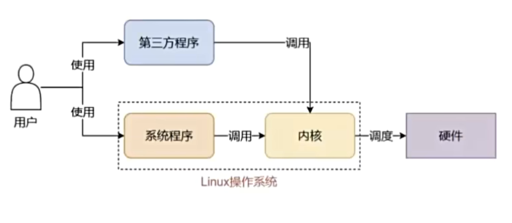
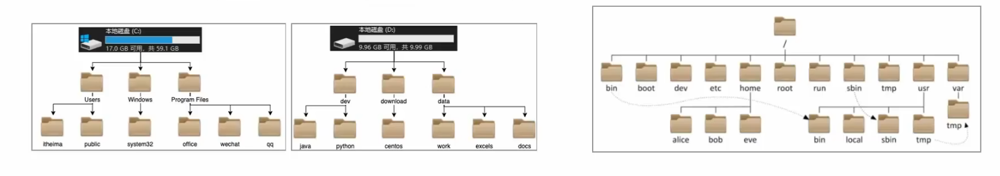
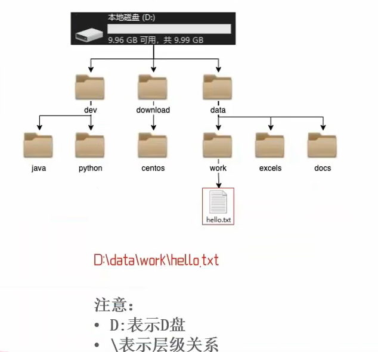
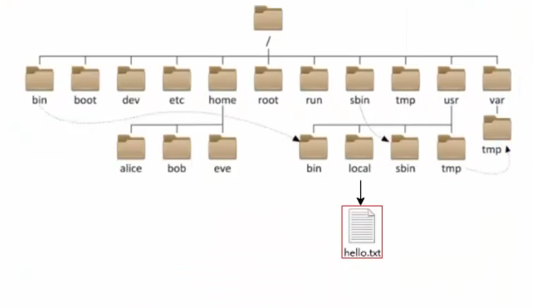
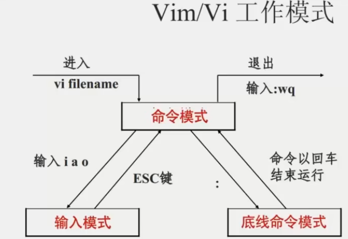
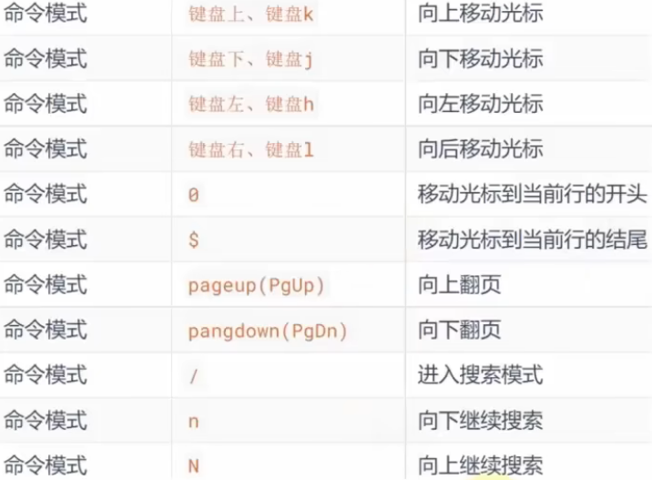
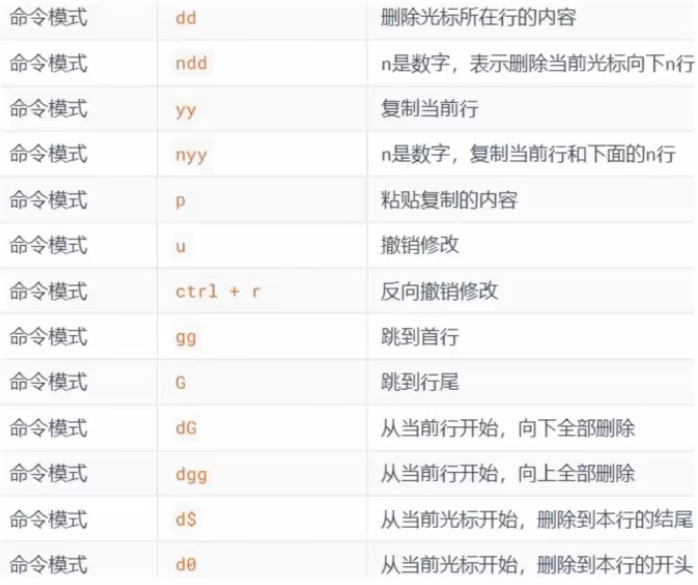
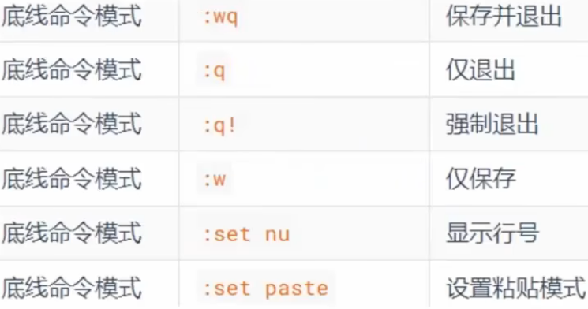
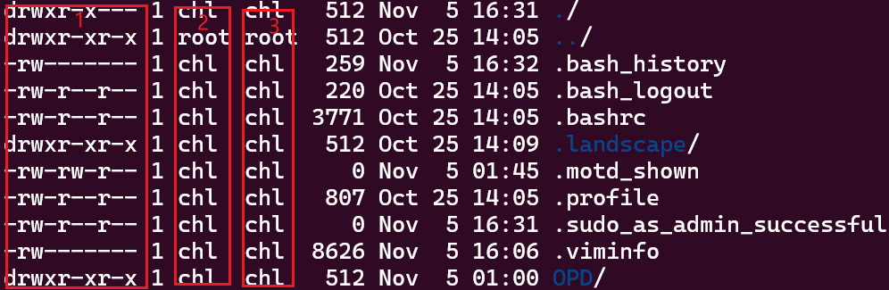
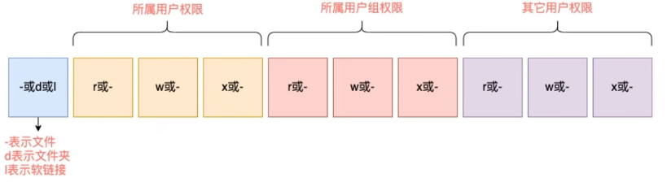

# [MainPage](../readme.md)/Linux

## Linux内核

### Linux系统的组成



- **Linux系统内核**
  - 提供系统最核心的功能，调用硬件，如：调度CPU、调度内存
- **系统级应用程序**
  - 出厂自带的程序，可供用户快速上手操作系统，如：文件管理器、任务管理器

### Linux系统的发行版

- 内核无法被用户直接使用，需要配合应用程序才能被用户使用
- 在内核之上，封装系统级应用程序，组合在一起就成为Linux发行版

## 虚拟机

- 什么是虚拟机？

```
通过虚拟化技术，在电脑内，虚拟出计算机硬件，并给虚拟的硬件安装操作系统，
即可得到一台虚拟的电脑，称之为虚拟机  
```

### 快照

快照可以保存虚拟机的状态，当虚拟机出现问题的时候，可以通过预先制作的快照恢复到制作时候的状态，用作被封。

## Linux的目录结构

Linux的目录结构是一个树形结构

Windows系统可以拥有多个盘符，如C盘、D盘

Linux没有盘符这个概念，只有一个**根目录/**，所有文件都在它下面

也就是说Linux只有一个顶级目录“/”



### Linux路径的描述方式

- 在Linux中，路径之间的层级关系，使用：/来表示
- 在Windows中，路径之间的层级关系，使用：\来表示
  - 出现在开头的/表示：根目录
  - 出现在后面的/表示：层次关系





## Linux命令基础

- **命令行**：即Linux终端(Terminal)，是一种命令提示符页面。以纯字符的形式操作系统，可以使用各种字符化命令对系统发出操作指令。
- **命令**：即Linux程序。一个命令就是一个Linux的程序。命令没有图形化页面，可以在命令行（终端）中提供字符化的反馈。

### Linux命令的基础格式

无论是什么命令，用于什么用途，在Linux中，命令有其通用的格式：

```
command [-options] [parameter]
```

- **command**：命令本身
- **options**：[可选，非必填]命令的一些选项，可以通过选项控制命令的行为细节
- **parameter**：[可选，非必填]命令的参数，多用于命令的指向目标等
- ==语法中的[]，表示可选的意思==

### ls

在命令行中，以平铺的形式，展示当前的工作目录（默认HOME目录）下的内容（文件或文件夹）

```
ls [-options] [Linux路径]
```

#### HOME目录

HOME目录是每一个用户在Linux的专属目录，默认在：/home/用户名

#### 当前工作目录

Linux命令在执行命令的时候，需要一个工作目录，打开命令程序（终端）默认设置工作目录在用户的HOME目录中

#### 参数

可以指定要查看的文件夹（目录）的内容，如果不给定参数，就查看当前工作目录的内容

- **-a(all)**：可以展示出隐藏的内容

  - 以**·**开头的文件或文件夹默认被隐藏
- **-l**：以列表的形式展示内容，并展示更多细节
- **-h**：需要和**-l**搭配使用，以展示文件大小的单位
- 选项的组合使用：

```
ls -lah
ls -a -l  
```

### cd(change directory)

```
cd [Linux路径]
```

- 没有选项，只有参数
- 切换到参数指定路径
- 不使用参数，切换工作目录到当前用户的HOME

### pwd(print work directory)

- 没有选项和参数
- 输出当前所在的工作目录

### 相对路径，绝对路径及特殊路径符

- 绝对路径:以根目录为起点，描述路径的方式，路径以/开头
- 相对路径：以当前目录做起点，描述路径的方式，路径不以/开头
- **.**表示当前目录，如：cd.或cd./Desktop
- **..**表示上一级目录，如：cd..或cd../..
- **~**表示用户的HOME目录，如：cd \~或cd\~/Desktop

### mkdir(make directory)

```
mkdir [-p] Linux路径
```

- 创建新的目录（文件夹）
- 参数必填，表示要创建的==目录== 的路径，相对、绝对、特殊路径符都可以使用
- **-p**：可选，表示自动创建不存在的父目录，适用于创建连续多层级的目录

### touch

```
touch Linux路径
```

- 创建一个新的文件
- 参数必填，表示要创建的==文件== 的路径，相对、绝对、特殊路径符都可以使用

### cat

```
cat Linux路径
```

- 用于查看文件内容
- 参数必填，表示要查看的文件的路径，相对、绝对、特殊路径符都可以使用

### more

```
more Linux路径
```

- 用于查看文件内容
- 参数必填，表示要查看的文件的路径，相对、绝对、特殊路径符都可以使用
- 使用空格进行翻页，使用q推出查看

### cp(cope)

```
cp [-r] 参数1 参数2  
```

- -r选项,可选，用于复制文件夹使用，表示递归  
- 参数1，Linux路径，表示被复制的文件或文件夹  
- 参数2，Linux路径，表示要复制去的地方  

### mv(move )  

```
cp 参数1 参数2  
```

- 参数1，Linux路径，表示被复制的文件或文件夹  
- 参数2，Linux路径，表示要移动去的地方，如果目标不存在，则进行改名，确保参数存在  

例：

```
mv test.txt Desktop/  
```

加一个/只是强调第二个路径是目录而不是需要重命名的名称  

改名：  

```
如果test2.txt不存在  
mv tset.txt test2.txt  
```

### rm(remove)  

```
rm [-r -f] 参数1 参数2 ...... 参数N
```

- -r选项，可选，文件夹删除
- -f选项，可选，用于强制删除（不提示，一般用于root用户）
- 参数，表示被删除的文件或文件夹路径，支持多个，空格隔开  
- 参数支持通配符*，用以做模糊匹配  
  - *test，以test开头的
  - test*，以test结尾的
  - *test\*，包含test的

### which  

- 查找命令的程序文件  
- Linux的命令本质上是程序文件，相当于Windows的exe文件  

```
which 要查找的命令
```

- 无需选项，只需要参数表示要查找哪个命令  

例：

```
which ls
```

结果将会展示ls命令保存在哪里  

```
/usr/bin/ls
```  

### find  

- 用于查找指定的文件  

- 按文件名查找  
  - 支持通配符
```
find 起始路径 -name "被查找文件名"
``` 

例：  

```
find / -name "test.txt"
```  

在根目录下查找test.txt  

- 按文件大小查找  
  - +,-：+表示大于，-表示小于 
  - -n：表示文件大小
  - [kMG] :表示文件大小的单位
```
find 起始路径 -size +|-n[kMG]
```

例：  

```
find / -size +100M
```

表示在根目录下查找大于100M的文件  

### echo  

- 可以使用echo命令在命令行输出指定内容  

```
echo 输出的内容
```

- 无需选项，只有一个参数，表示要输出的内容，复杂内容可以用""  

### `反引号符  

- 被``包围的内容，会被做为命令执行，而非普通字符  

例：  

```
echo `ls`
```  

会输出当前目录的内容  

### 重定向符  

- \>,将左侧命令的结果，==覆盖==写入到符号右侧指定的文件中  
- \>>,==追加==写入到符号右侧指定的文件中  

### tail  

- 查看文件尾部内容，并可以持续跟踪  

```
tail [-f -num] Linux路径
```  

- -f，表示持续跟踪
  - 例如我想查看test.txt的尾部内容，如果有-f则会在输出指定或默认行数的内容后不结束程序，此时如果该文件内容更新，如在末尾又添加了一行，那么此时tail命令会输出新的这一行。
  - 可以使用ctrl+c来推出持续跟踪  
- -n，表示查看尾部多少行，默认10  

例：  

```
tail -f -5 test.txt
```

### 管道符|  

- 将管道符左边命令的结果，作为右边命令的输入  

```
ls /usr/bun | grep gt f
```

意思是利用grep指令在/usr/bun下的文件中寻找带gt f的行  

- 管道符可以嵌套使用  

```
cat test.txt | grep itcast | grep itheima
```

cat test.txt获取该文件里的内容，然后利用grep在其中查找itcast，返回带有itcast的行，然后这些行再作为输入，利用grep查找带有itheima的行  

### grep  

- 从文件中通过关键字过滤文件行  

```
grep [-n] 关键字 文件路径
```

- 选项-n，可选，表示在结果中显示匹配行的行号  
- 参数，关键词，必填，表示过滤的关键词，建议用""将关键词包围起来  
- 参数，文件路径，必填，表示要过滤内容的文件路径，可作为管道符的输入  

### wc  

- 命令统计文件的行数、单词数量、字节数、字符数等  

```
wc [-c -m -l -w] 文件路径
```

- 不带选项默认统计：行数、单词数、字节数
- -c字节数、-m字符数、-l行数、-w单词数  
- 参数，被统计的文件路径，可作为管道符的输入    


## vi/vim编辑器  

### 什么是vi/vim编辑器  

- vi/vim编辑器，就是在命令行模式下的文本编辑器，用来编辑文件  
- vim是vi的升级版，一般用vim即可，包含全部vi功能  

### 基础命令  

```
vi 文件路径
vim 文件路径
```

### 运行模式  

- 命令模式，默认的模式，可以通过键盘快捷键控制文件内容  
- 输入模式，通过命令模式进入，可以输入内容进行编辑，按esc退回命令模式  
- 底线命令模式，通过命令模式进入，可以对文件进行保存、关闭等操作  

  

**命令模式快捷键**  

  

**输入模式快捷键**  

  

  

**底线命令模式快捷键**  

  

## Linux的用户和权限    

### Linux的root用户（超级管理员）  

无论是Windows、MacOS、Linux均采用多用户的管理模式进行权限管理  

- 在Linux中，拥有最大权限的账户名为：root（超级管理员）
- 普通用户的权限，一般在其HOME目录内是不受限的  
- 一旦出了HOME目录，大多数地方，普通用户仅有只读和执行权限，无修改权限  

### su和exit    

- 可以切换用户  

```
su [-] [用户名]
```  

- -表示切换后加载环境变量，建议带上  
- 用户可以省略，省略默认切换到root  
- 切换用户后，可以通过**exit**命令退回上一个用户，也可以使用快捷键：ctrl + d  

- 使用普通用户，切换到其他用户==需要==输入密码，如切换到root用户  
- 使用root用户切换到其他用户，==无需==密码，可以直接切换  

### sudo  

- 可以让一条普通命令带有root权限  

```
sudo 其他命令
```  

- 需要以root用户执行visudo命令，增加配置方法可让普通用户有sudo命令的执行权限  

### 用户和用户组管理  

Linux系统中可以：  

- 配置多个用户  
- 配置多个用户组  
- 用户可以加入多个用户组中  

Linux中关于权限的管控级别有2个级别，分别是：  

- 针对用户的权限控制
- 针对用户组的权限控制  

比如，针对某文件，可以控制用户的权限，也可以控制用户组的权限  
所以，我们需要学习在Linux中进行用户、用户组管理的基础命令  

#### 用户组管理  

==以下命令需root用户执行==  

- 创建用户组  

```
groupadd 用户组名
```  

- 删除用户组  

```
groupdel 用户组名
```  

#### 用户管理  

==以下命令需root用户执行==  

**创建用户**  

```
useradd [-g -d] 用户名  
```  

- 选型：-g指定用户的组，不指定-g，会创建同名组并自动加入，指定-g需要组已存在，如已存在同名组，必须使用-g  
- 选项：-d指定用户HOME路径，不指定，HOME目录默认在：/home/用户名  

**删除用户**  

```
userdel [-r] 用户名  
```  

- 选项：-r，删除用户的HOME目录，不使用-r，删除用户时，HOME目录将保留  

**查看用户所属组**

```
id[用户名]
```  

- 参数：用户名，被查看的用户，如果不提供则查看自身  

**修改用户所属组**  

- 将指定用户加入指定组  

```
usermod -aG 用户组 用户名  
```  

**getgent**  

- 查看系统中有哪些用户  

```
getent passwd
```  

- 共有7份信息，分别是：  
  - 用户名：密码（x）：用户ID：描述信息（无用）：HOME目录：执行终端（默认bash）  

-  查看系统中有哪些用户组  

```
getent group  
```  

- 共有3份信息：
  - 组名称：组认证（显示为x）：组ID  

### 查看权限控制信息  

  

- 序号1，表示文件、文件夹的权限控制信息  
- 序号2，表示文件、文件夹所属用户  
- 序号3，表示文件、文件夹所属用户组  

  

#### rwx  

- r代表读权限  
- w代表写权限  
- x代表执行权限  

针对文件、文件夹的不同，rwx的含义具有席位差别  

- r，针对文件可以擦好看文件内容  
  - 针对文件夹，可以查看文件夹内容，如ls命令  
- w，针对文件表示可以修改此文件  
  - 针对文件夹，可以在文件夹内：创建、删除、改名等操作  
- x，针对文件表示可以将文件作为程序执行  
  - 针对文件夹，表示可以更改工作目录到此文件夹，即cd进入  

### chmod  

- 功能，修改文件、文件夹的权限细节  
- 限制，只能是文件、文件夹的所属用户或root有权修改  

```
chmod [-R] 权限 文件或文件夹
```  

- 选项：-R，对文件夹内的全部内容应用同样的规则  

### chown  

- 使用chown命令，可以修改文件、文件夹的所属用户和用户组  

==普通用户无法修改所属为其他用户或组，所以此命令只适用于root用户执行==  

```
chown [-R] [用户] [:] [用户组] 文件或文件夹  
```  

- 选项，-R，同chmod，对文件夹内部全部内容应用相同规则  
- 选项，用户，修改所属用户
- 选项，用户组，修改所属用户组
- :用于分隔用户和用户组  

例：

```
chown root hello.txt,将hello.txt所属用户修改为root
chown :root hello.txt,将hello.txt所属用户组修改为root
chown root:it hello.txt,将hello.txt所属用户修改为root，用户组修改为it
chown -R root test,将文件夹test的所属用户修改为root并对文件夹内全部内容应用同样规则
```  

## Linux使用操作  

