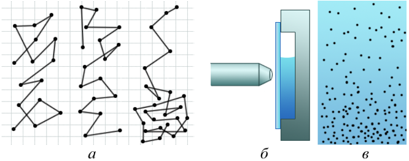
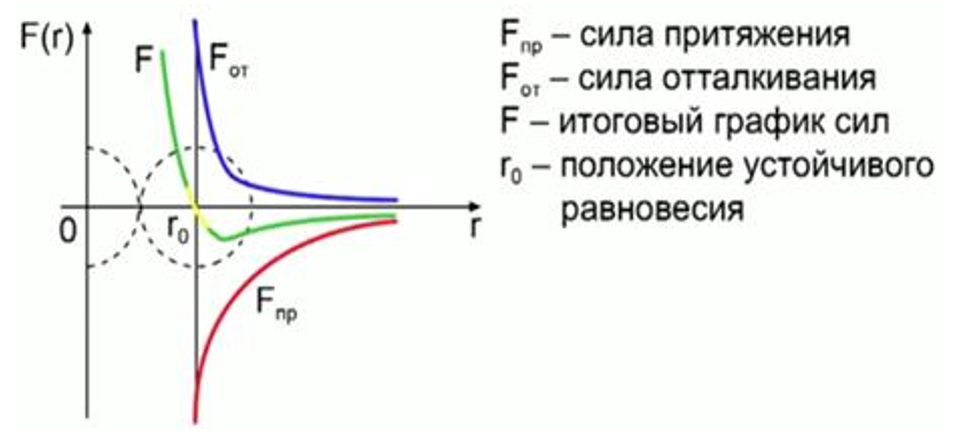
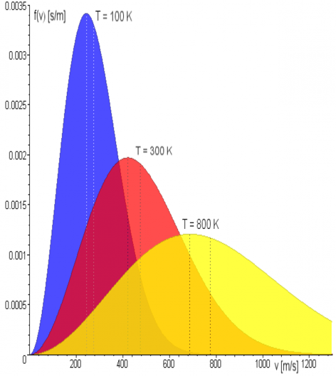

# [MainPage](../readme.md)/Физика  

# МОЛЕКУЛЯРНАЯ ФИЗИКА 分子物理学  
# ТЕРМОДИНАМИКА 热力学  

| 俄语| 中文 |
| ---- | --- |
| термодинамический | 热力学的 |
| равновесие | 平衡 |
| [Молекулярно-кинетическая теори(МКТ)](#молекулярно-кинетическая-теоримкт) | 分子动力学理论 |
| [Броуновское движение](#броуновское-движение) | 布朗运动 |
| Диффузия | 扩散 |
| Строение вещества| 物质结构 |
| ядро | 原子核 |
| протон | 质子 | 
| нейтрон | 中子 |
| электрон | 电子 |
| Молекула | 分子 |
| Атом | 原子 |
| Тепловое движение | 热运动 |
| [Силы взаимодействия молекул](#силы-взаимодействия-молекул) | 分子间相互作用力 |
| Относительная атомная масса | 相对原子质量 |
| Количество вещества(v) | 物质的量 |
| Моль | 摩尔 |
| Число Авогадро | 阿伏伽德罗常数 |
| Молярная масса | 摩尔质量 |
| смесь газов | 混合气体 |
| Массовая доля(w) | 质量分数 |
| макроскопический | 宏观的 |
| Температурные шкалы(шкала температур) | 温标 |
| [постоянная Больцмана](#постоянная-больцмана) | 玻尔兹曼常数 |
| [Закон Авогадро](#закон-авогадро) | 阿伏伽德罗定律 |
| [График функции распределения молекул по скоростям](#график-функции-распределения-молекул-по-скоростям) | 分子速度分布函数图 |

## Молекулярно-кинетическая теори(МКТ)  

- теория, которая объясняет процессы, происходящие в макроскопических телах на основе предположения, что все тела состоят из атомов и молекул, подчиняющихся при движении законам механики Ньютона.  

- 一种解释宏观物体运动过程的理论，其假设是所有物体都由原子和分子组成，运动时遵守牛顿力学定律。

## Броуновское движение  

- беспорядочное движение броуновской частицы под влиянием ударов молекул среды  

- 布朗粒子在介质中分子撞击影响下的无序运动

  

## Силы взаимодействия молекул   

  

## Постоянная Больцмана  

- k - коэффициент пропорциональности между энергетической и абсолютной температурой, постоянная Больцмана    

- 玻尔兹曼常数是有关于温度及能量的一个物理常量

- $k = 1.38 \times 10 ^ {-23} J/K$  

- 理想气体状态方程：$pV = nRT = NkT$  

- $k = \frac{R}{N_A}$

## Закон Авогадро  

- В равных объемах любых газов, взятых при одной и той же температуре и при одинаковом давлении, содержится одно и то же число молекул.  

- 在相同温度和压力下，等体积的任何气体都含有相同数量的分子。   

## График функции распределения молекул по скоростям  

- При повышении Т максимум функции смещается вправо, но площадь графика постоянна, =>растягивается и понижается.  
- 随着 T 的增大，函数的最大值向右移动，但图形的面积不变，=>拉伸并减小。  

- Максимальная скорость 
$v_B = \sqrt{\frac{2RT}{M}}$  

- Средняя скорость
$<v> = \sqrt{\frac{8RT}{\pi M}}$  

  
