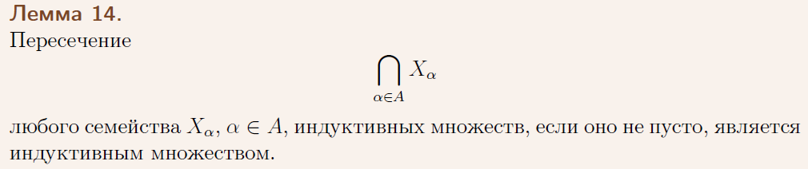
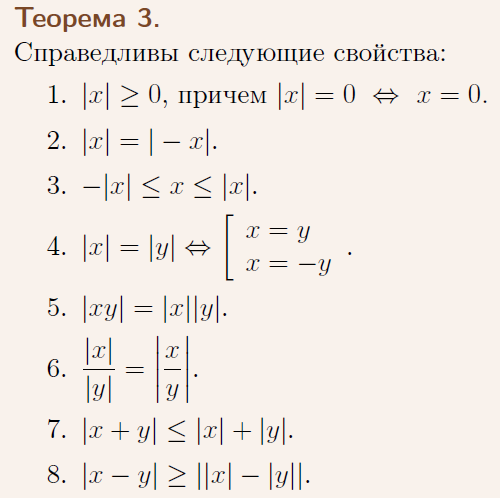
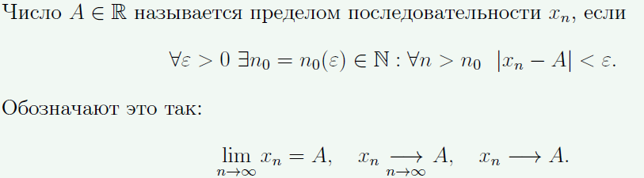
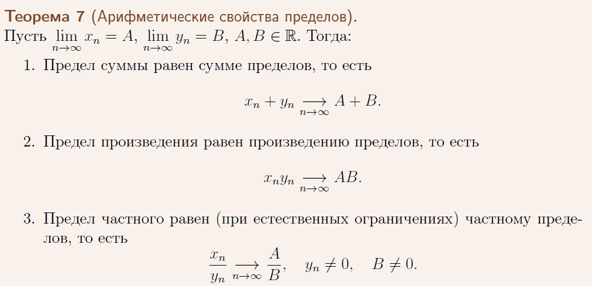
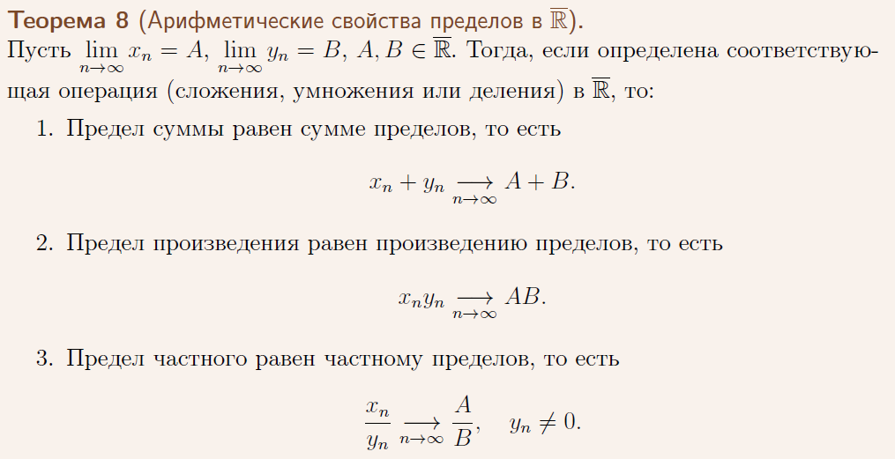
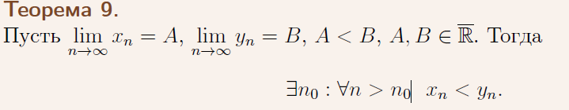

**1.Сложение в R**  
Аксиомы сложения. Леммы о единственности нуля, единственности противоположного элемента, о решении линейного уравнения.  

解：  
1. Операция + коммутативна, то есть для любых x, y ∈ R  
x + y = y + x.

2. Операция + ассоциативна, то есть для любых x, y, z ∈ R  
(x + y) + z = x + (y + z).

3. Существует нейтральный элемент 0 ∈ R (называемый нулем), такой, что длялюбого x ∈ R  
x + 0 = x.

4. Для каждого элемента x ∈ R существует противоположный элемент −x такой,что  
x + (−x) = 0.  

В множестве R ноль единственен.  

В множестве R каждый элемент имеет единственный противоположный.  

В множестве R уравнение x + a = b имеет единственное решение x = b + (−a).  

**2.Умножение в R**
Аксиомы умножения. Леммы о единственности единицы, о единственности обратного элемента, о решении линейного уравнения.

解：
1. Операция · коммутативна, то есть для любых x, y ∈ R  
x · y = y · x.

2. Операция · ассоциативна, то есть для любых x, y, z ∈ R  
(x · y) · z = x · (y · z).

3. Существует нейтральный элемент 1 ∈ R \ {0} (называемый единицей), такой,что для любого x ∈ R  
x · 1 = x.

4. Для каждого элемента x ∈ R\ {0} существует обратный элемент x_−1 такой, что  
x · x_−1 = 1.

В множестве R единица единственна.

В множестве R \ 0 каждый элемент имеет единственный обратный.

В множестве R уравнение a · x = b при a ̸= 0 имеет единственное решение x = b · a_−1

**3.Связь сложения и умножения в R**
Аксиома связи сложения и умножения. Лемма об умножении на ноль и следствие, лемма о противоположном элементе и следствия.

解：
Умножение дистрибутивно по отношению к сложению, то есть ∀x, y, z, ∈ R
(x + y) · z = x · z + y · z.

Лемма：
Для любого x ∈ R выполняется
x · 0 = 0.

Следствие：
(x · y = 0) ⇔ (x = 0) ∨ (y = 0).

**4.Порядок в R**
Аксиомы порядка, аксиомы связи порядка со сложением и умножением. Лемма о сравнении нуля и единицы (со вспомогательными леммами).

解：
Между элементами R введено отношение порядка ≤, то есть для элементов x, y ∈ R установлено: справедливо x ≤ y, или нет. При этом выполняются следующие условия:
1. Отношение ≤ рефлексивно, то есть
∀x ∈ R x ≤ x.
2. Отношение ≤ антисимметрично, то есть
(x ≤ y) ∧ (y ≤ x) ⇒ (x = y).
3. Отношение ≤ транзитивно, то есть
(x ≤ y) ∧ (y ≤ z) ⇒ (x ≤ z).
4. Для любых двух элементов x, y ∈ R выполнено либо x ≤ y, либо y ≤ x.

Если x, y, z ∈ R, то
(x ≤ y) ⇒ (x + z ≤ y + z).

Если x, y ∈ R, то
(0 ≤ x) ∧ (0 ≤ y) ⇒ (0 ≤ x · y).

**5.Непрерывность R**
Аксиома непрерывности. Леммы о существовании и иррациональности числа, квадрат которого равен 2.

- **Аксиома непрерывности**:
     - \( \mathbb{R} \) является полным порядковым полем, что означает, что не существует "разрывов" между числами. Это связано с тем, что любые ограниченные числовые последовательности в \( \mathbb{R} \) имеют предел.
- **Лемма о существовании числа, квадрат которого равен 2**: Существует число \( \sqrt{2} \), которое является иррациональным, то есть оно не может быть записано в виде дроби \( \frac{p}{q} \), где \( p \) и \( q \) — целые числа.

- **连续性公理**：  
     \( \mathbb{R} \) 是一个完备的有序域，这意味着在数轴上不存在“间隙”或“断裂”。换句话说，任意有界的实数序列在 \( \mathbb{R} \) 中都有极限。这一性质确保了实数集的连续性。

- **关于平方等于 2 的数存在性的引理**：  
     存在一个数 \( \sqrt{2} \)，其平方等于 2。也就是说，存在一个实数 \( x \in \mathbb{R} \)，使得 \( x^2 = 2 \)。

- **无理性的引理**：  
     这个数 \( \sqrt{2} \) 是无理数，意味着它不能表示为形如 \( \frac{p}{q} \) 的分数，其中 \( p \) 和 \( q \) 为整数。

**6.Натуральные числа и математическая индукция**
Индуктивные множества, лемма о пересечении индуктивных множеств, множество натуральных чисел. Принцип математической индукции, неравенство Бернулли.

Множество X ⊂ R называется индуктивным, если
∀x ∈ X (x + 1) ∈ X.

  

如果有一系列归纳集合 \( \{ S_i \} \)，其中每个集合 \( S_i \) 都是归纳集合，那么它们的交集 \( \bigcap_i S_i \) 也是归纳集合。这意味着每个归纳集合包含所有自然数，因此它们的交集也包含所有自然数。

Множеством натуральных чисел называется пересечение всех индуктивных множеств, содержащих число 1. Обозначается множество натуральных чисел как N.

自然数集合被定义为所有包含数字 1 的归纳集合的交集。自然数集合记作 \( \mathbb{N} \)。

- **Принцип математической индукции**:

Если множество X ⊂ N таково, что 1 ∈ X и ∀x ∈ X (x + 1) ∈ X, то X = N.

- **Принцип математической индукции**:
     - Для доказательства утверждения, верного для всех натуральных чисел, следует выполнить два шага:
       1. Доказать, что утверждение верно для начального элемента (например, для \( n = 1 \)).
       2. Предположить, что утверждение верно для \( n = k \), и доказать, что оно верно для \( n = k + 1 \).

- **数学归纳法原理**：
  - 为了证明一个对所有自然数成立的命题，需要完成两个步骤：
    1. 证明该命题对初始元素（例如 \( n = 1 \)）成立。
    2. 假设命题对 \( n = k \) 成立，证明它对 \( n = k + 1 \) 也成立。
  
- **Неравенство Бернулли**:
     - Для любого \[
(1 + x)^n \geq 1 + nx, \quad x > -1, \, n \in \mathbb{N}.
\]
    - 该不等式适用于所有 \( x > -1 \) 且 \( n \) 为自然数。它说明，当 \( x > -1 \) 时，\( (1 + x)^n \) 总是大于或等于 \( 1 + nx \)，这个不等式在数学归纳法中有重要应用。

**7.Модуль**
Модуль вещественного числа. Теорема о восьми свойствах.

Модулем вещественного числа \(x\) называется число, равное \(x\), если оно положительно или равно нулю, и равное \(-x\), если оно отрицательно. Иными словами:

\[
|x| =
\begin{cases} 
x, & \text{если } x \geq 0 \\
-x, & \text{если } x < 0 
\end{cases}
\]  

“实数 \(x\) 的绝对值是这样一个数：当 \(x\) 为正数或零时，绝对值等于 \(x\)；当 \(x\) 为负数时，绝对值等于 \(-x\)。换句话说：

\[
|x| =
\begin{cases} 
x, & \text{如果 } x \geq 0 \\
-x, & \text{如果 } x < 0 
\end{cases}
\]”

  

**8.Ограниченность**
Границы множества, ограниченность множества. Максимум, минимум, супремум и инфимум множества. Принцип точной грани, следствие для любых непустых множеств. Эквивалентные определения супремума и инфимума.  

**有界性**  
集合的边界，集合的有界性。集合的最大值、最小值、上确界和下确界。精确边界原理，适用于任何非空集合的推论。上确界和下确界的等价定义。

- Понятие границы множества
Множество X ⊂ R называется ограниченным сверху, если
∃M ∈ R : ∀x ∈ X x ≤ M.
Найденное число M называется верхней границей для X.
Множество X ⊂ R называется ограниченным снизу, если
∃m ∈ R : ∀x ∈ X x ≥ m.
Найденное число m называется нижней границей для X.

- Понятие ограниченности множества
Множество X ⊂ R называется ограниченным, если оно ограничено как сверху,
так и снизу, то есть
∃M,m ∈ R : ∀x ∈ X m ≤ x ≤ M.

- Максимум множества \( A \) — это наибольшее значение, которое принадлежит множеству. Минимум — это наименьшее.
- Супремум (верхняя грань) множества \( A \) — это наименьшее из всех чисел, которые больше или равны каждому элементу множества \( A \).
- Инфимум (нижняя грань) множества — это наибольшее из всех чисел, которые меньше или равны каждому элементу множества.

- **Принцип точной грани**: Если множество \( A \) ограничено, то оно имеет супремум (верхнюю грань) или инфимум (нижнюю грань).
- **Эквивалентные определения супремума**: Супремум множества — это наименьшее верхнее ограничение множества.  

**9.Принцип Архимеда**
Теорема о существовании максимума у любого непустого подмножества N. Следствие о неограниченности N. Принцип Архимеда и следствия из него.

关于任意非空子集 𝑁存在最大值的定理。关于 𝑁的无界性的推论。阿基米德原理及其推论

Пусть X ⊂ N – непустое ограниченное множество. Тогда ∃ max X.

Множество натуральных чисел N не ограничено сверху.

Принцип Архимеда:
Пусть x ∈ R, x > 0. Для любого y ∈ R существует единственное целое k ∈ Z такое, что
(k − 1)x ≤ y < kx.

Для любого \( \varepsilon > 0 \) существует натуральное число \( n \), такое что 

\[
0 < \frac{1}{n} < \varepsilon
\]

Пусть x ∈ R. Если ∀ε > 0 выполняется 0 ≤ x < ε, то x = 0.

Для любого числа x ∈ R существует единственное k ∈ Z такое, что k ≤ x < k+1.  

**10.Предел последовательности**
Определение предела последовательности через неравенства, эпсилон-окрестности, окрестности, доказательство эквивалентности определений. Утверждение о том, что число не является пределом. Три свойства последовательностей, имеющих предел.

  

**11.Арифметические свойства пределов последовательностей в R**
Определение предела последовательности. Утверждение о том, что число не является пределом. Арифметические свойства пределов в R.

 

**关于一个数不是极限的命题**  
如果 \( A \) 不是序列 \( x_n \) 的极限，那么存在一个 \( \varepsilon > 0 \)，对于任意的正整数 \( n_0 \)，总能找到一个 \( n > n_0 \)，使得
\[
|x_n - A| \geq \varepsilon.
\]
这表示序列 \( x_n \) 的项不能稳定地接近 \( A \)。

  

**12.Арифметические свойства пределов последовательностей в расширенном R**
Определение предела последовательности, бесконечные пределы. Арифметические свойства пределов в расширенном R (арифм. свойства в R доказывать не нужно).

  

**13.Предельный переход в неравенствах для последовательностей**
Определение предела последовательности, бесконечные пределы. Теорема о влиянии неравенства между пределами на неравенство между последовательностями. Предельный переход в неравенствах.

