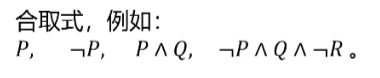
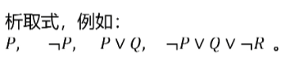
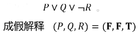
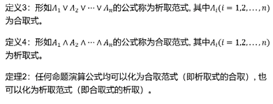
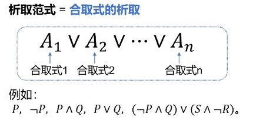
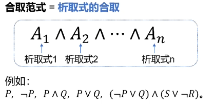
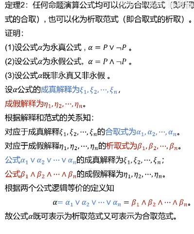

# [MainPage](../readme.md)/离散数学  

# 合取式与析取式  

- **定义一** ：命题变元或命题变元的否定或由他们利用合取词组成的合取公式称为**合取式**  
- **定义二** ：命题变元或命题变元的否定或由他们利用析取词组成的析取公式称为**析取式**  
- **定理一** : 任给一个成真解释，有且仅有一个合取式与之对应；任给一个成假解释，有且仅有一个析取式与之对应。反之亦然。  

  

  

P和非P 是命题变元  
$\vee$ 和 $\wedge$是析取词和合取词  
成真解释 例：对于合取式$\neg P\vee Q \vee \neg R$结果为真  
(P,Q,R)=(T,F,T)  

  

# 合取范式与析取范式  

  

  

  

  

